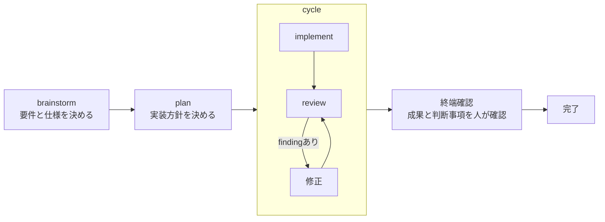

# agentic-workflow ロードマップ

## 目的

このリポジトリは、AIエージェントへソフトウェア変更を任せる際の作業を、合意形成から実装、
レビューまで一貫して進めるためのworkflowを提供する。

中心となる流れは完成している。今後は駅を増やすことより、仕様と検証の接続を強め、実利用の
ある周辺道具だけを小さく追加することを優先する。

## 現在地

2026-08-27時点で、メインフローを構成する5つのskillは実装済みである。

| 駅 | 担当 | 責務 |
|---|---|---|
| 壁打ち | `ba0918-brainstorm` | 目的、要件、仕様、重要な設計判断を人と決める |
| 計画 | `ba0918-plan` | 承認済み仕様を、実装可能な順序と検証方法へ変換する |
| 実装 | `ba0918-implement` | planの1手順を実装し、検証証拠を残す |
| レビュー | `ba0918-review` | 差分を独立に確認し、指摘（finding）を固定して収束を判定する |
| 進行 | `ba0918-cycle` | implement、review、修正を、人の判断が必要になるまで自走させる |

幹の実装は完了した。以下は完成条件を変更する未完了工程ではなく、幹の品質向上と周辺道具の
追加候補である。

## 判断原則

- 新しい工程を独立させるのは、その工程だけが生む固有の成果物または契約がある場合に限る。
- 検出や分析を担う周辺道具は実装、レビュー、修正ループを持たず、既存の幹または`iterate`へ
  渡す。`iterate`だけは、承認済み仕様と既存設計の範囲で閉じる極小cycleとして扱う。
- 既存のskill、review profile、通常指示、実行環境の機能で代替できる仕組みを再実装しない。
- 人に判断を求めるのは、重要な設計判断、不可逆・危険な操作、または作業を続けると被害が
  広がる事故などに限る。
- 新しい依存、保存方式、外部サービス、権限、配布方式は、各能力のbrainstormで明示的に決める。
- 旧版の名称や構造ではなく、実利用で必要だった能力を移す。

## 次に強化する幹

### 1. 仕様要求と検証を接続する

最優先の残作業。現行の各skillにも仕様と検証を扱う責務はある。ここでは、承認済み仕様の各要求に
検証手段が対応していることと、その対応漏れをreviewが検出できることを一貫させる。旧
`spec-verify`を独立skillとして移植せず、メインフローへ分配する。

- brainstormは、観測可能な成功条件、失敗条件、境界条件、反例、人にしか判断できない条件を
  仕様へ記録する。
- planは、要求ごとに適切な検証方法を選ぶ。unit、integration、E2E、性質を多数の入力で
  確かめるproperty-based test（PBT）、静的検査、成果物、人の確認を必要に応じて組み合わせる。
- implementは、planが選んだ実行可能な検証を実装し、その結果を証拠として残す。
- reviewは、仕様要求の検証漏れと、実装が仕様に適合しているかを確認する。
- reviewが指摘の確かめ方として記録できる操作は、現在は固定の一覧だけで、承認済みplanが
  選んだ検査コマンド（このリポジトリなら品質ゲート）を記録できない。planの検査を確かめ方の
  出所に加えるかは、`docs/spec/review.md`「確かめ方を先に書く」の改訂としてbrainstormで決める。

仕様への参照、plan、既存のテストと検査、実行証拠、reviewを組み合わせて追跡する。独自の
条項schema、永続ID、専用保存層は作らず、PBTだけを正解としない。

### 2. reviewの対象を拡張する

reviewの共通のfinding管理と収束方法を保ったまま、対象固有の知識をprofile（対象種類ごとの
観点集）として追加する。実装単位は各brainstormで決める。

- **dependency profile** — 依存関係を宣言するmanifest、解決結果を固定するlockfile、依存差分を
  対象にする。既知脆弱性は専用検査器（scanner）を事実源とし、エージェントは到達性、開発時のみ
  使う依存か本番でも使う依存か、変更の意味を相関分析する。
- **testing profile** — テストの欠陥検出力、公開契約との対応、安定性、不具合を見逃したり
  テストを不安定にしたりする典型的な書き方を対象にする。
- **whole-codebase scope** — review対象範囲（scope）をコードベース全体にできるようにする。最初に全体を1回、
  修正中はfinding周辺だけ、最後に新しい文脈で全体を1回確認する。固定reviewer構成や総合点は
  持たない。

旧`review-deps`、`review-testing`、`codebase-review`は独立skillとして移植しない。

## 独立した周辺道具の候補

以下は利用価値と固有責務が確認できた候補である。一括移植せず、1つずつ実装brainstormで
責務、入出力、権限、保存期間、失敗時の扱い、検証方法を決める。

| 候補 | 固有責務 | 幹との境界 |
|---|---|---|
| `iterate` | planを必要としない小さな変更を完了させる | 承認済み仕様と既存設計の範囲を越えるならbrainstormへ戻す |
| `investigate` | 読み取り専用で原因、影響範囲、確信度を返す | 修正は`iterate`または通常の幹へ渡す |
| `doc-check` | コード、仕様、READMEなどの乖離findingを返す | 小さな整合修正は`iterate`、仕様の不足や誤りはbrainstormへ渡す |
| `refactor` | 外部から観測できる挙動を保存したまま構造を改善する | 小規模なら`iterate`、広範囲ならplanとcycleへ渡す |
| `issue` | リポジトリ内の未着手事項を記録、一覧、状態管理する | 実行は通常の幹へ渡す。正規データは`docs/issues/`とする方向で設計する |
| `attack-review` | 攻撃シナリオ、再現方法、リスクを読み取り専用で報告する | 修正は通常の幹へ渡す |

`issue`のファイル形式と運用は未設計であり、実装前のbrainstormで決める。旧保存場所に残るissueを
移行、保管、またはそのまま残すかも、そのbrainstormで決める。

## UI workflowの再設計

UI関連の能力には利用実績がある一方、旧構成には大きな改善余地があった。旧`design-guide`、
`design-scaffold`、`design-generate`、`design-lint`、`design-validate`、`mockup-diff`の名称、分割、
独自基盤をそのまま移植しない。

別のbrainstormで、実際に役立った能力と運用上の問題を整理し、既存のデザインツールや検証手段を
優先して責務境界を決め直す。それまでは個別skillを移植予定として扱わない。

## 独立移植しないもの

| 旧skill | 扱い |
|---|---|
| `spec-verify` | 仕様要求と検証を接続する能力をメインフローへ統合する |
| `doc-audit` | 有用な文書間整合の観点を`doc-check`へ統合する |
| `problem-solving` | 有用な思考法だけをbrainstormの補助資料として利用する |
| `systematic-debugging` | `investigate`から`iterate`または通常の幹へ進む流れで代替する |
| `sweep-fix` | 同型箇所の探索は`investigate`、修正は既存の実装経路で扱う |
| `doc-write` | `ba0918-readability`と通常の文書化指示で扱う |
| `generate-review-rules` | 評価軸は`AGENTS.md`、`PROJECT.md`、仕様書などの正規文書へ置く |
| `brief` | 説明品質は変換用skillではなく、元の応答と文書で改善する |
| `artifacts` | 一時成果物は所有するworkflowが管理し、重要文書は`docs/`でGit管理する |
| `github-issue` | 対応する実行環境にエージェント起動機能がある場合はそれを利用し、このリポジトリでは代替機構を実装しない |
| `goal-decomposition`、`goal-loop`、`loop-triage` | 対応する実行環境にgoal機能がある場合は既存の幹と組み合わせ、このリポジトリでは代替機構を実装しない |
| `parallel-cycle` | 利用者が監督する作業は1つずつ進め、内部の独立作業だけ必要時に委譲する |
| 旧`commit` | `ba0918-commit`と実行環境の通常のGit操作で代替する |
| `review-deps`、`review-testing` | `ba0918-review`のprofileへ統合する |
| `codebase-review` | `ba0918-review`のwhole-codebase scopeへ統合する |

## 完了の扱い

各残作業は、それぞれのbrainstormで仕様と境界を決め、planを経て、reviewを内包するcycleで
完成させる。新しい能力が前後の駅と実際につながり、名乗った振る舞いを適切な検証で確認できた
ときに完了とする。

brainstormの一時記録は、正規文書が承認されcommitされた後に削除する。planは、実装結果が
取り込まれた後に削除する。実行証拠、branch、worktreeの物理削除はこのROADMAPでは変更せず、
必要な場合は明示した別操作として扱う。

このROADMAPには現在有効な戦略だけを残す。細かな移行経緯、過去の測定値、撤回済みの設計は
Git履歴へ委ねる。
