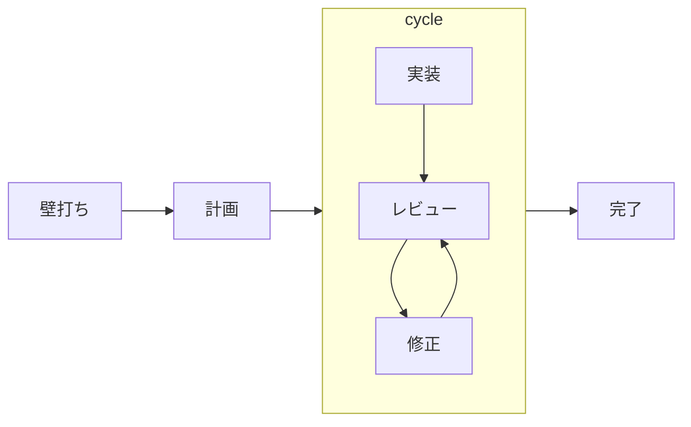

# agentic-workflow 移行ロードマップ

## この文書は何か

AI エージェントにソフトウェアの変更を任せるときの作業の進め方を、ステップに分けて決めた
仕組みが、このリポジトリです。各ステップは `skills/ba0918-<名前>/` にある「skill」（AI が
読む手順書と補助スクリプト）として配布します。仕組みの全体像は
[docs/spec/README.md](docs/spec/README.md) にあります。

以前は `claude-skills` という別リポジトリの仕組みを使っていました。それを一度に複製せず、
小さな単位ごとにこのリポジトリへ作り直しています。この文書は、その作り直しをどの順番で
進め、いまどこにいて、次に何をするかを書いたものです。

読者は、このプロジェクトを初めて見る人です。仕様書と同じく、このプロジェクトの中でしか
通じない言葉は、先に意味を述べてから名前を出します。

## 通したい開発の流れ



人が止まるのは 2 か所だけです。壁打ちから計画へ移るとき（要件を確認する）と、計画から
実装へ移るとき（手順を確認して進めてよいと言う）。実装からレビュー、レビューから修正の
往復は止めずに回し、終わったところで「直した指摘」と「直さなかった指摘」を人が確認します。

各駅の現状（2026-08-26 実測）:

| 駅 | 担当 | 状態 |
|---|---|---|
| 壁打ち | `ba0918-brainstorm` | ある |
| 仕様 | `docs/spec/` と brainstorm | ある。ただし仕様どうしの矛盾を機械で見る手段は無い |
| 計画 | `ba0918-plan` | ある。ただし仕様を書き写しているので重い |
| 実装 | `ba0918-implement` | ある。ただし機構が過剰で、1 実行で 36 箇所の停止点を持つ |
| レビュー | `ba0918-review` | ある。ただし実装の実行 ID でしか起動できず、任意の差分を見られない |
| 修正の往復 | — | **無い**。いまは人が手で回している |
| 往復の進行役（cycle） | — | **無い**。実装の委譲もここが持つ |

無い 2 つを作ることと、既にある 3 つを減量することが、これ以降の最優先です。
どちらも同じ 1 つのフェーズ（Phase 14）で行います。切り離すと、減らす前の重い形に
新しい駅を接ぐことになるからです。

## 完了の定義

フェーズを「完了」と呼べるのは、次の両方を満たしたときだけです。

1. **継ぎ目を 1 回通した。** そのフェーズが作る駅と、前後の駅との受け渡しを、実際の入力で
   1 回通してある。通していない継ぎ目は完了に数えない
2. **名乗った能力が実物の中にある。** そのフェーズが「移した」「統合した」と書く能力は、
   対応する skill・仕様書・スクリプトの中で機械的に確かめられる

この定義は 2026-08-25 に決めました。それまでの「完了」は自己申告で、実測すると 3 件の
主張が実物と食い違っていました（下の「終わったフェーズ」）。

## 全フェーズに共通する約束

### 小さく移す

- 1 つのフェーズでは、利用者向けの能力を 1 つだけ完成させる
- 1 回の実装では、原則として 1 つの skill だけを変える。大きければ手順書を分ける
- フェーズの終わりで必ず止まり、人が成果を確かめる

### 駅を増やすときの条件

新しい駅（工程）を立ててよいのは、**その駅の出力が、前の駅の出力の再記述でないとき**だけ
です。再記述になるなら、独立した駅にせず、前の駅の一部にします。

継ぎ目は 1 つにつき費用がかかります。受け渡す物を定義し、渡された物が承認された物かを
確かめ、それぞれが記録を持ち、AI が skill を切り替えるたびに文脈を作り直します。
その費用に見合うのは、**新しい情報を生む駅**だけです。

この条件は 2026-08-26 に足しました。同じ日に、構想していた駅が 2 つこの条件で消えました
（影響範囲調査、ドキュメント整合）。書いておかないと、また増えます。

### 横断の変更では、分岐点を検索で洗い出す

変更する概念が複数の場所に現れるとき（「完了の示し方に新しい種類を足す」のような横断の
変更）は、手順書の書き込み範囲を記憶から書かず、分岐点を検索で洗い出してから決めます。

これは**義務ではなく指針**です。2026-08-25 の時点では「5.2 の 3 回の改訂は、検索を 1 回
すれば全部防げた」を根拠に義務として書いていましたが、2026-08-26 に手順書 r1〜r4 の差分を
突き合わせた結果、**その根拠は成り立ちませんでした**。3 回とも改訂の引き金は実装中に
見つかった仕様の穴で、検索で先回りできたのは 3 回のうち 1 回です。

安いので指針として残しますが、これで防げる範囲を大きく見積もってはいけません。実装して
初めて分かることは、手順書を書く前のどんな調査でも防げません。防げないなら、分かったときに
安く回復できることのほうが答えです（下の「止まっても続けられる」）。

### brainstorm には 2 つの粒度がある

**戦略 brainstorm** はプロジェクト全体の目的、原則、責任の境界、移行の順序を決めます。
成果物はこの ROADMAP で、直接には手順書に変換しません。

**実装 brainstorm** は 1 つの skill、または 1 つの利用者向け能力だけを対象にします。
成果物は、その skill を実装できる仕様書（`docs/spec/` の該当する文書）です。1 回の実装で
終えられることを確かめてから plan へ進みます。

### plan に進める条件

次がそろっていない brainstorm は手順書に変換しません。足りなければ手順書を大きくせず、
フェーズを分けます。

- 対象が 1 つの skill か、1 つの利用者向け能力に限られている
- 利用者が得る結果を一文で言える
- 対象と対象外が明示されている
- 配布の単位と動かし方が決まっている
- 保存する状態、その寿命、移行が決まっているか、無いと確認されている
- 外部との入出力と必要な権限が決まっている
- 人が判断する場面と、そのとき見せる物が決まっている
- 完了を機械的に確かめる方法がある
- 変更する skill、スクリプト、補足文書、テストの見本を列挙できる
- 決まっていない基礎設計が残っていない
- 1 回の実装で、検証とレビューまで終わる見込みを説明できる

### 手順書は仕様書を写さない

手順書には、仕様書への参照と、その計画で採る実装方針、その根拠、変更するファイル、順序、
完了の示し方、実装側に任せてよい選択、止まる条件を書きます。**仕様の内容そのものは
書き写しません。**

2026-08-25 までの仕様は逆で、「手順書だけを読んで分かるように書く」ことを求めていました。
その結果 5.2 の手順書は 788 行になり、うち大半が仕様の写しでした。写しを持つと、正本が
変わるたびに手順書ごと作り直しになります。5.2 で改訂が 3 回起きた直接の理由です。

### Agent Skills 標準に従う

- 各 skill は `SKILL.md` を中心とした標準的なディレクトリとして配布する
- 決まった処理が要るなら `scripts/` に実行できる形で同梱する。補足は `references/` に置く
- 読む側が存在しない独自の付加情報を足さない。共有の実行基盤を暗黙の前提にしない
- `bunx skills-ref validate` に加え、skill 単体を配置した起動試験を行う

### 完了の示し方は 4 種類。AI を実際に走らせる確認は頼まれたときだけ

手順書の各手順は、完了をどう示すかを次の 4 種類から選びます。選ぶ基準は「何を作るか」
ではなく **誰が完了を判定できるか** です。

| 種類（手順書での値） | 何に使うか | 完了の証拠 |
|---|---|---|
| テストで示す（`test`） | 決まった入力に決まった出力を返すコード | 先に失敗するテストを書き、直して通す |
| 検査で示す（`check`） | 生成した物、道具が判定できる成果物 | 手順が挙げた検査コマンドがすべて成功する。人の承認は求めない |
| 作った物で示す（`artifact`） | 人が読んで意味を判断する文章、設定 | 決めた内容で存在し、形式検査を通り、人が読んで OK と言う |
| 外で確かめる（`external`） | 実機での確認、人が頼んだ実測 | 実行結果を人が見て OK と言う |

読んで意味を判断する文章を `check` にしてはいけません。検査コマンドを 1 つ書いて承認を
省く使い方は、承認を儀式にしないという約束を逆向きに破ります。

文章に対して LLM を実際に走らせて振る舞いを確かめること（以下「実測」）は、既定では
要求しません。人が名前を挙げて頼んだときだけ、確認する場面を 1 つ、使う LLM を 1 つ、
費用の上限を先に決めて行います。

旧版 `claude-skills` との操作回数やトークンの比較測定はもう行いません。品質を下げる
トークン削減は採用せず、実測していない改善を効率化の成果として書きません。

### 機械の検査は、外の世界を見るものに限る

補助スクリプトが行う検査は、**外の世界について何かを言っているもの**に限ります。

- 人が承認した内容と、いま手元にある内容が違う
- 手順書の範囲外のファイルに書こうとしている
- パスが安全でない
- 人の判断が無い、人が読んだ物が変わった、人が却下した
- 認証情報らしき文字列や生のログが混ざっている
- テストの失敗が「何かエラーが出た」で終わっていて、承認された未実装を指していない

**自分が書く記録の形式を自分で検査すること**は、機構が自分で導入したデータ構造を自分で
守っているだけなので、行いません。2026-08-26 に `execution_model.py` の 995 行を関数単位で
分類した結果、外の世界を見ている検査は 6 関数・15 箇所・11 コード（156 行）で、残り
約 111 箇所・29 コード（839 行）は自己検証でした。

自己検証を削っても、AI が肩代わりする仕事は増えません。機構が無ければ、その形式も存在
しないからです。

### 合意を越えない

- 手順書は合意済みの意味を実装手順に変換するだけで、新しい設計を足さない
- 新しい配布方式、実行基盤、保存方式、独自の書式、外部依存は brainstorm に戻す
- 決まっていないことを、実装者やレビュアーが補完しない
- 仕様書、手順書、この ROADMAP は利用者の言語（いまは日本語）で書き、読んで判断できる
  文章にする。機械が読む識別子は英語の固定語でよい
- 「正本は LLM 向けに密度を優先してよく、人間には要約だけ見せる」という考え方は採用しない

### 承認は、人が読んだファイルそのものに対して行う

仕様書、手順書、この ROADMAP の改訂は、すべて次の手順で正本になります。AI が草稿を
一時ファイルに保存し、パスと指紋（内容の SHA-256）を示す。人が自分の道具で読む。人が
「このファイルを正本にしてよい」と言う。AI が指紋の一致を確かめて正本の場所へ移す。

### 承認を儀式にしない

人に承認を求めるのは、人が見て初めて決まることに限ります。決まったコマンドが判定できる
ことについて承認を求めてはいけません。どうでもいい承認を重ねると、人は中身を見ずに「OK」
と答える役になり、本当に見るべき承認も素通りします。

同じことが**停止**にも当てはまります。2026-08-26 に 5.2 の実行を数えたところ、9 回止まった
うち 8 回は、次の 1 手が「続ける」でした。人が調べて何かを直した形跡はありません。
実際に人の判断が要ったのは 1 回だけです。**止まる場所を増やすことは、安全を増やすことでは
ありません。**

### 記録は、現実を変える操作と同じ操作の中で書く

状態を表すファイルは、それを変える操作の中で一緒に書きます。別の手順にしません。

このリポジトリで古くなった状態ファイルは 3 つあり（未完了の手順書の索引、進捗ファイル、
引き継ぎファイル）、**3 つとも、現実を変える操作とは別の操作で書かれていました。**
書く手順を飛ばしても作業は進むので、飛ばされます。一方、実行の出来事の記録は 77 件すべて
正確でした。書くこと自体が操作だからです。

同じ理由で、**判断は状態ファイルに書きません。**「次にすべきこと」のような判断は、記録を
追記するコードには導けないので、書くと経路が分かれて古くなります。機械的に導ける事実だけを
書き、判断は読んだ側が導きます。

### review を収束させる

- 最初のレビューで指摘の集合を固定する
- 指摘ごとに、直ったことを確かめる方法を割り当てる
- 修正後は、固定した指摘と関連する差分だけを見直す
- 2 人目のレビュアーは、人がその場で明示したときだけ 1 回動く

## 現在地（2026-08-26）

`main` にあるもの: 4 つの skill（brainstorm、plan、implement、review）と 6 本の仕様書。
テストは 379 件。

### 実測で確かめた「完了」と「計画」

新しい完了の定義で、これまでのフェーズを実物と突き合わせた結果です。

| フェーズの主張 | 実物 | 判定 |
|---|---|---|
| Phase 0「失敗ブランチ `cycle/20260821172451` を記録として隔離して残している」 | ローカルにも remote にも存在しない | **主張を撤回** |
| Phase 1「`ledger` を統合」 | `docs/spec/brainstorm.md` に 6 箇所 | 実体あり |
| Phase 1「`decision-journal` を統合」 | skill の 3 ファイルに記述 | 実体あり |
| Phase 1「`spec-verify`（仕様の条項を検証可能な形にする）を統合」 | `条項`・`検証可能`・`clause`・`PBT`・`drift` が 0 件 | **未実装。Phase 10 に切り出す** |
| Phase 2「plan が書式と仕様書の指紋を検査」 | `InvalidPlanFormat` 24 箇所。5.2 で実際に働いた | 実体あり |
| Phase 3.5「`.agents/runtime/cycles/` を削除」 | 無い | 主張どおり |
| Phase 3.5「回帰評価を implement 用に書き直した」 | `evals/cases/` に brainstorm・plan・implement。**review は無い** | 部分 |
| Phase 4「review 完了」 | 束ね直した実行を読めず `spec_drift` で拒否していた（2026-08-25 に修正） | **継ぎ目が通っていなかった** |
| Phase 6（旧）「3 回の改訂は、分岐点の検索を 1 回すれば全部防げた」 | 手順書 r1〜r4 の差分では、3 回とも引き金は実装中に見つかった仕様の穴。検索で先回りできたのは 1 回 | **主張を撤回。Phase 6 を解散** |

### 終わったフェーズ

- **Phase 0: 移行の基準を直す。** 再移行の開始地点と越えてはいけない境界を決めた。仕様書は
  利用者の言語で書く。`claude-skills` の既存コード、独自の付加情報、テストは移植元にしない。
  移す skill ごとに、移行の直前に旧版を読んで「残す振る舞い / 捨てる振る舞い」を決める
- **Phase 1: brainstorm。** 広い依頼を独立した利用者価値に分け、最初の 1 つだけを詳しく
  する対話の skill。旧版の `brainstorm`、`ledger`、`decision-journal` を統合した。
  `spec-verify` は統合していない
- **Phase 2: plan。** 承認済みの仕様書を、人が読んで判断でき implement がそのまま実行
  できる手順書に変える skill
- **Phase 3: implement。** 手順書を専用のブランチと作業ディレクトリで 1 手順ずつ実装し、
  証拠を残す skill
- **Phase 3.5: 仕様書の書き直しと継ぎ目の修正。** 仕様書を移行フェーズ別の 4 本から
  ステップ別の 6 本に書き直し、手順書の書式を決め、完了の示し方を導入し、「使用中」の印を
  廃止した
- **Phase 4: review。** implement が残したブランチと証拠を独立した目で確かめる skill。
  指摘の集合を固定し、修正後は未解決の指摘だけを見直す。**ただし束ね直した実行を読む継ぎ目は
  2026-08-25 まで通っていなかった**
- **Phase 5.1: 終端と人の判断を記録に揃える。** review の完了を終端の出来事なしに導き、
  「直さない」という人の判断を理由つきで記録する
- **Phase 5.2: 止まっても続けられる。** 手順書を改訂しても実行を束ね直して続けられる。
  完了の示し方に「検査で示す」を足し、道具が判定できる手順から人の承認を外した。凍結した
  テストと食い違っても実行は止まらず、同じ手順で RED を取り直せば続く

## Phase 5: 記録と回復（設計は決まり、実装は Phase 14 に含める）

### 利用者が得るもの

会話の圧縮、セッションの切断、強制終了のあとでも、「何が終わっていて、何が途中で、次に何を
決めるべきか」を、記録だけから取り戻せる。

### 決めたこと

- 復帰の手段は、各ステップが残す耐久記録からの復元だけ。会話の文脈を要約して次の
  セッションへ渡す道具（handoff）はこのリポジトリの責務外
- 観測できる事実は記録せず導く。記録するのは、観測できない人の判断だけ。ただし導くコストが
  高いなら、導いた結果を写しとして残してよい（下の `current-status`）
- 復元には限度がある。作り直すほうが、途中の状態を保存し続けるより安全で安い

### 5.3 現在地の導出と提示（2026-08-26 に設計が決まった）

新しいセッションが「いまどの切れ目にいて、どのコマンドで再開するか」を 1 回で知れる。
当初は独立した skill（`ba0918-resume`）を作る計画でしたが、**1 つのファイルを読むだけで
足りることが分かった**ので、skill は作らず、記録の形として実装します。

決めたこと（2026-08-25 の brainstorm 分）:

- 責務は「中断していた場合に速やかに途中から再開できる」こと。次の予定を教えるものではない
- ROADMAP は読まない。幹に途中の物が無ければ「途中の物は無い」で終わる
- 完了した手順書（実行が全手順完了、review 完了、コミット列がメインのブランチから辿れる）
  は、索引が `current` と言っていても「途中」ではない
- 保留の手順書に残った実行は、最後の出来事が `stopped` でも「途中」ではない。保留は人が
  「いまはやらない」と判断した記録だから。`stopped` 単独は中断であって中止ではない
- フェーズの間の切れ目も「途中」として検出し、それぞれ再開できるようにする
- brainstorm → plan の切れ目は「進める判定つきの wrap 記録のうち、どの手順書からも
  参照されていない物」として導く
- 利用者価値の言い方: 復帰でストレスを感じないこと

却下した案（2026-08-25 の brainstorm 分。理由ごと残します）:

- ROADMAP の現在地から「次は 5.x」を導く — 次の予定は人の判断で、責務外
- 仕様書に「plan 待ち」の印を残す — 仕様書は状態を持たない
- wrap の記録と手順書を仕様書の指紋で突き合わせる — 仕様書が改訂されると対応が取れない

決めたこと（2026-08-26 分）:

- 状態の写し（`current-status`）は実行ごとに
  `.agents/artifacts/executions/<手順書ID>/<実行ID>/` に置く。全体に 1 つ置くと「いまどの
  実行か」を名指しする必要が出て、並行したときに壊れる
- 生きている実行の一覧は `git worktree list` から導く。索引を自作しない。前提として
  「1 ブランチ 1 セッション」を規則にする。これで未完了の手順書の索引
  （`open-plans.json`）が要らなくなる
- 写しは、出来事を追記するのと同じ操作の中で書く。別の手順にしない
- 写しに書くのは機械的に導ける 4 つだけ — 手順書のパスと版 / 完了した手順 / 最後の出来事と
  その理由 / ブランチと作業ディレクトリ。「次にすべきこと」は書かない
- 写しは実行が終わっても消さない。消すのは別の操作になり、上の約束を破る

### 5.4 記録の寿命と片づけ（畳んだ）

独立したフェーズとして立てません。動機だった「終わった手順書や古い記録を AI が検索で拾い、
古い情報を現状と取り違える」は、次の 2 つでほぼ解消します。

- 手順書を git 管理にして、完了したら作業ツリーから削除する（Phase 14）
- 未完了の手順書の索引を廃止する（5.3）

残るのは実行の証拠の掃除だけで、「取り込まれた実行の証拠は git へ移し、作業ツリーには
現状だけを置く」という 1 つの決まりで済みます。フェーズを立てる規模ではありません。

## Phase 6: 影響範囲調査（解散）

**駅を作りません。** 2026-08-25 に「変更が触る場所を、手順書を書く前に機械で洗い出す
読み取り専用の skill」を最優先で立てましたが、その根拠が 2026-08-26 に反証されました。

根拠は「5.2 で 3 回続けて範囲の書き漏らしが起き、その全部がこの駅 1 つで防げた」でした。
手順書 r1〜r4 の差分を突き合わせると、**3 回とも引き金は実装中に見つかった仕様の穴**で、
範囲が増えたのは仕様を直した結果として新しい手順が増えたからです。検索で先回りできたのは
3 回のうち 1 回でした。

調査は工程ではなく道具です。壁打ちで要るならやり、計画で要るならやります。指針としては
「横断の変更では分岐点を検索で洗い出す」に残しました（上の共通の約束）。

旧版の `investigate` は、幹に移す対象から外し、必要なときに呼ぶ周辺の道具として扱います。

## Phase 7: 改善（cycle に統合）

**独立した駅を作りません。** review が固定した指摘を閉じていく往復は、Phase 14 で作る
`ba0918-cycle` の 1 つのフェーズとして持ちます。

修正を review 自身にやらせることはしません。指摘を出した本人が直して本人が確認すると、
独立した目という review の存在意義が消えるためです。cycle が修正を委譲します。

修正する側と review の契約は 1 つだけです。**修正コミットの末尾（trailer）に指摘の ID を
書く。**review はコミット履歴の trailer から関連する差分を機械的に計算します。この契約は
既に `docs/spec/review.md` にあり、新しいスクリプトは要りません。

## Phase 8: ドキュメント整合（review の観点に統合）

**独立した駅を作りません。** 実装と文書のずれを見つけるのは、review がファイルごとに
切り替える観点表（`references/profile/`）に 1 つ足すことで済みます。

独立させると継ぎ目が 1 つ増えます。そして「駅を増やすときの条件」を満たしません。この駅の
出力（ずれの一覧）は、review の出力（指摘の集合）と同じ形だからです。

## Phase 9: 最終レビュー（廃止）

**作りません。** 2026-08-25 の実測で、人が最後に見るべきものは「証拠で説明できない
コミットと範囲外の変更」だけに絞れていました。そしてそれは既に implement の終端で人に
見せています。別の駅を立てる理由がありません。

旧版の `codebase-review` / `attack-review` / `review-deps` / `review-testing` は、
review の観点表に足すか、周辺の道具として扱うかを、必要になった時点で決めます。

## Phase 10: 仕様の機械的検証

Phase 1 が統合したと書いていて実際には移っていない `spec-verify` の能力。自然言語の仕様書
から検証できる条項を取り出し、実装との乖離を機械で見つける。

- Phase 1 の主張を撤回したうえで、独立したフェーズとして立て直す
- 5.2 で、仕様の自己矛盾（宣言の書式が未定義 / 何も変えない手順が完了できない）を実装中に
  2 件踏んだ。書く時点で見つけられていない。Phase 14 の分析でも、3 回の改訂すべての引き金が
  実装中に見つかった仕様の穴だったと分かっている。**この駅の価値がいちばん裏付けられている**

## Phase 11: 周辺の skill

次を 1 つずつ、別の brainstorm と手順書で移します。一括では移しません。

`issue`、`github-issue`、`parallel-cycle`、`goal-decomposition`、`goal-loop`、
`loop-triage`、`brief`、`artifacts`

`parallel-cycle` を移すときは、5.3 で決めた「1 ブランチ 1 セッション」との整合を先に
確かめます。

## Phase 12: 作業の種類別 skill

`systematic-debugging`、`refactor`、`sweep-fix`、`problem-solving`、`doc-write`、
`doc-audit`、`generate-review-rules`、`commit`。1 つの skill を 1 つの移行単位にします。

## Phase 13: UI のワークフロー

UI（設計ガイド、模型の生成、画面の比較、見た目の回帰、アクセシビリティ、UX の人の判断）は
幹と分けて独立に brainstorm します。旧版の `design-guide`、`design-generate`、
`design-lint`、`design-scaffold`、`design-validate`、`mockup-diff` が対象です。

## Phase 14: 幹の減量と往復の自走

**これが次にやることです。** 2026-08-26 の戦略 brainstorm で決めた設計を実装します。
合意の全文は `.agents/artifacts/ideas/20260826011349_trunk-slimming-and-fix-loop.md`
（合意 32 件、受け入れ基準 13 件）にあります。

### なぜ必要か

移行の動機は 5 つ記録されていました。棚卸しの結果、**解決したのは 2 つ**（人が読める文書、
Codex 呼び出しの明示化）、**解けていないのが 1 つ**（会話の圧縮での文脈喪失。移植前後で
変わらず、解決困難）、**評価不能が 1 つ**（収束判定。実用に耐えるほど動かせなかった）、
そして**悪化したのが 1 つ**でした。

悪化したのは**責務過多**です。それを理由に移行を始めたのに、`implement` が同じ形に
なりました。18 コマンド、停止点 36 箇所、検証コード 995 行、それを説明する文書 1,191 行
（機構を持たない brainstorm は 391 行）。

そして解決した 2 つは、どちらも Python 4,000 行と関係がありません。文書の書き方の規則と
引数の設計で達成されています。**複雑さを買わずに手に入るものでした。**

### 何をするか

**減らす**

- 機械の検査を、外の世界を見る 11 コード・15 箇所に絞る（`execution_model.py` は
  995 行 → 156 行前後）
- 停止点を 36 箇所から、仕様書が挙げる 3 分類に収まる数へ減らす
- 証拠の形式を素朴にする。1 件 約 900 バイトのうち 約 500 バイトを占める指紋を落とす
- 手順書に仕様を書き写させない（788 行 → 150 行前後）
- 未完了の手順書の索引（`open-plans.json`）を廃止する
- 手順書を git 管理にして、完了したら作業ツリーから削除する

**足す**

- `ba0918-cycle` — 実装 → レビュー → 修正の往復を止めずに回す。実装を subagent へ委譲して
  メインセッションの文脈を守る。往復の上限は 3〜4 回で、超えたら人に見せる
- 状態の写し（`current-status`）— 5.3 の設計どおり
- review の入口を「実行 ID」から「ブランチまたは差分」に変える。任意の差分をレビューできる
  ようにする
- ドキュメント整合を review の観点表に足す

**委譲の解禁**

実装 subagent の禁止を解きます。禁止の理由は「旧 fixture で結果通知の欠落により 3 シナリオ中
2 件が停止した」で、再検討条件は「結果配送を機械的に保証し、直接実行より小さい context と
同等以上の成功率を実測できた場合」でした。前半は満たせます。**証拠の記録がそのまま結果**
なので、通知が届かなくても親はどこまで進んだかを正確に読めます。後半（実測）は費用の都合で
行えないため、条件を「原因が構造的に除かれ、失敗しても検出できること」に読み替えます。

打ち切りは理由ではなく進捗で判定します。新しい subagent を起こして証拠が 1 件も増えずに
戻ったら、原因が何であれ人に返します。文脈切れなら次は必ず進み、クォータ切れなら進まない
ので、同じ判定で分かれます。

### 結果として skill は 5 つになる

```
ba0918-brainstorm   対話して仕様を決める
ba0918-plan         仕様を参照して実装方針・順序・範囲を決める
ba0918-implement    1 つの手順書を実行する（cycle から委譲される）
ba0918-review       差分をレビューし、指摘を固定し、再検証する
ba0918-cycle        implement → review → 修正 を回す。重い作業を委譲する
```

構想では 9 駅まで増える予定でしたが、5 つに収束しました。薄いオーケストレータの skill は
作りません。cycle が implement 以降を持つと、自動で進める継ぎ目がゼロになるからです
（残る 2 つは人が止める場所です）。

### 分け方

1 回の実装で終わる大きさではないので、複数の手順書に分けます。分け方は実装 brainstorm で
決めます。減らす作業と足す作業の順序も、そこで決めます。

## 順序

```text
14 幹の減量と往復の自走 → 10 仕様の機械的検証
                        → 11 周辺 → 12 作業の種類別 → 13 UI
```

Phase 14 を最優先にするのは、いまの形が実用に耐えていないからです。1 実行で 9 回止まり、
そのうち人の判断が要ったのは 1 回でした。この状態に新しい駅を接いでも、止まる場所が
増えるだけです。

Phase 10 を 14 の次に置くのは、5.2 の 3 回の改訂すべての引き金が「実装中に見つかった仕様の
穴」だったからです。仕様の矛盾を書く時点で見つけられれば、往復そのものが減ります。

Phase 6・7・8・9 は上のとおり解散・統合・廃止しました。番号は歴史として残します。

旧版と併用して穴を埋めることはできません。brainstorm・plan・review は名前が衝突し、
発火が混戦します。**移し終わるまで、このワークフローは片肺のままです。**

## 旧版 40 skill の仕分け

| 区分 | skill |
|---|---|
| 移した（幹） | `brainstorm`、`ledger`、`decision-journal`、`plan`、`cycle`（→ implement）、`plan-implement`（→ implement に統合）、`plan-reviewer`（→ review）、`using-workflow`（→ routing） |
| これから移す（幹） | `cycle` の往復と委譲（Phase 14 で `ba0918-cycle` として作り直す）、`iterate`（Phase 14 で cycle の 1 フェーズに統合）、`doc-check`（Phase 14 で review の観点に統合）、`spec-verify`（Phase 10） |
| これから移す（周辺） | `investigate`、`issue`、`github-issue`、`parallel-cycle`、`goal-decomposition`、`goal-loop`、`loop-triage`、`brief`、`artifacts`、`systematic-debugging`、`refactor`、`sweep-fix`、`problem-solving`、`doc-write`、`doc-audit`、`generate-review-rules`、`commit` |
| 必要になったら判断（review の観点か、周辺の道具か） | `codebase-review`、`attack-review`、`review-deps`、`review-testing` |
| UI（Phase 13） | `design-guide`、`design-generate`、`design-lint`、`design-scaffold`、`design-validate`、`mockup-diff` |
| 移さない（別リポジトリ） | 規則: `test-driven-development`（→ agentic-rules）/ 会話の引き継ぎ: `handoff` / skill を測る道具: `context-audit`、`empirical-prompt-tuning`、`skill-improve`、`skill-interface-audit`、`skill-regression`、`skill-reviewer`、`trigger-eval`（→ agentic-meta） |
| 捨てる | `migrate-cycles-to-plans`（一度きりの移行）、`shared`（旧版の実装詳細） |

## このリポジトリへ移さないもの

- **規則（agentic-rules が持つ）**: design、placement、secrets、TDD、testing、commit、
  release、delegation、verification、reuse、scaffold、human-readable
- **skill 自体を測る道具（agentic-meta が持つ）**: context audit、prompt tuning、
  skill improvement、skill interface audit、skill regression、skill reviewer、
  trigger evaluation
- **会話の文脈の引き継ぎ（handoff）**: ワークフローの外側の汎用 skill

このリポジトリでは、公開済みの規則や道具を明示的に使うだけで、重複して実装しません。

## 各フェーズを始めるときに示すこと

フェーズを始めるとき、最低限次を利用者の言語で示します。人がこれを理解できるまで、
手順書を作りません。

```text
利用者が得るもの:
今回移す責任:
今回移さない責任:
配布の単位:
動かし方:
機械的な検証の方法:
人が判断する項目:
横断の変更なら、分岐点の検索結果（使った検索コマンドと一覧）:
実測の要否と予算（人が頼んだ場合だけ）:
このフェーズの止まる条件:
継ぎ目を通す相手（前後の駅と、通したことを示す方法）:
```
