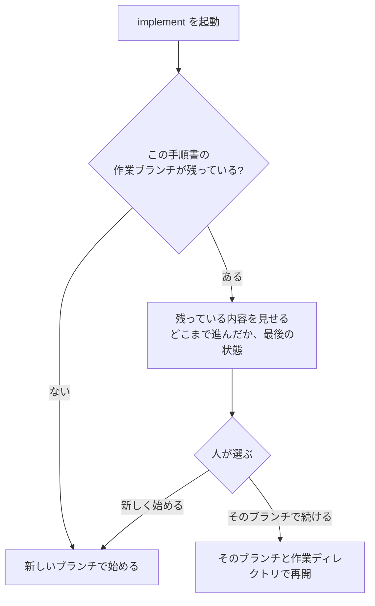

# agentic-workflow 移行ロードマップ

## 目的

`claude-skills`にあるworkflow責務を、一度に複製せず、小さな利用可能単位ごとに
`agentic-workflow`へ移す。

各フェーズは単独で利用価値を持ち、Agent Skills標準への準拠、実環境での動作、
機械検証、トークン効率を確認してから完了する。あるフェーズの完了は、次のフェーズを
自動的に開始する権限を与えない。

## 現在地

最初の移行では全workflowを一つのplanへ含めたため、文脈が肥大化し、未合意の設計判断と
review loopを招いた。また、旧skill全体を読まず、名前の分類だけを全体調査として扱った。
`cycle/20260821172451`の実装は成果物および移植元として採用しない。失敗原因と消費を
確認できる記録としてのみ隔離する。

再移行は、承認済みのworkflow仕様とトークン効率化資料を入力にして、`main`から開始する。
既存実装のコード、schema、test、独自メタデータは移植元として扱わない。新しいフェーズで
必要性が独立に証明された小さな部分だけ、元の`claude-skills`と再比較して再利用を判断する。

2026-08-23時点の現在地はPhase 3.5である。Phase 1〜3でbrainstorm、plan、実装の三つのskillを
作ったが、Phase 4に入る前の試運転で、planが作った手順書を実装skillが読めないこと、途中で
止まった実装を誰も片付けられないこと、そして仕様書が条文の羅列で人間が読んで判断できない
ことが分かった。Phase 4は中断し、先に仕様書の書き直しと手順書の受け渡しの修正を行う。

## 全フェーズ共通の契約

### 小さく移す

- 一つのフェーズでは、一つの利用者向け能力だけを完成させる。
- 一つの実装cycleでは、原則として一つのskillだけを移行する。
- 複数skillの責務を統合する場合も、成果物は一つの利用者向けskillに限定する。
- 各skillまたは独立した利用者価値に、個別のbrainstorm、実装、検証、reviewを用意する。
- 仕様文書とplanの一対一対応は要求しない。planは関係する承認済み仕様条項へ追跡できればよい。
- 一つのplanへ複数の独立skillや将来フェーズを含めない。
- フェーズ終了時に必ず停止し、人間が成果と実測値を確認する。
- 次のフェーズは、新しい会話または明示的な再開指示から始める。

### Brainstormを二つの粒度に分ける

プロジェクト全体のbrainstormと、一つのskillを実装するbrainstormを同じ成果物として
扱わない。

#### 戦略brainstorm

- プロジェクト全体の目的、原則、責務境界、移行順序を決める。
- 成果物はROADMAPとし、直接実装planへ変換しない。
- 複数skillや複数cycleを含んでよい。
- 各フェーズで改めて決める事項を明示する。

#### 実装brainstorm

- ROADMAP上の一つのskillまたは一つの利用者向け能力だけを対象にする。
- 元skillのsource auditと、直前フェーズの実測結果を入力にする。
- 配布、実行、状態、外部I/O、人間ゲート、機械検証を決める。
- 成果物は、そのskillだけを実装できる、現在の利用者の言語による仕様集合とする。
- 一つのcycleで完了できることを確認してからplanへ進む。

### Plan readiness gate

次をすべて満たさないbrainstormは、実装planへ変換しない。

- 成果物が一つのskillまたは一つの独立した利用者向け能力に限定されている。
- 利用者が得る結果を一文で説明できる。
- 対象と対象外が明示されている。
- 配布単位と実行方法が決まっている。
- 永続状態、寿命、migrationが決まっているか、適用外と確認されている。
- 外部I/Oと必要な権限が決まっている。
- 人間が判断する項目と提示内容が決まっている。
- 完了を判定する機械的なoracleがある。
- 変更予定のskill、scripts、references、fixturesを列挙できる。
- 未決定の基礎設計が残っていない。
- 一つのcycleで実装、検証、reviewまで完了できる見込みを説明できる。

満たさない場合はplanを大きくするのではなく、ROADMAP上の複数フェーズへ分解する。

### Agent Skills標準に従う

- 各skillは`SKILL.md`を中心とした標準的なskillディレクトリとして配布する。
- 決定的な処理が必要なら、そのskillの`scripts/`へ実行可能な形で同梱する。
- 補助文書はそのskillの`references/`へ置き、`SKILL.md`から相対パスで参照する。
- 外部依存が必要なら`compatibility`へ明記する。
- 実際に解釈するconsumerが存在しない独自メタデータを追加しない。
- 共有runtimeやplugin全体を暗黙の前提にしない。
- `skills-ref validate`に加え、対象クライアントへskill単体を配置した起動試験を行う。

### 完了の示し方と、LLMを実際に走らせる確認の扱い

作るものは二種類しかない。決まった入力に決まった出力を返すコード（補助script、手順書を
読む処理など）と、LLMに読ませる文章（`SKILL.md`、references、仕様書、手順書）である。

- コードは、先に失敗するテストを書き、それを通すことで完了を示す。
- 文章は、決めた内容で存在し、形式検査を通り、人が読んで承認することで完了を示す。
  文章に対して、LLMを実際に走らせて振る舞いを確かめること（以下「実測」）を既定では
  要求しない。
- 実測は、人が名前を挙げて頼んだときだけ行う。そのとき確認する場面は一つ、使うLLM
  backendは一つ、費用の上限（request数または時間）を先に決める。
- LLM側が「これは実測すべきだ」と判断したら提案してよい。ただしワークフロー系の作業は
  実測に倒れやすい偏りがあるため、提案は抑制的にする。
- 旧版`claude-skills`との操作回数・トークンの比較測定は行わない。移行の判断材料としての
  役目は終えている。
- 品質を下げるトークン削減は採用しない。
- 実測していない改善を、効率化の成果として記載しない。

Phase 1〜3の完了条件に残っている「固定fixtureでの実測」「旧版との比較」は、当時そのように
判断して完了した記録として残す。今後のフェーズには適用しない。

### 合意を越えない

- planは合意済みの意味を実装手順へ変換する。新しい製品設計を追加しない。
- 新しい配布方式、runtime、永続化方式、独自schema、外部依存はbrainstormへ戻す。
- 人間向けの判断材料は現在の利用者の言語と平易な言葉で提示する。
- 正本spec、正本plan、ROADMAPは現在の利用者の言語で記述し、利用者が翻訳を介さず意味を確認できるようにする。
- 条項ID、状態名、schema fieldなど機械処理に必要な識別子は英語を使用してよいが、
  その意味と判断材料は現在の利用者の言語で記述する。
- 未決定事項を実装者やreviewerが補完しない。

### reviewを収束させる

- 初回reviewでfinding集合を固定する。
- 各findingへ再現テスト、静的検査、または明示的な人間ゲートを割り当てる。
- 修正後は固定findingと関連diffだけを再確認する。
- 再reviewで見つかった別問題は現在の合否へ追加せず、後続候補として分離する。
- INFOは修正ループへ入れない。
- second reviewerは現在の実行でflagまたは対話により人間が明示した場合だけ、一度だけ起動する。許可を持ち越さず、自動再試行しない。

## 移行順序


矢印は候補順序を示すだけで、自動進行を意味しない。

## Phase 0: 移行基準の修復

### 目的

再移行の開始地点と、今後越えてはいけない境界を明確にする。

### 対象

- 失敗した実装ブランチを未採用の記録として保持する。
- `main`上の正本spec、brainstorm記録、トークン効率化資料を確認する。
- 既存の英語specを、条項IDと意味を維持した日本語specへ置き換える。
- spec内の`core`が共有runtimeを意味しないことを明記する。
- specification verificationを独立skillとして移植しないことを明記する。
- Agent Skills標準準拠とskill単体配布を受入条件へ追加する。
- 最初の移行対象である旧`brainstorm`について、`SKILL.md`だけでなく直接参照される
  references、scripts、fixtures、共有契約まで読む。
- 旧`brainstorm`のsource auditを作り、利用者価値、責務、trigger、依存関係、永続状態、
  人間ゲート、機械検証、既知の失敗、トークン要因、残す挙動、捨てる挙動を記録する。
- 後続skillは移行直前に同じsource auditを行う。全skillの調査完了をPhase 1の開始条件にしない。
- 直接依存と共有契約を可視化し、単独で読んだだけでは判断できない責務を明示する。

### Source auditの必須項目

| 項目 | 記録する内容 |
|---|---|
| Source | 読んだ`SKILL.md`、references、scripts、fixtures、共有契約とsource revision |
| Trigger | 何をきっかけに起動するか |
| User value | 利用者のどの摩擦を解決するか |
| Responsibility | そのskillが所有する責務 |
| Dependencies | 他skill、共有契約、外部tool |
| Persistent state | 保存する状態、保存先、寿命 |
| Human gates | 人間が判断する場所と提示内容 |
| Mechanical checks | script、test、validator、未検証部分 |
| Token costs | 長い文書、再読、subagent、review loop |
| Known failures | 漏れ、儀式化、非収束、互換性問題 |
| Destination | 移植、統合、後回し、rules、meta、UI、廃止 |
| Rationale | その行き先を選ぶ理由 |
| Acceptance fixture | 移行後も維持する観測可能な挙動 |
| Excluded behavior | 意図的に捨てる挙動と理由 |

### 対象外

- workflow skillの実装
- 失敗ブランチからのコード移植
- skill名だけに基づく分類
- 新しい共通runtimeの選定

### 完了条件

- 日本語の移行境界を人間が説明できる。
- 旧`brainstorm`に読了したsource一覧とsource auditがある。
- 旧`brainstorm`の直接依存と共有契約が列挙されている。
- 旧`brainstorm`から残す挙動と捨てる挙動が証拠から決まり、受入fixtureと理由がある。
- 未決定の設計事項が、後続planへ紛れ込まない。
- Phase 1だけを対象とした新しいplanを作成できる。

## Phase 1: Brainstorm vertical slice

### 利用者価値

広い依頼を独立した利用者価値へ分け、最初の一フェーズだけを詳細化する。対話の途中で
compactや中断が起きても意味を失わず、利用者が直接読める仕様集合とplan readiness結果を作る。

### 統合する責務

- 旧`brainstorm`の対話と要件深掘り
- 旧`ledger`の合意、禁止、未決定、委任、改訂の管理
- 旧`decision-journal`のうち、高影響判断に必要な選択肢、採否理由、証拠、再検討条件
- 旧`spec-verify`のうち、条項抽出、projectに適した検証方法の選択、検証不能項目の検出、反例の記録

これらは一つのbrainstorm体験へ統合する。`ledger`、`decision-journal`、`spec-verify`を
独立した利用者向けskillとして作らない。

### 成果物

```text
skills/ba0918-brainstorm/
├── SKILL.md
├── scripts/
├── references/
└── fixtures/
```

- 現在の利用者の言語による正本spec
- 広い依頼から分けた全体フェーズと、最初に詳細化する一フェーズ
- 合意、禁止、未決定、委任、却下、改訂、現在位置の復元可能なprogress
- plan readinessの合否と不足項目
- 条項ごとの観測可能な成功条件、反例または既知の失敗、projectに適した検証方法
- 機械検証できない項目に対応する人間ゲート

brainstormはplan生成、ideaのarchive・drop、cycle開始を所有しない。

### 必須fixture

- 今回のような広い移行依頼を一つのplanにせず、全体フェーズと最初の一フェーズを提示する。
- compact後も合意、禁止、未決定、委任、却下、改訂、次の論点が復元される。
- 意味が変わらない会話では状態を書き換えない。
- 同じsessionへの同時更新を上書きまたは自動mergeせず、競合として停止する。
- wrapと承認の成功後はprogressを除去し、失敗時は再開可能な状態で残す。
- 高影響判断の理由と再検討条件が残る。
- PBTに向かない条件を無理にPBTへ変換しない。
- 人間判断が必要な条件を自動成功にしない。
- 利用者が読めない言語のspecまたはplanを承認対象にしない。
- planで未合意のruntime、保存方式、skill分割、architectureを補完しない。
- 明示許可なしにsecond reviewerを起動しない。
- 旧idea memoを新形式へ自動変換しない。

### 完了条件

- skill単体がAgent Skills標準検証を通る。
- まず利用者指定の低コストな`opencode --auto` process backend上で、対話から承認までの一本が実際に動く。
- Claudeでの実測は利用可能になるまで保留し、現在phaseの完了を妨げない。
- Codexで実測する場合は`gpt-5.6-luna`を明示し、既定modelや`gpt-5.6-sol`を使わない。
- `ba0918-skill-regression`の同じscenarioを利用可能なbackendで実行し、結果をbackend別の独立した証拠として記録する。
- 固定fixtureが、重大な仕様漏れと不適切な検証方法を検出する。
- 旧版との品質・操作・トークン比較が記録される。
- 人間が現在の利用者の言語による正本specを読み、意味を承認する。

### 現在の検証状況

- `opencode-go/deepseek-v4-flash`で広域依頼分割、compact後の復元と競合拒否、利用者言語のwrap/readinessを最終contractに対して再実測し、三scenarioがPASSした。
- 承認前draftをchatだけで提示し、fileを変更しないことをworktreeで確認した。
- 現在のbehavior surfaceを`regression-lock.json`へ記録した。
- Phase 1専用acceptance runで、同一progressの作成、日本語draft提示、人間承認、承認内容と同一hashの正本反映、内容確認、progress除去を順に確認した。
- 旧版`claude-skills@57bb6f06aecdf191d46d99d9a3283233a26ecfdd`と同一入力、同一`opencode-go/deepseek-v4-flash` backendで比較した。旧版は14 request、197.9秒、input 49,109、output 15,092、reasoning 1,292、cache read 288,768 token、$0.023638796だった。新版の有効runは5 request、75.7秒、input 16,639、output 2,450、reasoning 5,941、cache read 73,472 token、$0.009712944だった。
- 旧版は初回応答で重要な反例を深く問う一方、六つの質問と利用不能な自動second reviewerを起動した。新版は全体を独立phaseへ分け、次の重要判断を一問に限定し、無許可の外部呼出しとfile更新を行わなかった。
- 新版の初回比較runはreport生成後にbackend processが終了せず300秒でtimeoutしたが、同一条件の一回再実行では再現しなかった。未確認事項としてruntime固有の単発timeoutを残す。
- 旧版の全42契約を固定revisionから照合した。plan/archive/drop/cycle、旧idea memo、強制wrap、自動second reviewerは承認済みspecによる責務分離または安全gateを根拠に移行しない。
- 最終監査で見つかったpre-wrap自己監査、保存先policyのfail-closed処理、機密情報の人間確認境界、人間不在時の再開可能な停止、完了summary、open question契約を補い、unit test 11件とskill interface静的検査を通した。

重要機能の欠落、安全制約違反、重大な品質劣化は残っていないため、最終判定を「移行可」とする。Phase 1は完了とし、このrunではPhase 2へ進まない。

### Phase 1 acceptanceと旧版比較の完了条件

Phase 1のacceptanceと旧版との比較は、次の条件をすべて満たしてから完了とする。

- 既存の三つの回帰scenarioは変更せず、承認成功pathをPhase 1専用の独立したacceptance runとして検証する。
- 同一runでprogress作成、日本語draft提示、人間承認、正本更新、内容確認、progress除去の順序を証明する。
- 旧版はclaude-skillsの固定revision 57bb6f06aecdf191d46d99d9a3283233a26ecfddとし、同一入力で新版と比較する。
- 最終比較では要求充足、曖昧さの扱い、重要事項の深掘り、不要な承認要求、正本反映、失敗時の透明性を評価する。
- 重要機能の欠落、安全制約違反、重大な品質劣化を平均点で相殺してはならない。
- 正当な削除は承認済みspecの廃止、置換、責務移管を根拠とし、spec外でも互換性、安全性、データ保護、中核価値への重大影響を確認する。
- 低コストな契約完全性検査を先に行い、同一入力による内容品質の実測は最後に限定する。
- 最終評価は移行可、修正後に再評価、移行不可のいずれかで判定し、根拠と未確認事項を記録する。

## Phase 2: Plan

### 開始条件

Phase 1が完了し、brainstormが生成するspec、検証契約、反例の形式が実利用で安定している。

### 利用者価値

承認済み仕様を、実装者が勝手に意味を補わない実行計画へ変換する。

### 対象

- 承認済み条項、検証契約、反例からplanを生成する。
- 正本planは現在の利用者の言語で、変更箇所、変更しない箇所、外部影響、主要リスク、完了証拠を示す。
- 未決定事項、証拠不足、依存関係不明をplan作成前に拒否する。
- 正本と同一内容の草稿を人間が確認した後にだけ、正本planを書き込む。
- plan本文を進捗更新に使わず、後続工程が必要証拠から進捗を導出できるようにする。
- 未完了planを履歴全体から探さずに済む、再構築可能な内部索引を持つ。
- 現在対象planの切替では人間確認を必須とし、dirty worktreeを再開可能に隔離できない場合は停止する。

### 対象外

- 要件の追加や再解釈
- 実装
- review
- 複数planの並列実行
- TDD、branch、worktree操作
- resume、checkpoint、完了判定
- 手書きstatus、session history、plan本文の進捗checkbox

### 完了条件

- 一つの小規模fixtureをplanへ変換できる。
- 全plan項目がspec条項と検証条件へ追跡できる。
- 人間が正本plan全体だけで変更範囲、非変更範囲、外部影響、主要risk、完了証拠を判断できる。
- 人間確認前に正本planと未完了plan索引を変更せず、確認内容と同じidentityのplanだけを正本化する。
- runnerがstatus更新を省略しても、証拠がない項目を未完了として安全に扱える。
- 既存planの無言の置換、自動abandoned、dirty worktreeからの変更持越しを拒否する。
- 旧planのstatus、session history、resume、checkpoint、TDD、caller-supplied modeの処遇がsource auditから追跡できる。
- plan内部表現は、実測上の必要性が出るまで大規模な共有runtimeにしない。

### 現在の設計状況

- Phase 2固有の承認済み仕様と旧planのsource auditを`docs/spec/plan-skill-migration.md`へ記録した。
- plan skillはplan作成と手順revisionに限定し、TDDと実装をPhase 3、resumeとcheckpointをPhase 5へ移す。
- `status.md`、`session-history.md`、plan本文の進捗checkbox、headless自動abandonedを移植しない。
- 通常の実行対象は一件とするが、保留中の未完了planは複数保持できる。並列実行は明示的な別経路が所有する。
- 正本plan全体を現在の利用者の言語で書き、LLMだけが読む規範層を作らない。

### 現在の検証状況

- `ba0918-plan`を薄い`SKILL.md`、選択的に読む三つのreference、決定的なartifact helperとして実装した。通常の作成pathは136行、既存plan切替を含むpathでも174行のinstructionを読む。
- Python `unittest`は既存11件とplan用9件の合計20件がPASSした。identity不一致、path traversal、symlink、既存planの確認なし切替、dirty worktree、revisionのin-place変更を拒否する。
- `validate_repo.py`、三つのfixture schema、Markdown参照、`regression-lock.json`のfreshnessとcoverageを検証した。`skills-ref`実行体は環境に存在しないため、その名称での検証だけは未実施である。
- `opencode-go/deepseek-v4-flash`で、完全入力の日本語plan、不完全入力のbrainstorm返却、既存planとdirty worktreeの保護を再実測した。全critical条件をartifactとbaseline hashから再判定し、三scenarioをPASSとして現在のbehavior surfaceをlockへ記録した。
- 回帰中に、確認前のscratch draft作成、正本本文外へのplan ID/revision表示、仕様外の入力class追加を検出した。各原因を修正し、影響scenarioだけを再実行して固定した。
- skill単体の受入では、第一clientが正本全文、保存先、identityを提示してfileを変更せず停止し、確認済みbytesを受け取ったpublication clientが正本化、索引登録、読戻しidentity確認、一時file削除まで完走した。正本と索引は`sha256:53754da436ec3538ec1ed25887364c15eb52d3cae5b0a73ddacfea89eed93d9a`で一致し、`status.md`と`session-history.md`は作られなかった。
- OpenCode 1.18.18の`--session`による同一session継続は二回とも無出力でtimeoutした。部分書込みはなかった。確認済みbytesとidentityを明示した新規clientではpublicationが成功したため、skillのpublication契約とは分離したclient runtimeの未確認事項として残す。
- 同一入力・同一backendで固定revision`claude-skills@57bb6f06aecdf191d46d99d9a3283233a26ecfdd`の旧planと比較した。旧版は264.9秒、38 tool call、input 53,630、output 5,815、reasoning 25,343、cache read 1,147,392 token、約$0.040394624だった。新版の成功した草稿提示とpublicationの合計は86.2秒、25 tool call、input 56,553、output 6,664、reasoning 1,649、cache read 326,400 token、約$0.02021304だった。
- 旧版は質問なしでplanを書いたが、人間確認前に`status.md`、artifact policy、workspace policy、`.gitignore`と複数artifact directoryまで作成した。新版は人間が読む同一正本を確認対象にし、status、session history、TDD、resume、checkpointを移植せず、仕様外の意味を追加しなかった。

重要機能の欠落、安全制約違反、重大な品質劣化は残っていないため、最終判定を「移行可」とする。Phase 2は完了とし、このrunではPhase 3へ進まない。

## Phase 3: Implement and Cycle

### 開始条件

Phase 2のplanを人間が確認し、実装開始を明示している。

### 利用者価値

合意済みplanを専用worktreeでRED、GREEN、REFACTOR、commitの証拠付きで実装し、
独立reviewへ渡せる状態を作る。

### 対象

- `plan-implement`相当のTDD実装を一つの`ba0918-cycle`へ統合する。
- planを明示入力、直前のpublication結果、正常なcurrent plan索引から安全に解決する。
- repository単位claim、専用branch、linked worktreeへ実行をbindする。
- 現在の実行agentが直接TDDを実行し、nested delegationを行わない。
- plan、spec、worktree、oracle、write scopeのidentityを各境界で再確認する。
- RED、GREEN、REFACTOR、commitをimmutable eventとしてplan項目へ結び付ける。
- blocking failureでは追加編集を止め、worktree、commit、証拠を保持する。

### 対象外

- review policy、fix loop、final gate
- resume、checkpoint、Recovery
- dependency解析による部分継続
- parallel cycle
- merge、publication、issue管理
- worktree cleanup
- status、session history、plan本文または進捗fileの更新
- legacy artifactと旧cycleの後方互換

### 完了条件

- 一つの承認済みplanを、専用worktreeの実コード変更、GREEN、step単位commitまで完走できる。
- production codeを書く前に、承認済み条項に対応するREDを期待した理由で確認する。
- 意図しないREDをproduction変更とcommitの前に拒否する。
- spec、plan、worktree、oracleのidentity driftを追加編集前に拒否する。
- fresh sessionが会話履歴へ依存せず、正本とbindingから同じgateを実行できる。
- 正常、identity drift、意図しないREDの三scenarioを実agentで検証する。
- Phase 4が同じbranch、worktree、commit、evidenceを受け取れる。
- Phase 3はplan全体の完了、再開、cleanupを宣言または実行しない。

### 現在の検証状況

- `ba0918-cycle`を薄い`SKILL.md`、境界ごとに読む三つのreference、決定的なruntime helper（pure modelとGit/process adapter）として実装した。実行agentが直接TDDを行い、subagentへ再委譲しない。
- Python `unittest`は既存20件とCycle用97件の合計117件がPASSした。identity drift、意図しないRED、凍結testの弱体化、scope外staging、未記録commit、permission retry、test件数の取得不能、Human gate宣言の厳密検証を否定例として固定している。
- 最初の実process実走では、実行agentが候補oracleの組み立てで二度停止した。runtimeが要求するfailure kindの語彙と、failure signatureが出力行の部分文字列でなければならない制約が指示に書かれていなかったことが原因で、特定のbackendの能力差ではない。候補oracleの機械契約を`tdd.md`へ移し、あわせてCY-053に従い候補が予測できるfailure kindを`behavior_failure`に限定した。
- 修正後、`opencode-go/deepseek-v4-flash`で正常完了、spec drift停止、意図しないRED拒否、test弱体化拒否の四scenarioを再実走し、event chain、凍結oracle、commit、main checkout、linked worktreeのpost-stateから全criticalを判定してPASSとし、`regression-lock.json`へ記録した。Planの人間gate宣言の追加で古くなっていたPlanのlockも三scenarioを再実走して更新した。
- 同一fixtureを`opencode-go/ox-alpha-free`でも実走した。spec driftとtest弱体化は同じ停止理由で正しく止まったが、正常完了と意図しないREDの二本は600秒で打ち切られ報告が得られなかった（意図しないREDはpost-state上は正しく停止していた）。補強証拠としてのみ扱い、受け入れ根拠にはしない。
- 旧版`claude-skills@57bb6f06aecdf191d46d99d9a3283233a26ecfdd`の`cycle`と同一fixture、同一prompt、同一backendで比較した。旧版は主session 32 request、subagent 3 session 35 requestの合計67 request、input 143,383、output 93,376、cache read 3,696,384 token、約$0.119で、900秒のtimeoutまでに報告を返さなかった。新版は34 request、126秒、input 34,764、output 13,090、cache read 1,138,944 token、約$0.024で`implementation_green`まで完走した。
- 旧版はmain checkoutのbranchをその場で切り替え、scope外の`.gitignore`変更をcommitし、plan本文のStatusを`Completed`へ書き換え、review・final gateまで自走した。新版はlinked worktreeに隔離し、plan本文と索引を変更せず、reviewを開始せずに引き渡す。これらは承認済み仕様（CY-023、CY-073）と対象外の責務分離による差であり、欠落ではない。
- 残る未確認事項: planとworktreeのidentity drift、fresh session再入（`load`→`context`）を実agentで検証するscenarioはまだない。eval case定義の言語規約上の扱い、`execution.md`の再入手順がROADMAPの「resume」対象外に当たるかは人間の解釈が要る。

実装と受け入れ実測の範囲では重要機能の欠落、安全制約違反、重大な品質劣化は見つかっていない。Phase 3の実装と実測は完了とし、「移行可」の判定はPhase 4 reviewの合格をもって確定する。Phase 4へはbranch `cycle/20260822143915-implementation`、linked worktree、commit列、`regression-lock.json`を渡す。mainへのmergeとworktree cleanupは行わない。

### Phase 3.5による改訂

上の対象・完了条件はPhase 3当時の記録である。次の決定はPhase 3.5で取り消した。
理由と新しい形はPhase 3.5の節にある。

- 実装開始時にリポジトリ全体へ置く「使用中」の印（`.agents/runtime/cycles/current.claim`）
- 手順書の全ステップに「先に失敗するテスト」を要求すること
- `ba0918-cycle`という名前（`ba0918-implement`へ改名）

## Phase 3.5: 仕様書の書き直しと、手順書の受け渡しの修正

### なぜこのフェーズが要るか

Phase 4に入る前の試運転で、三つの問題が同時に見つかった。

1. planが作った手順書を、実装skillがそのまま読めなかった。手順書の書式と、実装skillが
   受け付ける書式の約束が、どこにも書かれていなかった。
2. 実装skillは、手順書の全ステップに「先に失敗するテストを書いて、それを通す」という証拠を
   要求していた。しかし「仕様書を書く」「設定を足す」「実機で動かして確かめる」といった
   ステップには、失敗するテストが原理的に存在しない。つまり、文章を作る手順書は完了判定に
   到達できない。
3. 途中で止まった実装を、誰も片付けられなかった。実装skillは開始時にリポジトリ全体へ
   「使用中」の印を置き、印を外す役目はPhase 5に予定されていて存在しなかった。

さらに根本として、仕様書（`docs/spec/`の4本）が「`CY-050` 〜しなければならない」という
条文の羅列で、利用者が読んで「この設計でよい」と判断できる形になっていなかった。
正本を日本語で書くことで承認の儀式化（理解しないまま判を押すこと）を防ぐはずだったが、
言語を変えただけで、読めない文書に判を押させる構造は残っていた。

これらは三つのskillを一つずつレビューしても見えない。skillとskillの継ぎ目と、文書全体の
読みやすさを、まとめて見直す必要がある。

### 利用者が得るもの

このプロジェクトを知らない人が仕様書を読んで、仕組みと判断点を自分の言葉で説明でき、
そのうえで承認できる。planが作った手順書を実装skillがそのまま実行でき、途中で止まっても
続きか最初からかを選んで再開できる。

### 対象読者と書き方

仕様書、手順書、このROADMAP、チャットの応答は、すべてこのプロジェクトを知らない初学者に
向けて書く。基準は`ba0918-readability`の規則であり、新しい契約は作らない。

- このプロジェクトの中でしか通じない名前（claim、oracle、attempt、identityなど）を、説明
  なしに使わない。使うなら先に意味を平易に述べてから名前を出す。
- 流れや関係の説明には図（mermaid）を使う。
- 条文IDの羅列を本文の主役にしない。
- 「正本はLLM向けに密度を優先してよく、人間には要約だけ見せる」という考え方
  （旧`claude-skills`の human-readable-summary 契約）は採用しない。人が承認する文書は
  人が読める文書でなければならない。

### 仕様書の新しい構成

いまの4本（全体 / plan / cycle / review）は、移行フェーズごとに書かれていて、旧版との比較
（source audit）や実測結果が混ざっている。これをワークフローのステップごとに分け直す。

| 文書 | 中身 |
|---|---|
| `docs/spec/README.md` | 全体の要約。何のための仕組みか、各文書へのリンク |
| `docs/spec/workflow.md` | 全体の流れ、想定する使い方、各ステップ間の受け渡しの約束 |
| `docs/spec/brainstorm.md` | brainstormが何をして何を作るか、人が判断する場面、やらないこと |
| `docs/spec/plan.md` | 同上（plan） |
| `docs/spec/implement.md` | 同上（implement。旧cycle） |
| `docs/spec/review.md` | 同上（review） |

- ステップ間の受け渡し（たとえば「planが作る手順書を実装skillがどう読むか」）は
  `workflow.md`に一か所でまとめる。継ぎ目のズレは両側を並べて見ないと分からない。
- 移行の経緯（旧`claude-skills`との比較、フェーズごとの実測結果）は仕様書に置かない。
  必要ならこのROADMAPに一つの表として置く。
- 新しい文書が承認された時点で、旧4本は削除する。経緯はgit履歴とROADMAPに残る。

### 手順書のステップと、完了の示し方

手順書の各ステップは、完了をどう示すかを次の三種類から選んで明記する。実装skillは種類
ごとに違う証拠を受け取る。

| 種類 | 何に使うか | 完了の証拠 |
|---|---|---|
| テストで示す | 決まった入力に決まった出力を返すコード | 先に失敗するテストを書き、直して通す |
| 作った物で示す | LLMに読ませる文章、設定ファイル | 決めた内容で存在し、形式検査を通り、人が読んでOKと言う |
| 外で確かめる | 実機での動作確認、人が頼んだ実測 | 実行結果を人が見てOKと言う |

「テストで示す」と「作った物で示す」の境界は、「全フェーズ共通の契約」の「完了の示し方」
の節に従う。文章の成果物に実測を既定で要求しない。

### 実装skillの改名と、止まった実装の扱い

- `ba0918-cycle`を`ba0918-implement`へ改名する。「cycle」は旧版の「refine → implement →
  review を回す」を指す名前で、いまの責務（与えられた手順書を実装する）より大きい。
- 実装開始時にリポジトリ全体へ置いていた「使用中」の印を廃止する。作業は常に専用ブランチと
  専用作業ディレクトリ（git worktree）で行うので、ファイルの衝突はそれで防げている。印の
  理由は「並列実行を考えたくない」という消極的なもので、止まった実装を誰も外せない構造を
  生んでいた。
- 実装skillは何も削除しない。同じ手順書の作業ブランチが残っていたら、人に「そのブランチで
  続けるか、新しいブランチで最初からやるか」だけを聞く。新しくやる場合は新しいブランチを
  切り、古いブランチと作業ディレクトリは放置する。不要になったものの削除は人の手作業。



「そのブランチで続ける」を最初の版で実装するか、仕様書には描いて未実装と明記するかは
未決である（決定者は人間）。

### レビューの観点

brainstorm、plan、implementの三つのskillは、単体ではなく三つをまたいで俯瞰でレビューする。
今回の継ぎ目の不具合は単体レビューでは見えなかった。Phase 4のreview設計には、ステップ間の
受け渡しを見る観点を含める。

### 対象外

- Phase 4（review）の実装。このフェーズの完了後に再開する。
- 前回止まったまま凍結している実装（実行ID `20260823t050354-ea799410`）、その印、作業
  ブランチ、作業ディレクトリへの操作。人の明示の指示があるまで触らない。
- 「そのブランチで続ける」の本格的な再開機能（Phase 5で扱う範囲と重なるため、実装範囲は
  次の実装brainstormで決める）。

### 進め方

1. 最優先は仕様書の書き直し。新構成の6文書を、実装brainstormで一つずつ草稿化し、人が読んで
   承認する。
2. 仕様書の承認後、plan skill（手順書の書式と完了の示し方の明記）、implement skill（改名、
   印の廃止、残り作業の2択、種類ごとの証拠）の順に手順書を作って実装する。
3. このROADMAP自体も、仕様書の後に同じ基準で書き直す。

### 完了条件

- 新しい6文書が存在し、利用者が読んで承認している。
- 説明なしの内部用語が残っていない（反例: 読者が意味を知らないまま`claim`や`oracle`という
  語に出会う）。
- planが作った手順書を、implementがそのまま受け付ける。
- 文章だけの手順書（テストで示すステップが一つもない手順書）でも、implementが完了判定に
  到達できる。
- 同じ手順書の作業ブランチが残っている状態でimplementを起動すると、続けるか新しく始めるかを
  人に聞く。
- 検証方法: 人が読む。加えて、文書中の内部用語・略語・ファイルパスを列挙し、初出時に説明が
  あるかを機械的に前検査する。実測は人が頼んだときだけ。

## Phase 4: Review

### 開始条件

Phase 3.5が完了し、新しい仕様書が承認されている。Phase 3でGREENと実装証拠が得られている。

### 利用者価値

問題を見つけながら、findingを無限に増やすreview loopを発生させない。旧`plan-reviewer`の
7観点並列subagentと常時second opinionによるtoken消費を、security findingとcritical級の
指摘を落とさずに減らす。

### 対象

- Phase 3の引き渡し物（attempt、branch、linked worktree、commit列、`regression-lock.json`）のidentityを検証してから初回full reviewを行う。
- 初回reviewから安定ID付きのfinding集合を固定する。安定IDは再現oracleから導出する。
- severityと必要actionを分離する。severityは`security`、`critical`、`warn`、`info`とする。
- 同じ根本原因のfindingをまとめる。
- findingごとに再現oracleを固定し、作成時点でREDを観測する。
- severityの候補ごとに入力範囲を変え、観点ごとに入力を読み直さない。
- 修正後は未解決findingと、finding IDをtrailerに持つ修正commitのdiffだけを再確認する。
- 差分再reviewで見つかった別問題は現在の合否へ混ぜず、後続候補へ分離する。
- 必須security項目と任意second reviewerを分離する。
- finding集合とround判定を、cycleのattempt配下のdurable eventとして保存する。
- fix側との受け渡し契約（読み取り専用のfinding集合、ID trailer付きcommit、後続候補の出口、完了claimを信用しないoracle再実行）を定義する。
- review観点をprofile（`references/profile/default.md`、`skill.md`）として分離し、diffのfile種別から自動選択、明示optionで上書きできるようにする。SKILL本体は選ばれたprofileだけを読む。
- review強度を`--level=light|standard`で指定できる。既定はstandard、lightはsecurity/criticalだけを見る。oracle必須と収束契約はlevelで変えず、変更量からの自動選択はしない。

### 対象外

- 全文敵対reviewの自動反復
- INFOの自動修正
- 差分再review中の新規finding追加
- 明示されていないsecond reviewer
- fixの実装、fix loopの進行制御、修正主体の呼出し
- final gate、doc-check、merge、worktree cleanup
- round上限による自動loop

### 全体flowにおける位置

```text
brainstorm -> plan -> implement(TDD実装) -> review(初回full review)
  -> fix-loop( 修正 -> review(差分再review) の往復 ) -> doc-check -> final gate -> done
```

- fix-loopは渡された修正事項を収束させるだけの薄いオーケストレータとし、後続phaseで扱う。reviewもfix-loop内の修正主体も、単体ではloopの責務を持たない。
- fix-loop内の修正主体を利用者向けskill（`iterate`）として分離するかは、`investigate`等の移植時の修正flowと合わせて後続phaseで判断する。
- final gateは人間確認と仕様整合の最終品質gateとし、致命的な問題はbrainstormへ、調整はfix-loopへ戻す。位置づけのみ記録し、本phaseでは実装しない。
- 工程遷移（cycle→review→fix-loop→doc-check→final gate）を誰が駆動するかは未決である。オーケストレータにworkflow domainが注入されないと正しいskillを読めず自走できないため、後続phaseで所有者を決める。
- `ba0918-cycle`は`ba0918-implement`へ改名する（Phase 3.5で決定）。
- brainstorm、plan、implementの継ぎ目（ステップ間の受け渡し）を見る観点をreviewに含める（Phase 3.5で決定）。

### 成果物

```text
skills/ba0918-review/
├── SKILL.md
├── scripts/
└── references/
    └── profile/
        ├── default.md
        └── skill.md
```

### 必須fixture

- 全テストGREEN後、reviewのたびに新しいfindingが追加されるケースを拒否する。
- 同じfindingのoracleがGREENなら、そのfindingを閉じる。
- 別問題は現在の合否へ混ぜず、後続候補へ分離する。
- `--second-reviewer`相当の明示optionなしにsecond reviewerを起動しない。
- profile散文にはfixtureを作らず、dogfoodingで直す。

### 完了条件

- 固定finding集合が有限回で収束する。
- review一回あたりの入力範囲とトークンが記録される。
- 旧版より全文再読とreview回数が減っている。
- 旧版が検出したsecurity/critical findingを新版が落としていない。

### 現在の設計状況

- Phase 4固有の承認済み仕様と旧`plan-reviewer`のsource auditを`docs/spec/review-skill-migration.md`へ記録した。
- review skillは初回full reviewと差分再reviewに限定し、fix loopと修正主体、final gateを後続phaseへ移す。`docs/spec/cycle-skill-migration.md`のSource audit表が「fix loop、final gate」をPhase 4へ割り当てている点は、cycle仕様を書き換えずにreview仕様側で再routingを明記する。
- 初回full reviewは現在の実行agentが一回だけ行い、7観点を並列subagentではなく同一contextのchecklistとして回す。second opinionは明示optionがある場合だけ初回に一回併走させる。
- 仕上げのfull reviewは人間が明示するたびに新規contextのagentで一回だけ追加し、結果を固定集合へ合流させてから差分再reviewで閉じる。
- Claude Code組み込みの`/code-review`と公式`code-review` pluginは、実行agentによって存在せず品質がぶれ、finding IDと限定再reviewを持たないため、初回reviewの委譲先にしない。
- 旧`skill-reviewer`は実装のreviewでありmetaの責務ではないため、観点を`skill.md` profileとして本phaseへ同梱する。profileは散文1 fileで副作用がないため、cycle分割やprofile専用fixtureは作らない。
- 旧版比較と受け入れ実測のfixtureはPhase 3が残した実branch `cycle/20260822143915-implementation`を使い、合成fixtureは作らない。
- 実process実測と旧版比較は利用者指定のopencode backendの回復を待つ。設計、実装、unit testは先行してよいが、Phase 4の完了判定は実測後とする。

## Phase 5: Artifacts, Handoff, and Recovery

### 開始条件

Phase 1から4までで、保存すべき実データと再開要件が確定している。

### 利用者価値

compact、セッション切断、必須provider停止の後でも、意味と再開位置を失わない。

### 対象

- `.agents/artifacts`、`.agents/runtime`、`.agents/tmp`の責務分離
- 合意、spec revision、証拠、finding、再開位置の保存
- 古い証拠のstale化
- 曖昧な旧artifactの拒否または人間への差し戻し

### 完了条件

- Phase 1から4の中断fixtureを復元できる。
- 保存先、schema、寿命、migrationを明示している。
- 各skill単体配布を壊す共有依存を導入していない。

## Phase 6: Follow-up adapters

各項目を別フェーズ、別brainstorm、別planとして移す。一括移植しない。

候補順序:

1. `iterate`
2. `issue`
3. `parallel-cycle`
4. `github-issue`
5. `goal-decomposition`
6. `goal-loop`
7. `loop-triage`

各adapterはPhase 1から5の公開成果物だけを利用する。内部実装への直接依存を追加しない。

## Phase 7: General work modes

次のskillはtrunk完成後に個別移植する。

- `investigate`
- `systematic-debugging`
- `refactor`
- `sweep-fix`
- `problem-solving`
- `doc-check`
- `doc-write`
- `doc-audit`
- `generate-review-rules`
- `commit`
- `attack-review`
- `codebase-review`
- `review-deps`
- `review-testing`

一つのskillを一つの移行単位とし、必要なworkflow連携だけを追加する。

## Phase 8: UI workflow

UI workflowはcore移行と分離する。次を独立してbrainstormする。

- design guideとdesign system
- mockup生成
- pixel comparison
- visual regression
- accessibility
- UXの人間ゲート

UI固有の判断や証拠形式を、汎用workflowへ先回りして追加しない。

## このリポジトリへ移さないもの

### agentic-rulesで所有するもの

- design
- placement
- secrets
- TDD
- testing
- commit
- release
- delegation
- verification
- reuse
- scaffold
- human-readable

### agentic-metaで所有するもの

- context audit
- prompt tuning
- skill improvement
- skill interface audit
- skill regression
- skill reviewer
- trigger evaluation
- 将来のトークン効率改善skill

このリポジトリでは、公開済みのruleやmeta能力を明示的に利用するだけとし、重複実装しない。

## 各フェーズの開始テンプレート

各フェーズ開始時に、最低限次を現在の利用者の言語で提示する。

```text
利用者が得るもの:
今回移す責務:
今回移さない責務:
Agent Skills上の配布単位:
実行方法:
機械検証方法:
人間が判断する項目:
実測の要否と予算（人が頼んだ場合だけ）:
このフェーズの停止条件:
```

この項目を人間が理解できる状態になるまでplanを作成しない。
