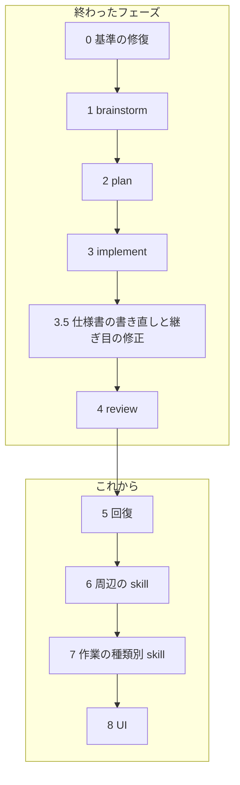

# agentic-workflow 移行ロードマップ

## この文書は何か

AI エージェントにソフトウェアの変更を任せるときの作業の進め方を、4 つのステップ
（brainstorm → plan → implement → review）に分けて決めた仕組みが、このリポジトリです。
各ステップは `skills/ba0918-<名前>/` にある「skill」（AI が読む手順書と補助スクリプト）
として配布します。仕組みの全体像は [docs/spec/README.md](docs/spec/README.md) にあります。

以前は `claude-skills` という別リポジトリの仕組みを使っていました。それを一度に複製せず、
小さな単位ごとにこのリポジトリへ作り直しています。この文書は、その作り直しをどの順番で
進め、いまどこにいて、次に何をするかを書いたものです。

読者は、このプロジェクトを初めて見る人です。仕様書と同じく、このプロジェクトの中でしか
通じない言葉は、先に意味を述べてから名前を出します。

## 現在地（2026-08-25）



矢印は候補の順序で、あるフェーズが終わっても次が自動で始まることはありません。
次のフェーズは、人が新しい会話か明示の指示で始めます。

Phase 4 までで、brainstorm、plan、implement、review の 4 つの skill と、6 本の仕様書が
`main` にあります。次は Phase 5（記録と回復）です。Phase 5 の brainstorm は済み、最初の
一枚（5.1）は実装と review を終えて `main` に取り込みました（実行
`20260824t155951-572eaea4`、review の指摘 6 件をすべて閉じて merge）。手順書 `20260825002031`
は完了ですが、索引から外す操作は 5.3 で決めるまで無いので、索引には残っています。次は 5.2
（現在地の導出と提示）の brainstorm です。

## 全フェーズに共通する約束

### 小さく移す

- 1 つのフェーズでは、利用者向けの能力を 1 つだけ完成させる
- 1 回の実装では、原則として 1 つの skill だけを変える。大きければ手順書を分ける
  （Phase 3.5 の implement 改修は 2 つに分けた）
- フェーズの終わりで必ず止まり、人が成果を確かめる

### brainstorm には 2 つの粒度がある

**戦略 brainstorm** はプロジェクト全体の目的、原則、責任の境界、移行の順序を決めます。
成果物はこの ROADMAP で、直接には手順書に変換しません。

**実装 brainstorm** は 1 つの skill、または 1 つの利用者向け能力だけを対象にします。
成果物は、その skill を実装できる仕様書（`docs/spec/` の該当する文書）です。1 回の実装で
終えられることを確かめてから plan へ進みます。

### plan に進める条件

次がそろっていない brainstorm は、手順書（plan が作る、implement が実行する文書）に
変換しません。足りなければ手順書を大きくせず、フェーズを分けます。

- 対象が 1 つの skill か、1 つの利用者向け能力に限られている
- 利用者が得る結果を一文で言える
- 対象と対象外が明示されている
- 配布の単位と動かし方が決まっている
- 保存する状態、その寿命、移行が決まっているか、無いと確認されている
- 外部との入出力と必要な権限が決まっている
- 人が判断する場面と、そのとき見せる物が決まっている
- 完了を機械的に確かめる方法がある
- 変更する skill、スクリプト、補足文書、テストの見本を列挙できる
- 決まっていない基礎設計が残っていない
- 1 回の実装で、検証とレビューまで終わる見込みを説明できる

### Agent Skills 標準に従う

- 各 skill は `SKILL.md` を中心とした標準的なディレクトリとして配布する
- 決まった処理が要るなら `scripts/` に実行できる形で同梱する。補足は `references/` に置く
- 読む側が存在しない独自の付加情報を足さない。共有の実行基盤を暗黙の前提にしない
- `bunx skills-ref validate` に加え、skill 単体を配置した起動試験を行う

### 完了の示し方は 3 種類。AI を実際に走らせる確認は頼まれたときだけ

作るものは 2 種類しかありません。決まった入力に決まった出力を返すコードと、LLM に
読ませる文章（`SKILL.md`、補足、仕様書、手順書）です。手順書の各手順は、完了をどう
示すかを次の 3 種類から選びます。

| 種類（手順書での値） | 何に使うか | 完了の証拠 |
|---|---|---|
| テストで示す（`test`） | コード | 先に失敗するテストを書き、直して通す |
| 作った物で示す（`artifact`） | LLM に読ませる文章、設定 | 決めた内容で存在し、形式検査を通り、人が読んで OK と言う |
| 外で確かめる（`external`） | 実機での確認、人が頼んだ実測 | 実行結果を人が見て OK と言う |

文章に対して LLM を実際に走らせて振る舞いを確かめること（以下「実測」）は、既定では
要求しません。人が名前を挙げて頼んだときだけ、確認する場面を 1 つ、使う LLM を 1 つ、
費用の上限を先に決めて行います。LLM 側が「実測すべきだ」と思っても、提案は控えめに
します（ワークフロー系の作業は実測に倒れやすい偏りがあるため）。

旧版 `claude-skills` との操作回数やトークンの比較測定はもう行いません。移行の判断材料と
しての役目は、Phase 1〜3 で終えています。品質を下げるトークン削減は採用せず、実測して
いない改善を効率化の成果として書きません。

### 合意を越えない

- 手順書は合意済みの意味を実装手順に変換するだけで、新しい設計を足さない
- 新しい配布方式、実行基盤、保存方式、独自の書式、外部依存は brainstorm に戻す
- 決まっていないことを、実装者やレビュアーが補完しない
- 仕様書、手順書、この ROADMAP は利用者の言語（いまは日本語）で書き、読んで判断できる
  文章にする。機械が読む識別子（手順書の印、状態名、JSON の欄）は英語の固定語でよい
- 「正本は LLM 向けに密度を優先してよく、人間には要約だけ見せる」という考え方は採用しない。
  人が承認する文書は、人が読める文書でなければならない

### 承認は、人が読んだファイルそのものに対して行う

仕様書、手順書、この ROADMAP の改訂は、すべて次の手順で正本になります。AI が草稿を
一時ファイルに保存し、パスと指紋（内容の SHA-256）を示す。人が自分の道具で読む。人が
「このファイルを正本にしてよい」と言う。AI が指紋の一致を確かめて正本の場所へ移す。
草稿の全文をチャットに貼ることも、要約を承認の対象にすることもしません。

### review を収束させる

- 最初のレビューで指摘の集合を固定する
- 指摘ごとに、直ったことを確かめる方法（再現テスト、静的検査、人の判断）を割り当てる
- 修正後は、固定した指摘と関連する差分だけを見直す。再レビューで見つかった別の問題は、
  いまの合否に混ぜず後続の候補にする
- 2 人目のレビュアーは、人がその場で明示したときだけ 1 回動く

## 終わったフェーズ

### Phase 0: 移行の基準を直す（完了）

再移行の開始地点と、越えてはいけない境界を決めました。最初の移行は全ワークフローを
1 つの手順書に入れたため文脈が膨らみ、未合意の設計判断が混ざって失敗しました。その
ブランチ `cycle/20260821172451` は、失敗の原因と消費を確かめられる記録として隔離して
残しています（成果物としても移植元としても使いません）。

決めたこと: 仕様書は利用者の言語で書く。`claude-skills` の既存コード、独自の付加情報、
テストは移植元にしない。移す skill ごとに、移行の直前に旧版を読んで「残す振る舞い / 捨てる
振る舞い」を決める（全 skill の調査を先に終えることは要求しない）。

### Phase 1: brainstorm（完了）

広い依頼を独立した利用者価値に分け、最初の 1 つだけを詳しくする対話の skill。旧版の
`brainstorm`、合意と未決定を管理する `ledger`、高影響の判断を記録する `decision-journal`、
仕様の条項を検証可能な形にする `spec-verify` の 4 つを、1 つの brainstorm 体験に統合
しました。会話の記憶が圧縮されても合意を復元でき、承認は草稿ファイルの指紋に対して
行います。仕様は [docs/spec/brainstorm.md](docs/spec/brainstorm.md)。

### Phase 2: plan（完了）

承認済みの仕様書を、人が読んで判断でき、implement がそのまま実行できる手順書に変える
skill。仕様に無いことを決めず、未決定が残っていれば brainstorm に戻します。手順書は
正本にする前に、機械が読む箇所の書式と、参照する仕様書の指紋の一致を検査します
（Phase 3.5 で追加）。仕様は [docs/spec/plan.md](docs/spec/plan.md)。

### Phase 3: implement（完了。当時の名前は cycle）

手順書を専用のブランチと作業ディレクトリで 1 手順ずつ実装し、証拠（どのテストが失敗し、
どう通り、何をコミットしたか）を残す skill。Phase 3 当時は、全手順にテスト駆動を要求し、
リポジトリ全体に「使用中」の印を置く設計でした。どちらも Phase 3.5 で取り消しています。
仕様は [docs/spec/implement.md](docs/spec/implement.md)。

### Phase 3.5: 仕様書の書き直しと、継ぎ目の修正（完了）

Phase 4 に入る前の試運転で、3 つの問題が同時に見つかりました。

1. plan が作った手順書を、implement がそのまま読めなかった。手順書の書式と、読む側が
   受け付ける書式の約束がどこにも無かった
2. implement が全手順に「先に失敗するテスト」を要求していた。仕様書や skill 本文を書く
   手順にはテストが存在しないので、文章の手順書は完了できなかった
3. 途中で止まった実装を誰も片付けられなかった。リポジトリ全体に 1 つの「使用中」の印を
   置く設計で、印を外す役が無かった

さらに根本として、当時の仕様書が「`CY-050` 〜しなければならない」という条文の羅列で、
利用者が読んで「この設計でよい」と判断できる形になっていませんでした。利用者の評価は
「LLM しか読めない仕様に価値は無い。承認の儀式化（理解しないまま判を押すこと）が解消
できていない」。

やったこと:

- 仕様書を、移行フェーズ別の 4 本から、ワークフローのステップ別の 6 本
  （README、workflow、brainstorm、plan、implement、review）に書き直した。読者は初学者、
  流れは図で示し、条文 ID は使わない
- 手順書の書式を決めた。機械が読む印（`Plan ID`、`Target specifications`、`Scope`、
  `Steps`、`Completion`、`Human gates`）は利用者の言語に依らない英語の固定語、本文と節の
  名前は利用者の言語。手順書の読み取りは plan 側のスクリプトが 1 か所で持ち、implement は
  それを使う
- plan は正本化の前に書式と仕様書の指紋を検査する
- 各手順が完了の示し方を 3 種類から宣言し、implement は種類ごとに違う証拠を要求する
- `ba0918-cycle` を `ba0918-implement` に改名し、「使用中」の印を廃止した。同じ手順書の
  終わっていない実行が残っていれば、implement は証拠を起点に見つけて事実を見せ、人が
  「そのブランチで続ける / 新しく始める」を選ぶ。人は選ぶ前に AI に読むだけの調査を
  頼める。機械が止めるのは、手順書か仕様書の指紋が変わっていたときだけ
- implement は何も削除しない。不要になったブランチや作業ディレクトリは人が消す

残っていた細かい片付けは終わっています。旧 cycle の印のディレクトリ `.agents/runtime/cycles/`
は削除済み、回帰評価の場面は `evals/cases/ba0918-implement/` として implement 用に
書き直しました（回帰の lock の追随は、次の skill-regression の実行で行われます）。

### Phase 4: review（完了）

implement が残したブランチと証拠を、独立した目で確かめる skill。最初のレビューで指摘
（finding）の集合を 1 つの記録として固定し、修正のあとは未解決の指摘とその修正の差分
だけを見直します。指摘の ID は「直ったかを確かめる方法」から導くので、修正で行番号が
動いても同じ指摘は同じ ID のままです。レビューに使ったモデルは必ず記録します。仕様は
[docs/spec/review.md](docs/spec/review.md)。

最初の入力は、review skill 自身を実装したブランチと証拠にしました（手順書
`20260823200534`。Phase 3.5 で改修した implement を実際に使った最初の実行でもあります）。
その一周の実績:

- 指摘 11 件（critical 1、warn 9、info 1）を、機械で確かめる指摘は全件「いま失敗する
  確かめ方」つきで固定した
- 修正 9 コミット（コミット末尾の `Finding:` 印が対象の指摘を名指しする）に対し、
  再レビュー 2 回と人の判断 1 件で全件が closed になり、往復は有限で収束した
- 修正中に気づいた別の問題 2 件は、今回の合否に混ぜず、後回しの候補として別に記録した
- 安全上の確認は観点の一覧（profile）の必須項目で、終えていなければ集合は固定されない。
  読む範囲は重さの候補ごとに変わる（全文を毎回読まない）
- 修正を含むブランチは merge コミットで main へ取り込んだ。レビューの証拠がコミットの
  指紋（SHA）を固定しているため、履歴を書き換える rebase はこのリポジトリでは使わない

修正の往復の進行役、文書の検査、最終の品質判定は Phase 4 では作らず、位置だけ記録して
います。工程の遷移を誰が駆動するかも未決のままです（後続のフェーズで所有者を決める）。

## 経緯の記録（Phase 1〜3 の実測と旧版比較）

Phase 1〜3 では、作った skill を LLM で実際に走らせ、旧版 `claude-skills`
（固定リビジョン `57bb6f06`）と同じ入力で比べていました。当時の判断材料として残しますが、
今後のフェーズでは行いません（上の「完了の示し方」の節）。使った LLM は `opencode-go/
deepseek-v4-flash`、数値はその 1 回の計測です。

| フェーズ | 確かめたこと | 旧版 | 新版 | 判定 |
|---|---|---|---|---|
| 1 brainstorm | 広い依頼の分割、圧縮後の復元と競合の拒否、利用者言語での締め | 14 回の要求、198 秒、約 $0.024。自動で 2 人目のレビュアーを起動 | 5 回、76 秒、約 $0.010。外部呼び出しとファイル更新なし | 移行可 |
| 2 plan | 完全な入力からの手順書、不完全な入力の差し戻し、既存手順書と未コミット変更の保護 | 265 秒、38 回のツール呼び出し、約 $0.040。人の確認前に状態ファイルを多数作成 | 86 秒、25 回、約 $0.020。人が読む正本だけを確認対象に | 移行可 |
| 3 implement（cycle） | 正常完了、仕様書の変更での停止、意図しない RED の拒否、テストの弱体化の拒否 | 67 回の要求、約 $0.119、900 秒で打ち切り | 34 回、126 秒、約 $0.024 で全手順完了 | 実装は完了。最終判定は Phase 4 の合格で確定 |

Phase 3 の引き渡しブランチ（`cycle/20260822143915-implementation`）は、いまのリポジトリには
存在しません。Phase 4 の入力は、上の Phase 4 の節に書いたとおり新しく作りました。

## Phase 5: 記録と回復

### 始める条件

Phase 4 が完了している（完了済み）。brainstorm は 2026-08-24 から 25 にかけて行い、
下の合意を得ました。

### 利用者が得るもの

会話の圧縮、セッションの切断、強制終了のあとでも、「何が終わっていて、何が途中で、次に何を
決めるべきか」を、記録だけから取り戻せる。

### 決めたこと

- 復帰の手段は、各ステップが残す耐久記録からの復元だけ。会話の文脈を要約して次の
  セッションへ渡す道具（handoff）は、このワークフローの外側の汎用 skill で、この
  リポジトリの責務外
- ワークフロー全体の現在地を表す状態ファイルは置かない。現在地は手順書の ID を根に、
  索引 → 実行の最後の出来事 → review の記録 → git の順で導く
- 観測できる事実（実行の完了、review の完了、取り込み）は記録せず導く。記録するのは、
  観測できない人の判断だけ
- 復元には限度がある。brainstorm の最後の保存より後の対話と、review の集合固定前に読んだ
  内容は失われてよい。作り直すほうが、途中の状態を保存し続けるより安全で安い

横断の約束は [docs/spec/workflow.md](docs/spec/workflow.md) の「止まったところから戻る」に、
review 側の変更は [docs/spec/review.md](docs/spec/review.md) にあります。

### 分割と順序

| | 利用者が得るもの | 完了が見える形 |
|---|---|---|
| 5.1 終端と人の判断を記録に揃える | どのステップで止まっても、終わったか途中か、次に何を決めるべきかが記録から読める | 手書きの引き継ぎ文書に載っていたワークフロー内の判断が、すべて記録から導ける |
| 5.2 現在地の導出と提示 | 新しいセッションが「いまどこ、次は何、どのコマンドで再開するか」を 1 回で知れる | 各中断点で導出結果が実際の位置と一致する。brainstorm の切断からの復元もここで実証する |
| 5.3 記録の寿命と片づけ | 記録が溜まっても、古い・曖昧なものが黙って使われない | 寿命切れの記録を読ませたとき機械が止まる |

順序は 5.1 → 5.2 → 5.3 です。導出は記録が揃わないと書けず、寿命は何を読むか決まってから
決めます。

5.3 には、手順書そのものの寿命も含めます。索引（`open-plans.json`）は完了状態を持たない設計
なので、完了した手順書は索引から外れる必要がありますが、いまは外す操作が無く、完了済みの
手順書が「保留（未完）」として索引に残ります（5.1 の手順書を現在対象にしたとき、完了済みの
`20260823200534` を保留にして切り替えました）。

5.3 の動機は片づけではなく、**AI の検索範囲の衛生**です。終わった手順書や古い記録が作業
ツリーに残っていると、AI がそれを検索で拾い、古い情報を現状と取り違える恐れがあります。
経緯は残したいが、AI には現状だけを見せたい。これは置き場を分ければ両立します — 作業ツリーには
現状だけを置き、終わった物は git の履歴へ移し、履歴は明示的に取りに行ったときだけ読む。

その原則の下で 5.3 の brainstorm の出発点にする案: 終わった手順書（完了、または取り下げ）は、
人が閉じると判断した時点で、手順書の全文をコミットメッセージに整形せず（verbatim）残し、
`Plan-ID:` と結果を trailer に書いて、ファイルと索引の項目を削除する。手順書は `.agents/` に
あって git に入っていないので、これは手順書が初めて git の履歴に残る変更でもあり、削除後も
実行の証拠が持つ手順書の指紋を履歴から確かめられます。作業ツリーに残す `closed/` のような
書庫は、検索範囲に残るのでこの動機を満たしません。閉じる操作の置き場（plan は git を操作しない
境界を持つ）、実行の証拠と review の記録の寿命、5.2 が完了を導く規則を「閉じたコミットが履歴に
あるか」にするかは、5.3 の brainstorm で決めます。5.2 は読み取り専用の小さな専用 skill（仮の名前 `ba0918-resume`）にし、自分では
再開せず、各 skill の再開の入口へ送ります。細部は 5.1 のあとに決めます。

### Phase 5 の途中で見つかった、仕様と実装の食い違い

5.1 の実装中に、implement の補助スクリプトが仕様書の「機械が必ず止めるのは指紋の不一致
だけ。証拠の外のコミットや未コミットの変更は人が見て判断する」に反していて、記録し損ねた
コミットが 1 つあるだけで実行ごと作り直すしかなくなる状態が実際に起きました。これは承認済みの
仕様に対するバグとして、ワークフローの外で main に直接直しました（2026-08-25。コミット後の
汚れの判定をそのコミットが触ったファイルに限る / 記録し損ねたコミットを同じ検査で後から記録する
`record-commit --commit` / 終端は履歴の各コミットに記録が 1 つ対応するかを見る。仕様書
`implement.md` も同じ意味に改訂済み）。止まっていた 5.1 の実行は、この仕組みで救いました。

同じ調べで見つかり、まだ直していないもの:

- **範囲外の未コミット変更の扱い。** `implement.md` の再開の段落は「範囲外の変更はコミット
  されずに残る」と約束しているが、補助スクリプトの `context` は作業ディレクトリに範囲外の
  変更が 1 つでもあると一律に拒否する。仕様と実装のどちらを直すかは決めていない。再開の
  入口を扱う 5.2 の brainstorm で決める

ワークフローの側で足りていなかった約束（`workflow.md` の候補。書くかどうかは次の brainstorm で
決める）:

- **バグの車線。** 実装が承認済みの仕様に反しているときは、brainstorm も手順書も要らず、
  テストつきで直接直してよい。コミット本文にどの仕様の節を回復したかを書く
- **道具の修理は実行を壊さない。** 実行中でも、その実行が束ねた手順書と仕様書の指紋が
  変わらない限り、skill のスクリプトの修理は実行を無効にしない
- **止まる条件の範囲。** implement が「手順書に無い判断」で止まるのは、成果物についての
  判断に限る。道具の不具合や記録の欠けは、人が判断する事実であって、止める理由ではない

### 5.1 の輪郭（完了）

```text
利用者が得るもの:   どのステップで殺されても、「何が終わっていて、何が途中で、次に何を
                    決めるべきか」が記録だけから読める
今回移す責任:       review の完了を終端の出来事なしに導く（開始と再開の判定に使う）/
                    「直さない」という人の判断を、固定後の開いている指摘に理由つきで記録する /
                    workflow.md の復帰の約束と review.md の改訂
今回移さない責任:   現在地の導出と提示（5.2）/ 記録の寿命（5.3）/ 会話の handoff（責務外）/
                    修正の往復の進行役（Phase 6）
配布の単位:         既存 skill ba0918-review の改訂（スクリプトと補足）。新しい skill は無し
動かし方:           review の既存コマンド（bind / decide / reverify）。新コマンド無し
機械的な検証の方法: review のテスト群への追加。仕様書と skill 本文は人が読む
人が判断する項目:   仕様書と手順書の承認 / 運用時の個々の却下判断とその理由
実測の要否と予算:   不要
このフェーズの止まる条件: review の記録の形と仕様書が食い違ったら、implement 側で吸収せず
                    brainstorm に戻す
```

観測できる成功: 全指摘が閉じた review に対して開始を試みると「完了済み」と答える /
機械で確かめる指摘を理由つきで却下でき、判断の記録に理由が残る / 手書きの引き継ぎ文書に
載っていたワークフロー内の判断が、workflow.md の「人の判断の置き場」の表に対応づく。

反例: 開いた指摘が残る review を「完了」と誤判定しない / 理由の無い却下は拒否される /
却下した指摘は、そのあと確かめ方が通っても状態を変えない / 却下は集合の固定後、開いている
指摘にだけ使える（固定前に指摘を消す抜け道にならない）。

### 対象外（Phase 5 全体）

- 修正の往復の進行役（Phase 6）
- 会話の文脈の引き継ぎ（別リポジトリの汎用 skill）

## Phase 6: 周辺の skill

次を 1 つずつ、別の brainstorm と手順書で移します。一括では移しません。

1. `iterate`（修正の往復）
2. `issue`
3. `parallel-cycle`
4. `github-issue`
5. `goal-decomposition`
6. `goal-loop`
7. `loop-triage`

各 skill は Phase 1〜5 の公開された成果物だけを使い、内部実装に直接依存しません。

## Phase 7: 作業の種類別 skill

幹が完成したあとに個別に移します: `investigate`、`systematic-debugging`、`refactor`、
`sweep-fix`、`problem-solving`、`doc-check`、`doc-write`、`doc-audit`、
`generate-review-rules`、`commit`、`attack-review`、`codebase-review`、`review-deps`、
`review-testing`。1 つの skill を 1 つの移行単位にします。

## Phase 8: UI のワークフロー

UI（設計ガイド、模型の生成、画面の比較、見た目の回帰、アクセシビリティ、UX の人の判断）
は幹と分けて、独立に brainstorm します。UI 固有の判断や証拠の形を、汎用のワークフローへ
先回りして足しません。

## このリポジトリへ移さないもの

- **規則（agentic-rules が持つ）**: design、placement、secrets、TDD、testing、commit、
  release、delegation、verification、reuse、scaffold、human-readable
- **skill 自体を測る道具（agentic-meta が持つ）**: context audit、prompt tuning、
  skill improvement、skill interface audit、skill regression、skill reviewer、
  trigger evaluation
- **会話の文脈の引き継ぎ（handoff）**: ワークフローの外側の汎用 skill。証拠からの復元とは
  別物で、別リポジトリに置く

このリポジトリでは、公開済みの規則や道具を明示的に使うだけで、重複して実装しません。

## 各フェーズを始めるときに示すこと

フェーズを始めるとき、最低限次を利用者の言語で示します。人がこれを理解できるまで、
手順書を作りません。

```text
利用者が得るもの:
今回移す責任:
今回移さない責任:
配布の単位:
動かし方:
機械的な検証の方法:
人が判断する項目:
実測の要否と予算（人が頼んだ場合だけ）:
このフェーズの止まる条件:
```
