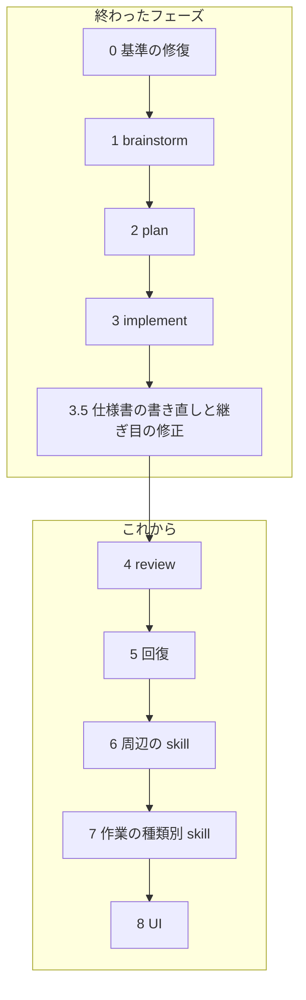

# agentic-workflow 移行ロードマップ

## この文書は何か

AI エージェントにソフトウェアの変更を任せるときの作業の進め方を、4 つのステップ
（brainstorm → plan → implement → review）に分けて決めた仕組みが、このリポジトリです。
各ステップは `skills/ba0918-<名前>/` にある「skill」（AI が読む手順書と補助スクリプト）
として配布します。仕組みの全体像は [docs/spec/README.md](docs/spec/README.md) にあります。

以前は `claude-skills` という別リポジトリの仕組みを使っていました。それを一度に複製せず、
小さな単位ごとにこのリポジトリへ作り直しています。この文書は、その作り直しをどの順番で
進め、いまどこにいて、次に何をするかを書いたものです。

読者は、このプロジェクトを初めて見る人です。仕様書と同じく、このプロジェクトの中でしか
通じない言葉は、先に意味を述べてから名前を出します。

## 現在地（2026-08-23）



矢印は候補の順序で、あるフェーズが終わっても次が自動で始まることはありません。
次のフェーズは、人が新しい会話か明示の指示で始めます。

Phase 3.5 までで、brainstorm、plan、implement の 3 つの skill と、6 本の仕様書が
`main` にあります。次は Phase 4（review）です。Phase 4 の手順書（後述）は旧仕様に基づく
ものが保留になっているので、新しい仕様書 `docs/spec/review.md` から作り直します。

## 全フェーズに共通する約束

### 小さく移す

- 1 つのフェーズでは、利用者向けの能力を 1 つだけ完成させる
- 1 回の実装では、原則として 1 つの skill だけを変える。大きければ手順書を分ける
  （Phase 3.5 の implement 改修は 2 つに分けた）
- フェーズの終わりで必ず止まり、人が成果を確かめる

### brainstorm には 2 つの粒度がある

**戦略 brainstorm** はプロジェクト全体の目的、原則、責任の境界、移行の順序を決めます。
成果物はこの ROADMAP で、直接には手順書に変換しません。

**実装 brainstorm** は 1 つの skill、または 1 つの利用者向け能力だけを対象にします。
成果物は、その skill を実装できる仕様書（`docs/spec/` の該当する文書）です。1 回の実装で
終えられることを確かめてから plan へ進みます。

### plan に進める条件

次がそろっていない brainstorm は、手順書（plan が作る、implement が実行する文書）に
変換しません。足りなければ手順書を大きくせず、フェーズを分けます。

- 対象が 1 つの skill か、1 つの利用者向け能力に限られている
- 利用者が得る結果を一文で言える
- 対象と対象外が明示されている
- 配布の単位と動かし方が決まっている
- 保存する状態、その寿命、移行が決まっているか、無いと確認されている
- 外部との入出力と必要な権限が決まっている
- 人が判断する場面と、そのとき見せる物が決まっている
- 完了を機械的に確かめる方法がある
- 変更する skill、スクリプト、補足文書、テストの見本を列挙できる
- 決まっていない基礎設計が残っていない
- 1 回の実装で、検証とレビューまで終わる見込みを説明できる

### Agent Skills 標準に従う

- 各 skill は `SKILL.md` を中心とした標準的なディレクトリとして配布する
- 決まった処理が要るなら `scripts/` に実行できる形で同梱する。補足は `references/` に置く
- 読む側が存在しない独自の付加情報を足さない。共有の実行基盤を暗黙の前提にしない
- `bunx skills-ref validate` に加え、skill 単体を配置した起動試験を行う

### 完了の示し方は 3 種類。AI を実際に走らせる確認は頼まれたときだけ

作るものは 2 種類しかありません。決まった入力に決まった出力を返すコードと、LLM に
読ませる文章（`SKILL.md`、補足、仕様書、手順書）です。手順書の各手順は、完了をどう
示すかを次の 3 種類から選びます。

| 種類（手順書での値） | 何に使うか | 完了の証拠 |
|---|---|---|
| テストで示す（`test`） | コード | 先に失敗するテストを書き、直して通す |
| 作った物で示す（`artifact`） | LLM に読ませる文章、設定 | 決めた内容で存在し、形式検査を通り、人が読んで OK と言う |
| 外で確かめる（`external`） | 実機での確認、人が頼んだ実測 | 実行結果を人が見て OK と言う |

文章に対して LLM を実際に走らせて振る舞いを確かめること（以下「実測」）は、既定では
要求しません。人が名前を挙げて頼んだときだけ、確認する場面を 1 つ、使う LLM を 1 つ、
費用の上限を先に決めて行います。LLM 側が「実測すべきだ」と思っても、提案は控えめに
します（ワークフロー系の作業は実測に倒れやすい偏りがあるため）。

旧版 `claude-skills` との操作回数やトークンの比較測定はもう行いません。移行の判断材料と
しての役目は、Phase 1〜3 で終えています。品質を下げるトークン削減は採用せず、実測して
いない改善を効率化の成果として書きません。

### 合意を越えない

- 手順書は合意済みの意味を実装手順に変換するだけで、新しい設計を足さない
- 新しい配布方式、実行基盤、保存方式、独自の書式、外部依存は brainstorm に戻す
- 決まっていないことを、実装者やレビュアーが補完しない
- 仕様書、手順書、この ROADMAP は利用者の言語（いまは日本語）で書き、読んで判断できる
  文章にする。機械が読む識別子（手順書の印、状態名、JSON の欄）は英語の固定語でよい
- 「正本は LLM 向けに密度を優先してよく、人間には要約だけ見せる」という考え方は採用しない。
  人が承認する文書は、人が読める文書でなければならない

### 承認は、人が読んだファイルそのものに対して行う

仕様書、手順書、この ROADMAP の改訂は、すべて次の手順で正本になります。AI が草稿を
一時ファイルに保存し、パスと指紋（内容の SHA-256）を示す。人が自分の道具で読む。人が
「このファイルを正本にしてよい」と言う。AI が指紋の一致を確かめて正本の場所へ移す。
草稿の全文をチャットに貼ることも、要約を承認の対象にすることもしません。

### review を収束させる

- 最初のレビューで指摘の集合を固定する
- 指摘ごとに、直ったことを確かめる方法（再現テスト、静的検査、人の判断）を割り当てる
- 修正後は、固定した指摘と関連する差分だけを見直す。再レビューで見つかった別の問題は、
  いまの合否に混ぜず後続の候補にする
- 2 人目のレビュアーは、人がその場で明示したときだけ 1 回動く

## 終わったフェーズ

### Phase 0: 移行の基準を直す（完了）

再移行の開始地点と、越えてはいけない境界を決めました。最初の移行は全ワークフローを
1 つの手順書に入れたため文脈が膨らみ、未合意の設計判断が混ざって失敗しました。その
ブランチ `cycle/20260821172451` は、失敗の原因と消費を確かめられる記録として隔離して
残しています（成果物としても移植元としても使いません）。

決めたこと: 仕様書は利用者の言語で書く。`claude-skills` の既存コード、独自の付加情報、
テストは移植元にしない。移す skill ごとに、移行の直前に旧版を読んで「残す振る舞い / 捨てる
振る舞い」を決める（全 skill の調査を先に終えることは要求しない）。

### Phase 1: brainstorm（完了）

広い依頼を独立した利用者価値に分け、最初の 1 つだけを詳しくする対話の skill。旧版の
`brainstorm`、合意と未決定を管理する `ledger`、高影響の判断を記録する `decision-journal`、
仕様の条項を検証可能な形にする `spec-verify` の 4 つを、1 つの brainstorm 体験に統合
しました。会話の記憶が圧縮されても合意を復元でき、承認は草稿ファイルの指紋に対して
行います。仕様は [docs/spec/brainstorm.md](docs/spec/brainstorm.md)。

### Phase 2: plan（完了）

承認済みの仕様書を、人が読んで判断でき、implement がそのまま実行できる手順書に変える
skill。仕様に無いことを決めず、未決定が残っていれば brainstorm に戻します。手順書は
正本にする前に、機械が読む箇所の書式と、参照する仕様書の指紋の一致を検査します
（Phase 3.5 で追加）。仕様は [docs/spec/plan.md](docs/spec/plan.md)。

### Phase 3: implement（完了。当時の名前は cycle）

手順書を専用のブランチと作業ディレクトリで 1 手順ずつ実装し、証拠（どのテストが失敗し、
どう通り、何をコミットしたか）を残す skill。Phase 3 当時は、全手順にテスト駆動を要求し、
リポジトリ全体に「使用中」の印を置く設計でした。どちらも Phase 3.5 で取り消しています。
仕様は [docs/spec/implement.md](docs/spec/implement.md)。

### Phase 3.5: 仕様書の書き直しと、継ぎ目の修正（完了）

Phase 4 に入る前の試運転で、3 つの問題が同時に見つかりました。

1. plan が作った手順書を、implement がそのまま読めなかった。手順書の書式と、読む側が
   受け付ける書式の約束がどこにも無かった
2. implement が全手順に「先に失敗するテスト」を要求していた。仕様書や skill 本文を書く
   手順にはテストが存在しないので、文章の手順書は完了できなかった
3. 途中で止まった実装を誰も片付けられなかった。リポジトリ全体に 1 つの「使用中」の印を
   置く設計で、印を外す役が無かった

さらに根本として、当時の仕様書が「`CY-050` 〜しなければならない」という条文の羅列で、
利用者が読んで「この設計でよい」と判断できる形になっていませんでした。利用者の評価は
「LLM しか読めない仕様に価値は無い。承認の儀式化（理解しないまま判を押すこと）が解消
できていない」。

やったこと:

- 仕様書を、移行フェーズ別の 4 本から、ワークフローのステップ別の 6 本
  （README、workflow、brainstorm、plan、implement、review）に書き直した。読者は初学者、
  流れは図で示し、条文 ID は使わない
- 手順書の書式を決めた。機械が読む印（`Plan ID`、`Target specifications`、`Scope`、
  `Steps`、`Completion`、`Human gates`）は利用者の言語に依らない英語の固定語、本文と節の
  名前は利用者の言語。手順書の読み取りは plan 側のスクリプトが 1 か所で持ち、implement は
  それを使う
- plan は正本化の前に書式と仕様書の指紋を検査する
- 各手順が完了の示し方を 3 種類から宣言し、implement は種類ごとに違う証拠を要求する
- `ba0918-cycle` を `ba0918-implement` に改名し、「使用中」の印を廃止した。同じ手順書の
  終わっていない実行が残っていれば、implement は証拠を起点に見つけて事実を見せ、人が
  「そのブランチで続ける / 新しく始める」を選ぶ。人は選ぶ前に AI に読むだけの調査を
  頼める。機械が止めるのは、手順書か仕様書の指紋が変わっていたときだけ
- implement は何も削除しない。不要になったブランチや作業ディレクトリは人が消す

残っていた細かい片付け（旧 cycle の印のディレクトリ `.agents/runtime/cycles/`、旧形式の
回帰評価の場面 `evals/cases/ba0918-cycle/`）は、人の手作業として残っています。

## 経緯の記録（Phase 1〜3 の実測と旧版比較）

Phase 1〜3 では、作った skill を LLM で実際に走らせ、旧版 `claude-skills`
（固定リビジョン `57bb6f06`）と同じ入力で比べていました。当時の判断材料として残しますが、
今後のフェーズでは行いません（上の「完了の示し方」の節）。使った LLM は `opencode-go/
deepseek-v4-flash`、数値はその 1 回の計測です。

| フェーズ | 確かめたこと | 旧版 | 新版 | 判定 |
|---|---|---|---|---|
| 1 brainstorm | 広い依頼の分割、圧縮後の復元と競合の拒否、利用者言語での締め | 14 回の要求、198 秒、約 $0.024。自動で 2 人目のレビュアーを起動 | 5 回、76 秒、約 $0.010。外部呼び出しとファイル更新なし | 移行可 |
| 2 plan | 完全な入力からの手順書、不完全な入力の差し戻し、既存手順書と未コミット変更の保護 | 265 秒、38 回のツール呼び出し、約 $0.040。人の確認前に状態ファイルを多数作成 | 86 秒、25 回、約 $0.020。人が読む正本だけを確認対象に | 移行可 |
| 3 implement（cycle） | 正常完了、仕様書の変更での停止、意図しない RED の拒否、テストの弱体化の拒否 | 67 回の要求、約 $0.119、900 秒で打ち切り | 34 回、126 秒、約 $0.024 で全手順完了 | 実装は完了。最終判定は Phase 4 の合格で確定 |

Phase 3 の引き渡しブランチ（`cycle/20260822143915-implementation`）は、いまのリポジトリには
存在しません。Phase 4 の入力は下の節のとおり新しく作ります。

## Phase 4: review

### 始める条件

Phase 3.5 が完了している（完了済み）。仕様は [docs/spec/review.md](docs/spec/review.md)
で承認済み。

### 利用者が得るもの

implement が残したブランチと証拠をレビューし、問題を見つけながら、レビューのたびに
指摘が増え続けて終わらない状態を作らない。旧版の `plan-reviewer` は 7 つの観点を別々の
AI で並列に走らせ、同じ入力を最大 8 回読んでいた。新版は 1 人のレビュアーが観点の一覧
（profile）を 1 回回し、安全上の指摘と重大な指摘を落とさないことを品質の床にする。

### 対象

`docs/spec/review.md` に書いてあることを実装する。要点は次のとおり。

- implement の引き渡し物（ブランチ、コミット列、証拠）と、手順書・仕様書の指紋を確かめて
  から最初のレビューを行う
- 指摘（finding）は番号つきの集合として最初のレビューで固定する。指摘ごとに「直ったと
  どう確かめるか」（再現テスト、静的検査、人の判断）を先に書く
- 重さ（`security` / `critical` / `warn` / `info`）と、必要な対応は分けて扱う。`info` は
  修正の往復に入れない
- 修正後は、未解決の指摘と、その修正の差分だけをもう一度見る
- レビューに使うモデルを指定できる（`--model`、`--second-reviewer`、`--second-model`）。
  自走時は、明示の指定 → プロジェクトの指示 → 利用者の規則 → いまの AI の順で決める
- 観点の一覧は散文のファイル（`references/profile/default.md`、`skill.md`）として分け、
  差分のファイル種別から選ぶ。brainstorm、plan、implement の継ぎ目（ステップ間の受け渡し）
  を見る観点を含める

### 対象外

- 修正の実装、修正の往復の進行役、最終の品質判定（後続のフェーズ）
- 全文を敵対的に読み直す自動反復、`info` の自動修正、明示されていない 2 人目のレビュアー
- main への取り込み、作業ディレクトリの片付け

### 進め方

1. plan で、`docs/spec/review.md` を入力に手順書を作る。保留中の旧手順書
   `20260823133736_review-skill-migration-r2` は旧仕様の指紋を参照しているので使わない
2. implement で実装する。これは改修後の implement を実際に使う最初の手順書になる。
   skill 本文の手順は「作った物で示す」、スクリプトは「テストで示す」
3. review skill の最初の入力は、review skill 自身を実装したブランチと証拠にする。
   合成の見本は作らない

### 完了の条件

- 固定した指摘の集合が、有限回の往復で収束する
- 安全上の指摘と重大な指摘を落とさない（観点の一覧に必須項目として入っている）
- レビュー 1 回あたりに読む範囲が、重さの候補ごとに変わる（全文を毎回読まない）
- 検証は、スクリプトのテストと、人が本文を読むこと。実測は人が頼んだときだけ

### 全体の流れの中での位置

```text
brainstorm → plan → implement → review（最初のレビュー）
  → 修正の往復（直す → 差分の再レビュー）→ 文書の検査 → 最終の判定 → 完了
```

修正の往復の進行役、文書の検査、最終の判定は Phase 4 では作らず、位置だけ記録します。
工程の遷移を誰が駆動するかも未決です（後続のフェーズで所有者を決める）。

## Phase 5: 記録と回復

### 始める条件

Phase 4 が完了し、保存すべき記録と再開の要件が分かっている。

### 利用者が得るもの

会話の圧縮、セッションの切断、必要な外部サービスの停止のあとでも、意味と再開位置を
失わない。

### 対象

- `.agents/artifacts`（残す記録）、`.agents/tmp`（使い捨て）の責任の分け方
- 合意、仕様の版、証拠、指摘、再開位置の保存と、古くなった物の扱い
- 曖昧な古い記録の拒否、または人への差し戻し

implement の「止まった実行の再開」は Phase 3.5 で先に作りました。Phase 5 ではそれを
前提に、brainstorm と review の再開、記録の寿命と移行を扱います。

### 完了の条件

- Phase 1〜4 の中断から復元できる
- 保存先、形式、寿命、移行が明示されている
- skill 単体の配布を壊す共有の依存を入れていない

## Phase 6: 周辺の skill

次を 1 つずつ、別の brainstorm と手順書で移します。一括では移しません。

1. `iterate`（修正の往復）
2. `issue`
3. `parallel-cycle`
4. `github-issue`
5. `goal-decomposition`
6. `goal-loop`
7. `loop-triage`

各 skill は Phase 1〜5 の公開された成果物だけを使い、内部実装に直接依存しません。

## Phase 7: 作業の種類別 skill

幹が完成したあとに個別に移します: `investigate`、`systematic-debugging`、`refactor`、
`sweep-fix`、`problem-solving`、`doc-check`、`doc-write`、`doc-audit`、
`generate-review-rules`、`commit`、`attack-review`、`codebase-review`、`review-deps`、
`review-testing`。1 つの skill を 1 つの移行単位にします。

## Phase 8: UI のワークフロー

UI（設計ガイド、模型の生成、画面の比較、見た目の回帰、アクセシビリティ、UX の人の判断）
は幹と分けて、独立に brainstorm します。UI 固有の判断や証拠の形を、汎用のワークフローへ
先回りして足しません。

## このリポジトリへ移さないもの

- **規則（agentic-rules が持つ）**: design、placement、secrets、TDD、testing、commit、
  release、delegation、verification、reuse、scaffold、human-readable
- **skill 自体を測る道具（agentic-meta が持つ）**: context audit、prompt tuning、
  skill improvement、skill interface audit、skill regression、skill reviewer、
  trigger evaluation

このリポジトリでは、公開済みの規則や道具を明示的に使うだけで、重複して実装しません。

## 各フェーズを始めるときに示すこと

フェーズを始めるとき、最低限次を利用者の言語で示します。人がこれを理解できるまで、
手順書を作りません。

```text
利用者が得るもの:
今回移す責任:
今回移さない責任:
配布の単位:
動かし方:
機械的な検証の方法:
人が判断する項目:
実測の要否と予算（人が頼んだ場合だけ）:
このフェーズの止まる条件:
```
