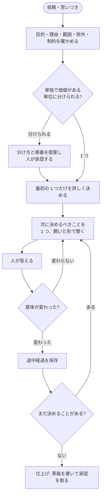

# brainstorm の仕様

brainstorm は、人と AI が対話して「何を作るか」を決めるステップです。
思いつきや依頼を、人が読んで承認した仕様書（または ROADMAP）に変えるところまでを
受け持ちます。手順書を作ること、実装することは受け持ちません。

全体の中での位置と、次のステップへ何を渡すかは [workflow.md](workflow.md) にあります。
ここでは brainstorm の中で何が起きるかを説明します。

## 何をするステップか

AI に作業を任せるときいちばん危ないのは、仕様に書いていないことを AI が勝手に決めて
しまうことです。brainstorm は、その「決める」を人と AI の対話の中に閉じ込めるためのステップ
です。brainstorm 以外のステップ（plan、implement、review）は、決まっていないことに
気づいたら止まって、ここに戻してきます。

brainstorm が終わったとき、次のものができています。

- 人が読んで承認した仕様書（または ROADMAP）
- その仕様書だけで次のステップ（plan）に進めるかどうかの判定

## 2 つの粒度

brainstorm には、扱う大きさの違う 2 種類があります。

| 種類 | 何を決めるか | 成果物 |
|---|---|---|
| 戦略 brainstorm | プロジェクト全体の目的、原則、責任の分け方、やる順番 | ROADMAP |
| 実装 brainstorm | 1 つの機能や変更について、作る物、作らない物、人が判断する場面、完了の確かめ方 | 仕様書 |

大きな依頼が来たら、まず戦略 brainstorm として「それぞれ単独で価値がある単位」に分け、
順番を決め、人に全体の分け方と「最初にやる 1 つ」を承認してもらいます。そのあと、
その 1 つだけを実装 brainstorm で詳しく決めます。先の単位を今から詳しく決めることは
しません。先に進むうちに前提が変わるからです。

## 対話の進め方



### 質問は 1 回に 1 つ、開いた形で

AI は、次に決めるべき大事なことを 1 つ選んで、「はい / いいえ」ではなく自由に答えられる
形で聞きます。小さな「はい / いいえ」の質問を並べて、見かけ上「決まった」状態を作ることは
禁止です。それでは人が考える余地がなく、承認が儀式になるからです。

一度決まったことを、理由なく聞き直すこともしません。

### 反対意見を出す

人の案にも AI 自身の案にも、AI は反論や反例をぶつけます。「反対が無い」ことと
「合意した」ことは別です。人が「それでいい」と言って初めて合意です。

### 事実と推測を分ける

AI が話すとき、確認した事実、事実から導いた推測、確かめていない仮説を区別して言います。
仕様書に書くのは合意した内容だけで、AI が勝手に足した仮定は「AI が足した仮定」として
別に示します。

### 調べてから決める

既存の仕組み（たとえば、以前の skill や既存のコード）を置き換える判断は、名前や概要だけで
行いません。中身を読んでから決めます。読んでいない段階で「これはこう扱う」と決めることは
禁止です。

## 記録するもの

対話の中で決まったことは、次の 6 種類に分けて記録します。

| 種類 | 意味 | 例 |
|---|---|---|
| 合意 | 人が「それでいい」と言ったこと | 「手順書のステップは 3 種類から完了の示し方を選ぶ」 |
| 禁止 | やってはいけないと決めたこと | 「Phase 4 の実装は、この作り直しが終わるまで着手しない」 |
| 未決定 | まだ決まっていないこと。誰が決めるかも書く | 「旧仕様書を消すか残すか（決定者: 人）」 |
| 委任 | 実装側に任せてよいと決めたこと。理由も書く | 「補助スクリプトの言語は Python でよい（既存と揃えるため）」 |
| 却下 | 検討したがやめた案。理由も書く | 「人間向け文書と LLM 向け yaml に分ける案（承認したものと実行するものが別物になるため）」 |
| 改訂 | 以前の合意を置き換えたこと。何を置き換えたかも書く | 「ブランチを消す → 消さずに放置する」 |

「未決定」と「委任」を分けるのが大事です。未決定は人が決めるまで実装に進めません。
委任は実装側が選んでよいものです。この 2 つを混ぜると、AI が未決定を委任だと思って
勝手に埋めてしまいます。

## 途中経過の保存

### いつ保存するか

上の 6 種類のどれかが増えたり変わったりしたとき（意味が変わったとき）に、人がそれに
同意したあとで保存します。雑談、言い換え、確認だけの発言では保存しません。意味が同じなのに
ファイルを書き換えることもしません。

### どこに保存するか

対象リポジトリの `.agents/artifacts/ideas/progress/<セッション ID>.md` に保存します。
中身は、上の 6 種類の項目、いまの位置、次に話すこと、改訂の履歴です。
保存は補助スクリプト（`scripts/state.py`）が行い、次を拒否します。

- 同じ ID の項目が 2 つある
- 改訂が、存在しない項目を指している
- 認証情報や秘密鍵のように見える文字列が含まれている
- 保存先がリポジトリの外を指している

### 同時に書き換えようとしたとき

同じセッションの途中経過を、2 つの会話が同時に書き換えようとすることがあります
（たとえば、古い会話が生き残っていた場合）。そのとき補助スクリプトは、上書きも自動の
合流もせず、後から来た内容を別ファイル（`<セッション ID>.conflict-<指紋の先頭>.md`）に
退避して止まります。どちらが正しいかは人が決めます。

### 会話が途切れたとき

長い会話は、途中で AI の記憶（コンテキスト）が圧縮されたり、会話そのものが切れたり
します。brainstorm は、会話の記憶ではなく保存した途中経過から、合意・禁止・未決定・委任・
却下・改訂と「次に話すこと」を復元します。復元したファイルが壊れていたら（ID の重複、
壊れた参照、指紋の不一致）、推測で補わずに止まって、どこが壊れているかを示します。

## 仕上げ（wrap）

決めることが無くなったら、仕様書（または ROADMAP）の草稿を書いて承認を取ります。

### 草稿を書く前に見直す

草稿を書く前に、AI は記録全体を見直します。次のどれかがあれば、草稿を書かずに対話に戻ります。

- 書きかけの箇所、矛盾、意味の曖昧な言葉、範囲の境界が書かれていない箇所がある
- その変更に関係するのに決まっていないことがある（保存の仕方、データの寿命、誰が持つか、
  同時に動いたときの扱い、権限、外部サービス、失敗したときの動き、移行、運用、復旧、
  公開の仕方、など）
- 合意として記録せずに、AI が黙って決めてしまったことがある
- 完了をどう確かめるか、どんな失敗例があるか、人が判断する場面はどこか、が書けていない

### 草稿の置き場所と承認

草稿は `.agents/tmp/ideas/<セッション ID>/` に、正本に書く内容と同じバイト列で保存します。
「草稿である」というヘッダは付けません。人が読むファイルと正本になるファイルが同じ物で
あるためです。

AI がチャットに出すのは、草稿のパス、内容の指紋（SHA-256 のハッシュ値）、反映先、
そして人が判断すべき点の要約だけです。草稿の全文をチャットに貼ることはしません。
人は自分の道具でファイルを読みます。

人が判断すべき点として AI が示すのは、次のものです。

- 代表的な使われ方の例
- 影響の大きい判断と、禁止したこと
- AI が足した仮定
- 有力だったが却下した案
- 残っているリスク、未決定、委任
- このあと自動で進む処理
- どこまで行ったら brainstorm に戻るべきか

承認は、人が「このパスのこのファイルを、この指紋のまま正本にしてよい」と明示したときだけ
成立します。黙っていること、「もう少し話そう」と言うことは承認ではありません。直したい
ところがあれば対話で受けて新しい草稿を出します。人にファイルを直接編集してもらうことは
しません（編集すると指紋が変わり、古い草稿として拒否されます）。

### 正本への反映

承認されたら、補助スクリプト（`scripts/draft.py`）が草稿を正本の場所へ移します。移す前に
指紋が提示したものと同じであることを確かめ、移したあと読み戻して指紋が一致したときだけ
成功とします。成功したら草稿と途中経過を消します。失敗したら両方を残し、失敗した段階を
報告します。

## plan に進めるかの判定

正本に反映したあと、AI は「この仕様書だけで plan に進めるか」を判定します。次がすべて
そろっているときだけ、plan に進めます。

- 成果物が 1 つの skill、または 1 つの単独で価値がある変更に限られている
- 利用者が得る結果を一文で言える
- 作る物と作らない物が書いてある
- 配布の単位と動かし方が決まっている
- 保存する状態、その寿命、移行の扱いが決まっているか、無いと確認されている
- 外部サービスとの入出力、必要な権限が決まっている
- 人が判断する場面と、そのとき見せる物が決まっている
- 完了を確かめる方法がある
- 変更する skill、スクリプト、補足文書を列挙できる
- 決まっていない基礎設計が残っていない
- 1 回の実装・検証・レビューで終わる見込みを説明できる

足りないものがあれば、足りない項目を示して対話を続けます。仕様書を大きくして無理に
通すことはしません。範囲が広すぎるなら、複数の単位に分けて ROADMAP に戻します。

## やらないこと

- 手順書（plan）を作らない。plan の開始も自動ではしない
- 実装しない。コード、手順書、承認前の仕様書や ROADMAP を変更しない
  （途中経過の保存と、草稿の一時保存、読み取りだけの調査は許可）
- アイデアの一覧管理、保管、破棄をしない
- 以前の仕組みのアイデアメモを、自動で新しい形式に変換しない。必要なら改めて対話で決める
- 2 人目のレビュアーを、人がその場で頼んでいないのに動かさない。動かすのは 1 回だけ

## 人が判断する場面

| 場面 | 人が決めること |
|---|---|
| 大きな依頼の分割 | 分け方と順番、最初にやる 1 つ |
| 意味が変わる発言のたび | その合意・禁止・却下でよいか |
| 未決定の項目 | 決める、または「実装に任せる」と明示する |
| 草稿の承認 | そのファイルを、その指紋のまま正本にしてよいか |
| 途中経過の競合 | 2 つの内容のどちらを残すか |
| 2 人目のレビュアー | 動かすかどうか（その場で、1 回だけ） |

## 失敗したときの動き

- 必要な人がいない（返事が得られない）ときは、承認を推測せず、途中経過を残したまま
  未完了で止まります。次の会話で再開できます。
- 正本への反映に失敗したら、途中経過と草稿を残し、どの段階で失敗したかを報告します。
  「反映した」とは言いません。
- 途中経過が壊れていて復元できないときは、壊れている箇所を示して止まります。
  「収束した」とは言いません。

## skill の構成

```text
skills/ba0918-brainstorm/
├── SKILL.md                  入口。責任の範囲と、どの補足をいつ読むか
├── references/
│   ├── session.md            対話の進め方、意味が変わる発言の定義
│   ├── state.md              途中経過の保存、競合、復元
│   └── wrap-readiness.md     仕上げ、草稿の承認、plan に進めるかの判定
└── scripts/
    ├── state.py              途中経過の保存と検証
    └── draft.py              草稿の保存と正本への反映
```

AI は SKILL.md を最初に読み、場面に応じて補足を 1 つずつ読みます。全部を先に読むことは
しません。
