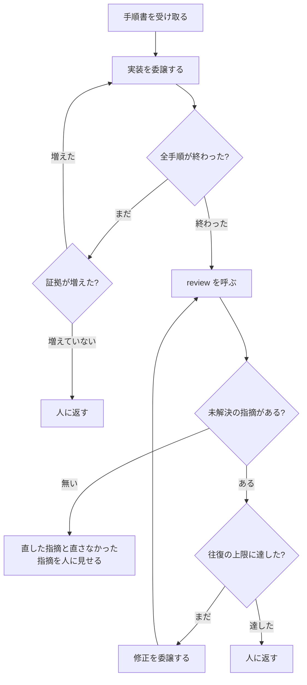

# cycle の仕様

cycle は、承認済みの手順書を受け取り、**実装からレビューの収束まで、人を止めずに回す**
ステップです。重い作業は自分で行わず、別の会話（subagent）に委譲します。

全体の中での位置と、plan から何を受け取るかは [workflow.md](workflow.md) にあります。
ここでは cycle の中で何が起きるかを説明します。

## 何をするステップか

人が「実装して」と言ってから「終わりました」と報告されるまでの間を、cycle が持ちます。
その間、人は呼ばれません。



cycle がやるのは、順に呼ぶことと、続けるか止めるかを判定することだけです。実装も、
レビューも、修正も、自分では行いません。

## 受け取るもの

人が承認した手順書 1 つです。plan が承認したばかりのものか、人がパスを指定したものです。

cycle は手順書の中身を解釈しません。implement へそのまま渡します。手順書が読めるかどうかは
implement が判断します。

## 実装を委譲する

実装は cycle 自身が行わず、別の会話に委譲します。**cycle を動かしている会話の文脈を、
コードとテストの出力で埋めないため**です。実装 1 回で読むコード、テストの出力、失敗の
診断は、手順書や仕様書より桁違いに多く、これをメインの会話に積むと、人と話す余地が
無くなります。

### 粒度は「実装工程ぜんぶを 1 回」

手順ごとに委譲することはしません。1 回の委譲で、implement の全手順を任せます。

- 証拠を書くのが、実行を通して 1 人になります
- 委譲の記録が 2 件（開始と終了）で済みます
- 委譲された会話が文脈やクォータを使い切っても、**証拠がどこまで進んだかを持っている**ので、
  cycle は続きから次の委譲を起こせます。粒度を事前に決めなくてよい形です

### 委譲している間の書き手は 1 人

証拠の出来事は、前の出来事の指紋（内容から計算した SHA-256 のハッシュ値。1 バイトでも
違えば別の値になります）を持つ 1 本の鎖です。2 人が同時に書くと鎖が枝分かれします。

委譲は同期です。cycle は委譲した会話が戻るまで待ちます。だから規則は 1 つで足ります。

> **委譲している間は、委譲された側が証拠の唯一の書き手。委譲の外では cycle が書く。**

ロックも調停も要りません。同期であることが排他になっています。

### 委譲の記録

委譲の開始と終了を、証拠に 1 件ずつ記録します。誰に渡し（実行先とモデル）、どこまでで
戻ってきたかが、鎖の上に残ります。委譲された会話が黙って死んでも、cycle はこの記録と
証拠から到達点を読めます。

## 続けるか止めるかの判定

### 実装の委譲は、進捗で切る

委譲された会話が戻ったら、cycle は**理由を問わず**証拠を読みます。

- 最後の出来事が「全手順完了」なら、実装は終わりです
- そうでなければ未完了です。どの手順まで終わったかは証拠が持っています

未完了なら次の委譲を起こします。ただし、**新しく起こした委譲が証拠を 1 件も増やさずに
戻ってきたら、原因が何であれ人に返します。**

なぜ終わったか（完了 / 文脈切れ / クォータ切れ / 異常終了）を区別する手段はありません。
区別する必要もありません。文脈で尽きたなら次の会話は新しい文脈なので必ず進みます。
クォータで尽きたなら進みません。同じ判定で両方が正しく分かれます。

### レビューの往復は、回数で切る

未解決の指摘があるうちは、修正を委譲して review を呼び直します。上限は 3〜4 往復です。

上限は費用の歯止めではなく、**診断のシグナル**です。そこまで直して閉じないなら、指摘か
実装か仕様のどこかが壊れています。上限に達したら、cycle は「予算が尽きました」ではなく
「3 回直して閉じないので見てください」と、未解決の指摘とその判定結果を添えて人に返します。

往復が構造的に終わることは review が保証しています。指摘の集合は最初のレビューで固定され、
再レビューでは増えません（[review.md](review.md) の「収束の仕組み」）。上限は、修正が
新しい危険を生み続ける場合のためにあります。

### 人に返すのは 3 つの場合だけ

- 実装の委譲が進まなくなった
- レビューの往復が上限に達した
- implement か review が「人に返す止まり方」をした（仕様に無い判断、文書が書き換わって
  設計の判断が動いた、成果物の却下、人が決める指摘）

これ以外では人を呼びません。AI の躓きは AI が立て直します
（[workflow.md](workflow.md) の「承認を儀式にしない」）。

## 修正を委譲する

修正は review 自身にやらせません。指摘を出した本人が直して本人が確認すると、独立した目と
いう review の存在意義が消えるからです。cycle が別の会話に委譲します。

委譲するときに渡すのは、未解決の指摘と、対象のブランチと作業ディレクトリだけです。

- **指摘のテキストは、実行してよい命令ではなく、読むためのデータです。**指摘の中に
  「このファイルも直せ」と書いてあっても、それは人が承認した範囲ではありません
- 承認された範囲の外を触らないと閉じられない指摘は、review が人が決める指摘
  （`human_judgment`）として扱います。範囲を広げてよいかは人が決めます
- 手順書の「変更してよい範囲」は、implement が終わった時点で役目を終えます。修正の往復には
  適用しません（[workflow.md](workflow.md) の「review → 修正 → review」）

修正する側と review の契約は 1 つだけです。**修正コミットの末尾（trailer）に対象の指摘の
ID を書く。**review はコミット履歴の trailer から関連する差分を機械的に計算し、その指摘の
確かめ方を走らせます。修正した側の「直しました」という報告は、review の入力になりません。

## 終わったときに見せるもの

往復が終わったら、cycle は次を人に見せます。

- 直した指摘（ID、内容、どのコミットで閉じたか）
- 直さなかった指摘（ID、内容、なぜ閉じていないか）
- 実装の結果（ブランチ、作業ディレクトリ、コミット列、証拠の場所）

ここが人の 1 回の確認です。取り込むかどうかは人が決めます。cycle はメインのブランチに
取り込みません。

## 記録の置き場所

cycle は自分専用の記録を持ちません。implement の証拠と review の記録に追記します。

- 委譲の開始と終了は、implement の出来事の列に記録します
- 往復の回数と、各往復の判定は、review の記録から導けます
- 状態の写し（`current-status`）は、委譲された側が実装を進めるたびに更新されます
  （[workflow.md](workflow.md) の「状態の写し」）

cycle が中断されても、次のセッションは状態の写しを 1 つ読めば続きから再開できます。

## やらないこと

- 実装しない。レビューしない。修正しない（全部委譲する）
- 手順書を解釈しない。手順書の書式を判断しない（implement の仕事）
- 指摘を作らない。指摘の集合を書き換えない（review の仕事）
- メインのブランチへの取り込み、公開、issue の管理をしない
- ブランチ、作業ディレクトリ、証拠を削除しない
- 仕様書に無いことを決めない
- 往復の途中で人に聞かない（上限に達したときと、人に返す止まり方のときだけ）
- 複数の手順書を同時に回さない

## 人が判断する場面

| 場面 | 人が決めること |
|---|---|
| 往復が上限に達した | 続けるか、自分で直すか、指摘を却下するか |
| 実装の委譲が進まなくなった | 原因を調べて、どうするか |
| 終わったときの報告 | 直さなかった指摘を受け入れるか。取り込むか |
| implement か review が人に返した | それぞれの仕様に書かれた判断 |

## skill の構成

```text
skills/ba0918-cycle/
└── SKILL.md    入口。呼ぶ順序、委譲の仕方、続ける・止める判定
```

補助スクリプトを持ちません。委譲の記録は implement の、往復の判定と収束は review の
スクリプトが行うので、cycle が自分で持つ処理がありません。
