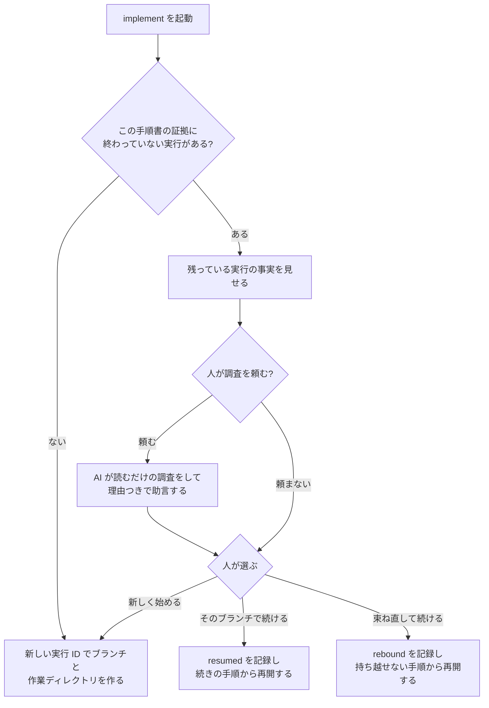

# implement の仕様

implement は、plan で承認された手順書を実際に実装するステップです。
専用のブランチと作業ディレクトリの中で、手順書の手順を 1 つずつ進め、
「どの手順がどう終わったか」の証拠をファイルとして残します。

全体の中での位置と、何を受け取り review へ何を渡すかは
[workflow.md](workflow.md) にあります。ここでは implement の中で何が起きるかを説明します。

implement は、cycle から委譲されて動くのが普通です。人が直接動かすこともできます。
どちらでも中身は同じです。

## 何をするステップか

implement は「手順書に書いてあることだけを、書いてある順に、証拠を残しながら実装する」
ステップです。手順書に書いていない判断が必要になったら、推測で進めずに止まります。

implement が終わったとき、次のものができています。

- 実装の入った専用ブランチと、そのコミット列
- 手順ごとの証拠（どのテストが失敗し、どう通り、何をコミットしたか）
- 実行の状態の写し（`current-status`）

implement は、レビューを始めません。メインのブランチに取り込むこともしません。
手順書を「完了」にもしません。それらは review と cycle と、人の判断の仕事です。

## 始める前に確かめること

### どの手順書を実行するか

次の順で候補を決めます。

1. 呼び出しのときに指定された手順書のパス（cycle から委譲されたときは、cycle が渡します）
2. 直前に plan が正本にしたばかりの手順書
3. 作業ツリーに 1 つだけある未完了の手順書

**未完了の手順書の索引は使いません。**手順書は git で管理し、完了したら作業ツリーから
削除するので、作業ツリーにある手順書がそのまま未完了の一覧です。

会話の流れから「たぶんこれ」と推測することはできますが、それは実行の根拠にはなりません。
実行の前に、その手順書が参照している仕様書の指紋が、手順書に書かれたものと一致することを
確かめます。

候補が無い、複数ある、のどちらかのときだけ人に聞きます。ファイルの更新日時や名前の順で
勝手に選ぶことはしません。

### 手順書の読み方

implement は手順書を人の言葉として読みます。決まった書き方で読むのは次の 2 つだけです
（[plan.md](plan.md)）。

- **参照する仕様書**: パスと指紋。実行の前に、いまの仕様書と一致することを確かめます
- **変更してよい範囲**: ファイルの木。コミットの境界（`stage`）で守ります

手順、完了の示し方、人が判断する場面は、本文を読んで理解します。読めない書式だから止まる、
ということはありません。読めなければ、読める形に直せるのは AI なので、AI が直します。
意味が変わる直しなら plan へ返します。

## 作業場所

実装は必ず、専用のブランチ（`implement/<実行 ID>`）と、専用の作業ディレクトリ
（git worktree。同じリポジトリを別の場所にもう 1 つ展開したもの）で行います。
普段使っているメインの作業ディレクトリは触りません。変更が小さくても同じです。

メインの作業ディレクトリに未コミットの変更があっても、それを作業ディレクトリに
持ち込みません。作業ディレクトリは、承認された仕様書がコミットされている時点の
メインブランチから作ります。

実行 1 回ごとに、実行 ID（時刻と乱数から作る、ファイル名に使える文字列）が付きます。
ブランチ、作業ディレクトリ、証拠の置き場所は、すべてこの ID で結び付きます。

1 つのブランチに対して同時に作業するセッションは 1 つだけです。この規則があるので、
生きている実行の一覧は `git worktree list` がそのまま持てます
（[workflow.md](workflow.md) の「現在地の導き方」）。

## 委譲されて動くとき

cycle から委譲されたときも、implement の中身は変わりません。次の 2 点だけが加わります。

- **委譲されている間、証拠を書くのは implement だけです。**委譲した側（cycle）は待って
  いるので、同時に書く人はいません
- **委譲の開始と終了を、証拠に記録します。**どの実行先とモデルに渡されたか、どこまでで
  戻ったかが残ります

委譲された会話が文脈やクォータを使い切って途中で終わっても、証拠と状態の写しが到達点を
持っているので、cycle は次の委譲を続きから起こせます。implement 側で特別な後始末は
要りません。

## 残っている作業があるとき

同じ手順書に対して、前の実行のブランチと作業ディレクトリが残っていることがあります
（途中で止まった、会話が切れた、など）。implement はそれを見つけたら、残っている内容を
見せて、人に選んでもらいます。



同じ実行の中での委譲の切り替わりは、ここには入りません。cycle が起こした次の委譲は、
人に聞かずに続きから始めます（[cycle.md](cycle.md) の「実装の委譲は、進捗で切る」）。
人が選ぶのは「前のセッションから残っている実行をどうするか」です。

### 何を起点に見つけるか

起点は証拠ディレクトリです。`.agents/artifacts/executions/<手順書 ID>/` の下にある実行の
うち、状態の写しが「全手順完了」でないものを「終わっていない実行」とします。ブランチ名の
一覧は起点にしません。人が手で切ったブランチや、証拠の無いブランチを誤って拾わない
ためです。

### 何を見せるか

終わっていない実行ごとに、次の事実を見せます。

- 実行 ID と、始めた日時
- 終わった手順の数と、最後の出来事の種類と理由（状態の写しから読む）
- ブランチ `implement/<実行 ID>` があるか。あれば、始めたコミットから先端までのうち、
  `commit` の出来事で説明できないコミットの一覧（SHA と件名）
- 作業ディレクトリがあるか、`git worktree list` に登録されているか、未コミットの変更が
  あるか。あれば変更されたファイルの一覧

### 人が判断する。機械が止めるのは 1 つだけ

機械が必ず止めるのは、束ねの記録（束ね直しがあれば、最後の `rebound` の出来事）に
書かれた手順書と仕様書の指紋が、いまの手順書と仕様書の指紋と一致しないときだけです。
前の実行は、いま承認されている内容とは別の内容に基づいているので、そのままでは書き
進められません。ただし「そのままでは続けられない」は「やり直し」ではありません。その実行
には「新しく始める」と「束ね直して続ける」の 2 つが残ります。

それ以外の事実（証拠の外のコミット、未コミットの変更、作業ディレクトリの状態）は、
機械が一律に弾きません。人が事実を見て総合的に判断します。人は選ぶ前に AI に調査を
頼めます。AI は読むだけの調査（証拠の外のコミットの中身、未コミットの差分、止まった
理由）をして、「使い回せそう」「やめたほうがいい」を理由つきで返します。調査ではブランチ、
作業ディレクトリ、証拠のどれも変えません。選ぶのは人です。

### 選んだあと

- 「新しく始める」を選んだら、新しい実行 ID でブランチと作業ディレクトリを作ります。
  古いブランチと作業ディレクトリは消さずに残します。不要になったら人が消します
- 「そのブランチで続ける」を選んだら、まず `resumed` の出来事を 1 つ記録します。そのときの
  ブランチの先端、記録で説明できないコミットの SHA、未コミットの変更の有無を書きます。
  証拠に無い変更を黙って引き継がないための記録です。そのうえで、残っている証拠から
  「`commit` の出来事が無い最初の手順」を導き、そこから再開します。RED の途中で
  止まっていた手順は、RED からやり直します（作業ディレクトリの状態を信頼しきれないため）。
  その手順のコミットがブランチにすでにある（コミットは済んだのに記録だけが済まなかった）
  ときは、やり直さずにそのコミットを後から記録します（下の「コミット」）。
  未コミットの変更は消しません。次の `stage`（下の「コミット」）は手順書の範囲内の
  ファイルしか通さないので、範囲外の変更はコミットされずに残ります
- 「束ね直して続ける」を選んだら、まず改訂前と改訂後の手順書の手順を、番号ではなく手順の
  文面（見出しと本文）の指紋で突き合わせて、次の表を人に見せます: 文面が同じで完了済みの
  手順（証拠とコミットを持ち越す）、文面が変わった完了済みの手順（やり直す。コミットは残し、
  消すかどうかは人が決める）、新しい手順（これからやる）、文面が同じで未完了の手順（続きから）。
  人が「続ける」と言ったら `rebound` の出来事を 1 つ記録します。以降の検査は改訂後の指紋で
  行います。そのうえで、対応表から「持ち越せない最初の手順」を導き、そこから再開します。
  変更してよい範囲が改訂で狭まり、持ち越したコミットが新しい範囲の外を触っていても、
  ここでは止めません。終端で列挙して人が承認します（下の「完了と引き渡し」）
- implement は、ブランチ、作業ディレクトリ、証拠のどれも削除しません

リポジトリ全体に 1 つしか置けない「使用中」の印は、ありません。作業は常に専用の
ブランチと作業ディレクトリで行うので、別の手順書の実行と場所がぶつかることはないからです。

## 手順の実行

手順書の手順を、書かれた順に実行します。手順の始めに、「手順書と仕様書が、始めたときと
同じか」を確かめます。違っていたら、その手順を進めずに止まります。

作業ディレクトリの未コミットの変更は、手順書の範囲内の物は作業中の変更として当然あるものと
し、範囲外の物は事実として持つだけで、止める理由にしません。範囲は、コミットの境界
（`stage`）で守り、終端で列挙して人が確かめます。

各手順は、完了の示し方（`test` / `check` / `artifact` / `external`）によって進め方が
変わります。

### テストで示す

いわゆるテスト駆動開発です。

1. **失敗するテストを先に書く（RED）**: その手順で作る振る舞い 1 つについて、小さなテストを
   1 つ書きます。製品のコードはまだ書きません。テストを走らせて、「まだ作っていないから
   失敗する」ことを確かめます。補助スクリプト（`accept-red`）が、失敗の理由を分類します。
   テストの書き間違い、読み込みの失敗、依存の不足、権限、ネットワーク、無関係な既存の失敗は
   「期待した失敗」ではありません。失敗の内容が `failed` や `exit code 1` のような、何が
   足りないのかを言っていない物であるときも、期待した失敗として受け付けません
2. **最小の実装で通す（GREEN）**: テストが通るのに必要なコードだけを書きます。テスト、
   テストが読むファイル、実行コマンドは変えません。同じテストを走らせて通ることを確かめます
3. **整える（REFACTOR）**: 重複、名前、責任の分け方を見て、直すべきところがあれば直します。
   直すところが無ければ「何を見て、なぜ不要と判断したか」を記録して先に進みます。実績を
   作るためだけの変更はしません。直したあとも同じテストを走らせます
4. **コミットする**（下の「コミット」）

RED で受け付けたテストは「凍結」されます。GREEN と REFACTOR は、凍結した内容のままで
通ることを確かめます。テストの中身、テストが読むファイル、コマンドのどれかが変わっていたら、
その状態のまま製品コードを進めることはできません。凍結を破ったこと自体は止まる理由では
ありません。同じ手順の中で新しい RED を書き直せば（`accept-red` をもう一度）、その RED が
新しい凍結になり、続きから進めます。

**この凍結が、この仕組みで唯一「AI の自己申告では代わりにならない」検査です。**テストを
弱めて通したとき、AI 自身は弱めたつもりがないことがあります。凍結したテストのバイト列を
比べることでしか、これは見つかりません。

テストを走らせるコマンドは、手順書に書いてあればそれを、無ければプロジェクトの指示や
既存のスクリプトを、それも無ければ標準の道具を 1 つだけ検出して使います。候補が複数ある、
または見つからないときは、製品コードを書く前に人に聞きます。

### 検査で示す

道具が生成した複製や、決まった検査が通ることだけが問題になる成果物です。人の承認は
求めません。判定できるのは検査であって、人ではないからです。

1. 手順書に書かれた作業をする（生成のコマンドを走らせる、ファイルを直す）
2. その手順が挙げた検査コマンドを、書かれた順にすべて走らせる
3. `check` の出来事を記録する（走らせたコマンドと終了コード、手順書の範囲内で変わった
   ファイルの一覧）。1 つでも成功以外で終わっていれば、その手順は完了しません。
   記録するファイルの一覧は、**その検査が通った時点で、手順書の範囲内に未コミットで残って
   いる変更**です。検査コマンドが変えた物だけではありません
4. 変えた物があればコミットする

検査の役目は確かめることであって、成果物を残すことではありません。何も変えない手順
（リポジトリ全体の検査が通ることを確かめるだけの手順）もあります。変えた物があるのに
コミットしていないときだけ、その手順は未完了です。

検査コマンドを挙げていない手順に、この種類は使えません。走らせるのは手順書が挙げた
コマンドだけで、その場で別のコマンドに差し替えることはしません。

### 作った物で示す

仕様書、skill の本文、設定ファイルのように、テストで振る舞いを示せないものです。

1. 手順書に書かれた内容でファイルを作る、または直す
2. 形式の検査（たとえば skill の構造検査、Markdown の参照切れの検査）があれば走らせて通す
3. `artifact` の出来事を記録する（作ったファイルの一覧、走らせた検査のコマンドと終了コード）
4. 人が読んで OK と言う。これは手順書が宣言した判断とは別物で、手順書に宣言が無くても
   implement がこの手順で必ず求める確認です。記録は `approval` の出来事です
5. コミットする

### 外で確かめる

実機で動かす、人が頼んだ「AI を実際に走らせる確認（実測）」のように、人の目が要るものです。

1. 手順書に書かれた確認を行う（implement が実行できるものは実行する。できないものは
   人に依頼する）
2. `external` の出来事を記録する（何を確かめたか、結果の短い要約）
3. 結果を人が見て OK と言う。`approval` の出来事として記録します
4. 記録するものがあればコミットする

実行の全出力や外部サービスのログは残しません（長い、秘密が混ざる、後から追えればよい）。

## 人が判断する場面

手順書が宣言した判断だけが、この節の「人が判断する場面」です。「作った物で示す」
「外で確かめる」の手順で implement が求める成果物の確認（上の節）はこれとは別で、宣言が
無くてもコミットの前に必ず求め、`approval` の出来事に記録します。

宣言のタイミングに応じて、implement は次の場所で人の判断を待ちます。

| タイミング | いつ待つか |
|---|---|
| 編集の前 | その手順のファイルを編集する前 |
| コミットの前 | その手順をコミットする前 |
| 全手順完了の前 | 全手順が終わったと宣言する前 |

判断は「承認」か「却下」で記録します。判断が無い、拒否された、判断の対象が変わっていた、
のどれかなら止まります。ツールの実行許可（サンドボックスの許可）を、手順書の判断の
代わりにすることはできません。

宣言に無い判断が必要になったら、それは仕様に無いことなので、止まって brainstorm に戻します。

## コミット

- 1 つの関心事につき 1 コミット。手順をまたぐコミットはしません。テストと、それを通す
  最小の実装は 1 つの関心事なので、同じコミットでかまいません
- コミットの作法は、プロジェクトの規則（AGENTS.md など）があればそれに、無ければ
  利用者の共通規則に従います
- ステージングは補助スクリプト（`stage`）を通します。手順書の「変更してよい範囲」の外、
  秘密情報、一時ファイル、ログ、ビルド成果物は拒否されます。`git add .` や `git add -A` は
  使いません
- git の hook は無効化しません。hook が失敗した、または hook がコミットしたファイルを
  書き換えたなら止まります。自動で直して再試行はしません
- コミットが終わったら、コミットの SHA を証拠に記録します（`record-commit`）
- 手順書の範囲外の直し（承認済みの仕様書に反するバグを見つけた、など）は、`stage` を通さずに
  普通にコミットしてかまいません。そのコミットは証拠で説明できないコミットとして終端で
  列挙され、人が承認します（[workflow.md](workflow.md) の軌道修正の入口 A）
- コミットは済んだのに記録が済まなかった（記録が拒否された、その間に会話が切れた）ときは、
  ブランチを積み直しません。そのコミットを後から記録します（`record-commit --commit <SHA>`）

## 証拠の残し方

証拠は、メインの作業ディレクトリ側の `.agents/artifacts/executions/<手順書 ID>/<実行 ID>/`
に残します。作業ディレクトリの中には置きません。

### 出来事

起きたことを 1 件 1 ファイルで、番号順に追記します。既存のファイルは上書きしません。

| 種類 | 意味 |
|---|---|
| `worktree-bound` | 作業場所ができた |
| `red` / `green` / `refactor` | テストで示す手順の、失敗するテスト / 通った / 整えた |
| `check` | 検査で示す手順の、走らせた検査のコマンドと終了コード、変わったファイルの一覧 |
| `artifact` | 作った物で示す手順の、作ったファイルの一覧、形式検査の結果 |
| `external` | 外で確かめる手順の、確かめた内容と結果の要約 |
| `commit` | コミットした（SHA）。後から記録したときはその旨 |
| `human_gate` | 手順書が宣言した判断の結果 |
| `approval` | 作った物で示す / 外で確かめる手順の成果物を、人が確認した結果 |
| `delegated` / `returned` | 委譲を始めた / 委譲された会話が戻った |
| `resumed` | 残っていた実行を続けた |
| `rebound` | 改訂後の手順書・仕様書で束ね直した |
| `history_approved` | 証拠で説明できないコミットと範囲外の変更を、人が意図した物と承認した |
| `stopped` | 止まった（理由） |
| `implementation_green` | 全手順完了 |

### 何を書き、何を書かないか

残す内容は、**人と AI が読んで意味が分かる最小限**です。失敗の理由の短い断片、コマンド、
終了コード、テストの件数、コミットの SHA、止まった理由、どの手順か。

**指紋は、承認した内容と手元の内容を比べるためだけに持ちます。**手順書と仕様書の指紋、
凍結したテストの指紋がこれにあたります。出来事どうしを鎖でつなぐための指紋、記録自身の
指紋、リポジトリや作業ディレクトリの指紋は持ちません。

指紋は AI が読むとき最も高くつく形式です（64 文字のランダムな 16 進数に、圧縮の余地が
ありません）。承認の照合という目的が無い指紋は、書く側のコストであると同時に、読む側の
コストです。

全出力、外部サービスのログ、認証情報、環境変数の値は残しません。

### 状態の写し

`.agents/artifacts/executions/<手順書 ID>/<実行 ID>/current-status` に、実行の現在地を
1 つ置きます。

- **出来事を追記するのと同じ操作の中で書きます。**別の手順にしません
- 書くのは 4 つだけです — 手順書のパスと版 / 完了した手順 / 最後の出来事とその理由 /
  ブランチと作業ディレクトリ
- **「次にすべきこと」は書きません。**判断は追記のコードには導けないので、書くと古くなります
- 実行が終わっても消しません

復帰するセッションは、このファイルを 1 つ読めば「どこまで進んで、いま何が起きているか」が
分かります。出来事の記録を全部読む必要はありません。読むのは、経緯を辿りたいときと、
review が確かめたいときだけです。

証拠を書けないとき（書き込みが拒否された、容量が無い）は、「未検証で止まった」として
報告します。コードとテストが通っていても、証拠が無ければ「全手順完了」にはなりません。

## 止まり方

止まり方には 2 つあります。**人に返す止まり方**と、**AI が自分で立て直す止まり方**です。
[workflow.md](workflow.md) の「承認を儀式にしない」の線引きに従います。

人に返すのは、次のどれかのときだけです。それ以上の編集とコミットをやめ、理由を記録して
（補助スクリプト `stop`）、人に渡します。

- 手順書に無い判断が必要になった（仕様の不足。brainstorm に戻す）
- 手順書、仕様書のどちらかが、人が承認した内容と違う（新しく始めるか、束ね直すかを人が選ぶ）
- 作った物を人が拒否した
- 必要な許可が得られない、証拠が書けない（人にしか解けない）
- 同じ手順で AI が立て直しを 3 回試して、まだ進めない

次は、AI が自分で立て直します。人を呼びません。何が起きて何をしたかを記録に残し、その手順が
終わったときにまとめて報告します。

- RED が期待した理由以外で失敗した（テストを書き直して、もう一度 RED を取る）
- 凍結したテストと食い違った（同じ手順で新しい RED を取り直す）
- 手順の途中で自分が順序を間違えた（その手順を RED からやり直す）
- コミットや hook が失敗した（原因を直して、もう一度コミットする。自動で握り潰さない）
- 記録を書き損ねた（後から記録する）
- 手順書が読みにくい形をしていた（読める形に直す。意味が変わるなら plan へ返す）
- 補助スクリプトの不具合に当たった（指紋の対象は手順書と仕様書だけなので、実行中に
  スクリプトを直しても実行は無効になりません）

立て直しは、実行を止めずに続けます。止めて再開する形を取るときも、続けるかどうかを人に
聞きません。人が選ぶのは「前のセッションから残っている実行をどうするか」であって、
「30 秒前に AI が転んだのをどうするか」ではありません。

次は止まる理由ですらありません。事実として記録し、終端で人に見せます: 範囲外の未コミット
変更、証拠で説明できないコミット。

`stop` は、手順書や仕様書の指紋が変わっていても記録できます。止まったことを記録できない
まま動けなくなる実行を作らないためです。

人に返す止まり方をしたあと、「この手順は止まったけど次の手順は独立してるから続けよう」とは
しません。すでに終わってコミットした手順と証拠はそのまま残し、手順書全体を止めます。
ブランチ、作業ディレクトリ、証拠は消しません。

## 会話が途切れたとき

会話の記憶が圧縮されたり切れたりしても、implement は状態の写しから現在地を読み、証拠から
詳しい経緯を読めます。使うのは手順書 ID と実行 ID から辿れる証拠ディレクトリだけで、
リポジトリ全体の印のようなものは使いません。読むことは、手順書や仕様書の指紋が変わっていても
通ります。記憶の圧縮そのものは止まる理由ではありません。指紋のどれかが違うときは書き進めずに、
「残っている作業があるとき」の流れ（束ね直すか、新しく始めるか）に入ります。

委譲されて動いていて、自分の文脈が尽きそうなときも、特別なことはしません。証拠と状態の
写しが到達点を持っているので、次の委譲が続きから始めます。

## 完了と引き渡し

全手順に、完了の示し方に応じた証拠とコミットがそろったら（`test` は RED → GREEN →
REFACTOR → コミット、`check` は検査 →（変えた物があれば）コミット、`artifact` は記録 →
承認 → コミット、`external` は記録 → 承認 →（記録する物があれば）コミット）、手順書が求める
広い検証（あれば）を走らせたうえで、`implementation_green`（全手順完了）を記録し、結果を
返します。

始めたコミットから先端までの各コミットを `commit` の出来事と突き合わせます。記録した順序は
問いません。出来事で説明できないコミット、履歴の差分に含まれる手順書の範囲外のパス、範囲外の
未コミット変更があれば、それらを列挙して人に見せ、人が「意図した物」と承認したら
`history_approved` の出来事を 1 つ記録してから `implementation_green` を記録します。
承認されなければ止まります。手順書の範囲内に未コミットの変更が残っていたら、コミットし忘れ
なので止まります。

結果には、手順書、実行 ID、ブランチ、作業ディレクトリ、コミット列、証拠の場所が含まれます。
これが review への引き渡しです。

`implementation_green` は、手順書の完了ではありません。手順書は review が終わり、人が
取り込みを決めるまで作業ツリーに残ります。implement は、ブランチ、作業ディレクトリ、
コミット、証拠をそのまま残して終わります。

## やらないこと

- レビュー、修正の往復、最終の品質判断をしない
- メインのブランチへの取り込み、公開、issue の管理をしない
- ブランチ、作業ディレクトリ、証拠を削除しない
- 手順書の本文、状態ファイル、セッションの履歴に進捗を書かない（証拠と状態の写しが唯一の記録）
- 手順書に無いことを決めない。手順書に無い判断を、ツールの実行許可で代用しない
- 複数の手順書を同時に実行しない
- 自分の記録の形式を機械で検査しない（[workflow.md](workflow.md) の「機械の検査は、
  外の世界を見るものに限る」）

## 人が判断する場面

| 場面 | 人が決めること |
|---|---|
| 手順書の候補が決まらない | どの手順書を実行するか |
| 残っている作業がある | そのブランチで続けるか、束ね直して続けるか、新しく始めるか（選ぶ前に AI に調査を頼める） |
| 終端で列挙されたコミットと範囲外の変更 | 意図した物として承認するか |
| 軌道修正の入口 | 直接直す（A）か、手順書を改訂する（B）か、brainstorm に戻る（C）か |
| 作った物で示す / 外で確かめる手順の成果物 | 人が読んで（見て）OK か（検査で示す手順では求めません） |
| テストのコマンドが決まらない | どのコマンドを使うか |
| 手順書に宣言された判断 | 承認か却下か |
| 仕様の不足で止まった | brainstorm に戻って決める |
| 許可待ちで止まった | 必要な許可を与えるか |

## skill の構成

```text
skills/ba0918-implement/
├── SKILL.md                  入口。責任の範囲と、どの補足をいつ読むか
├── references/
│   ├── execution.md          手順書の解決、作業場所、残っている作業、委譲、止まり方
│   ├── tdd.md                「テストで示す」手順の進め方と、テストの凍結
│   ├── artifacts.md          「検査で示す」「作った物で示す」「外で確かめる」手順の進め方
│   └── evidence.md           証拠と状態の写しの残し方
└── scripts/
    └── runtime/              責務ごとに 1 モジュール
        ├── cli.py            コマンドラインの受け口
        ├── planning.py       手順書から、参照する仕様書と変更してよい範囲を読む
        ├── repository.py     リポジトリの発見と、ブランチと作業場所の束ね
        ├── context.py        指紋の照合、出来事の追記、状態の写しの更新
        ├── tdd.py            テストファーストの一周（RED の受理、GREEN・REFACTOR の凍結）
        ├── deliverables.py   成果物の記録と人の承認記録
        ├── staging.py        コミット境界（変更してよい範囲、秘密情報の判定、ステージ）
        ├── resume.py         未完の実行の提示と再開、束ね直し
        ├── storage.py        .agents/ 配下への永続化
        └── gitio.py          git 呼び出しの一元化
```

補助スクリプトが行う検査は、外の世界を見るものだけです。自分が書く記録の形式を検証する
モジュール（かつての `execution_model.py`）は持ちません。

AI は SKILL.md を最初に読み、場面に応じて補足を 1 つずつ読みます。
