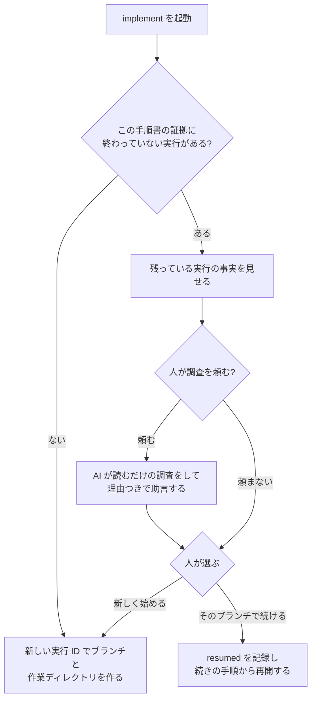

# implement の仕様

implement は、plan で承認された手順書を実際に実装するステップです。
専用のブランチと作業ディレクトリの中で、手順書の手順を 1 つずつ進め、
「どの手順がどう終わったか」の証拠をファイルとして残します。

全体の中での位置と、plan から何を受け取り review へ何を渡すかは
[workflow.md](workflow.md) にあります。ここでは implement の中で何が起きるかを説明します。

なお、この skill は以前 `cycle` という名前でした。「cycle」は以前の仕組みで
「手順書の調整 → 実装 → レビューを繰り返す」全体を指していた名前で、いまの責任
（与えられた手順書を実装する）より大きいので、`implement` に改めています。

## 何をするステップか

implement は「手順書に書いてあることだけを、書いてある順に、証拠を残しながら実装する」
ステップです。手順書に書いていない判断が必要になったら、推測で進めずに止まります。

implement が終わったとき、次のものができています。

- 実装の入った専用ブランチと、そのコミット列
- 手順ごとの証拠（どのテストが失敗し、どう通り、何をコミットしたか）

implement は、レビューを始めません。メインのブランチに取り込むこともしません。
手順書を「完了」にもしません。それらは review と、人の判断の仕事です。

## 始める前に確かめること

### どの手順書を実行するか

次の順で候補を決めます。

1. 呼び出しのときに人がパスを指定した手順書
2. 直前に plan が正本にしたばかりの手順書（plan が返したパスと指紋）
3. 未完了の索引（`open-plans.json`）で「いま対象」になっている、ただ 1 つの手順書

会話の流れから「たぶんこれ」と推測することはできますが、それは実行の根拠にはなりません。
実行の前に必ず補助スクリプト（`resolve`）で、手順書が索引に登録されていて、その指紋が
索引と一致し、参照している仕様書の指紋も手順書に書かれたものと一致することを確かめます。

候補が無い、複数ある、証拠どうしが食い違う、のどれかのときだけ人に聞きます。
ファイルの更新日時や名前の順で勝手に選ぶことはしません。索引に登録されていない手順書は、
パスを指定されても実行しません。

### 手順書の書式

implement は、[plan.md](plan.md) の「implement が機械的に読む箇所」に書かれた書式だけを
読みます。手順書の ID と版、参照する仕様書のパスと指紋、変更してよい範囲の木、
`### 1.`、`### 2.` … の手順見出し、各手順の `**Completion:**`（完了の示し方）、人が判断する場面の
`**Human gates:**` です。どれかが読めなければ、何も書き換えずに止まり、何が読めなかったかを
報告します。書式の修正は plan が新しい版として行います。

## 作業場所

実装は必ず、専用のブランチ（`implement/<実行 ID>`）と、専用の作業ディレクトリ
（git worktree。同じリポジトリを別の場所にもう 1 つ展開したもの）で行います。
普段使っているメインの作業ディレクトリは触りません。変更が小さくても同じです。

メインの作業ディレクトリに未コミットの変更があっても、それを作業ディレクトリに
持ち込みません。作業ディレクトリは、承認された仕様書がコミットされている時点の
メインブランチから作ります。

実行 1 回ごとに、実行 ID（時刻と乱数から作る、ファイル名に使える文字列）が付きます。
ブランチ、作業ディレクトリ、証拠の置き場所は、すべてこの ID で結び付きます。

## 残っている作業があるとき

同じ手順書に対して、前の実行のブランチと作業ディレクトリが残っていることがあります
（途中で止まった、会話が切れた、など）。implement はそれを見つけたら、残っている内容を
見せて、人に選んでもらいます。



### 何を起点に見つけるか

起点は証拠ディレクトリです。`.agents/artifacts/executions/<手順書 ID>/` の下にある実行
（`binding.json` を持つもの）のうち、出来事の最後が `implementation_green`（全手順完了）で
ないものを「終わっていない実行」とします。`stopped` で終わっているものも、出来事が途中で
途切れているものも含みます。ブランチ名の一覧は起点にしません。人が手で切ったブランチや、
証拠の無いブランチを誤って拾わないためです。

### 何を見せるか

終わっていない実行ごとに、次の事実を見せます。

- 実行 ID と、始めた日時
- 終わった手順の数（`commit` の出来事から導く）と、最後の出来事の種類と理由
- ブランチ `implement/<実行 ID>` があるか。あれば、その先端が証拠の最後の `commit` と
  同じか。違えば、証拠の外にあるコミットの一覧（SHA と件名）
- 作業ディレクトリがあるか、git の worktree 一覧に登録されているか、未コミットの変更が
  あるか。あれば変更されたファイルの一覧

### 人が判断する。機械が止めるのは 1 つだけ

機械が必ず止めるのは、`binding.json` に記録された手順書と仕様書の指紋が、いまの手順書と
仕様書の指紋と一致しないときだけです。前の実行は承認されていない（古い）内容に基づいて
いるので、人が望んでも続けられません。その実行は「続けられない」と示し、「新しく始める」
だけが残ります。

それ以外の事実（証拠の外のコミット、未コミットの変更、作業ディレクトリの状態）は、
機械が一律に弾きません。人が事実を見て総合的に判断します。実際には「ブランチが残ってる
けど、どうなってる？調べて」という流れになるはずなので、人は選ぶ前に AI に調査を
頼めます。AI は読むだけの調査（証拠の外のコミットの中身、未コミットの差分、止まった
理由）をして、「使い回せそう」「やめたほうがいい」を理由つきで返します。調査ではブランチ、
作業ディレクトリ、証拠のどれも変えません。選ぶのは人です。

### 選んだあと

- 「新しく始める」を選んだら、新しい実行 ID でブランチと作業ディレクトリを作ります。
  古いブランチと作業ディレクトリは消さずに残します。不要になったら人が消します
- 「そのブランチで続ける」を選んだら、まず `resumed` の出来事を 1 つ記録します。そのときの
  ブランチの先端、証拠の外にあったコミットの SHA、未コミットの変更の有無を書きます。
  証拠に無い変更を黙って引き継がないための記録です。そのうえで、残っている証拠から
  「最後に `commit` まで終わった手順」を導き、その次の手順から再開します。RED の途中で
  止まっていた手順は、RED からやり直します（作業ディレクトリの状態を信頼しきれないため）。
  未コミットの変更は消しません。次の `stage`（下の「コミット」）は手順書の範囲内の
  ファイルしか通さないので、範囲外の変更はコミットされずに残ります
- implement は、ブランチ、作業ディレクトリ、証拠のどれも削除しません

リポジトリ全体に 1 つしか置けない「使用中」の印は、ありません。作業は常に専用の
ブランチと作業ディレクトリで行うので、別の手順書の実行と場所がぶつかることはないからです。

## 手順の実行

手順書の `### 1.`、`### 2.` … を順番に実行します。各手順の始めと、手順の中の区切りごとに、
補助スクリプト（`context`）で「手順書、仕様書、作業ディレクトリ、ブランチが、始めたときと
同じか」を確かめます。どれかが変わっていたら、その手順を進めずに止まります。

各手順は、`**Completion:**`（完了の示し方）に書かれた種類（`test` / `artifact` / `external`）
によって進め方が変わります。

### テストで示す

いわゆるテスト駆動開発です。

1. **失敗するテストを先に書く（RED）**: その手順で作る振る舞い 1 つについて、小さなテストを
   1 つ書きます。製品のコードはまだ書きません。テストを走らせて、「まだ作っていないから
   失敗する」ことを確かめます。補助スクリプト（`accept-red`）が、失敗の理由を分類します。
   テストの書き間違い、読み込みの失敗、依存の不足、権限、ネットワーク、無関係な既存の失敗は
   「期待した失敗」ではないので、そこで止まります
2. **最小の実装で通す（GREEN）**: テストが通るのに必要なコードだけを書きます。テスト、
   テストが読むファイル、実行コマンドは変えません。同じテストを走らせて通ることを確かめます
3. **整える（REFACTOR）**: 重複、名前、責任の分け方を見て、直すべきところがあれば直します。
   直すところが無ければ「何を見て、なぜ不要と判断したか」を記録して先に進みます。実績を
   作るためだけの変更はしません。直したあとも同じテストを走らせます
4. **コミットする**（下の「コミット」）

RED で受け付けたテストは、その手順の間「凍結」されます。テストの中身、テストが読む
ファイル、コマンドのどれかが変わったら、それは「テストを弱めた」可能性があるので、
製品コードの変更をそこで止めます。新しい振る舞いが要るなら、新しい小さな RED を先に書きます。

テストを走らせるコマンドは、手順書に書いてあればそれを、無ければプロジェクトの指示や
既存のスクリプトを、それも無ければ標準の道具を 1 つだけ検出して使います。候補が複数ある、
または見つからないときは、製品コードを書く前に人に聞きます。

### 作った物で示す

仕様書、skill の本文、設定ファイルのように、テストで振る舞いを示せないものです。

1. 手順書に書かれた内容でファイルを作る、または直す
2. 形式の検査（たとえば skill の構造検査、Markdown の参照切れの検査）があれば走らせて通す
3. `artifact` の出来事を記録する（作ったファイルの一覧と指紋、走らせた検査のコマンドと
   終了コード）
4. 人が読んで OK と言う。これは手順書の `**Human gates:**` の宣言とは別物で、
   手順書に宣言が無くても implement がこの手順で必ず求める確認です。記録は `approval` の
   出来事（どの手順か、確認した成果物の指紋、`approved` か `rejected` か）で、宣言された
   判断の記録（`human_gate`）とは区別します。手順書側は、この確認を宣言に重ねて書きません
5. コミットする

### 外で確かめる

実機で動かす、人が頼んだ「AI を実際に走らせる確認（実測）」のように、人の目が要るものです。

1. 手順書に書かれた確認を行う（implement が実行できるものは実行する。できないものは
   人に依頼する）
2. `external` の出来事を記録する（何を確かめたか、結果の短い要約）
3. 結果を人が見て OK と言う。「作った物で示す」と同じく、宣言とは別に implement が
   必ず求める確認で、`approval` の出来事として記録します
4. 記録するものがあればコミットする

実行の全出力や外部サービスのログは残しません（長い、秘密が混ざる、後から追えればよい）。

## 人が判断する場面

手順書に `**Human gates:**` で宣言された判断だけが、この節の「人が判断する場面」です。
「作った物で示す」「外で確かめる」の手順で implement が求める成果物の確認（上の節）は
これとは別で、宣言が無くてもコミットの前に必ず求め、`approval` の出来事に記録します。
宣言のタイミングに応じて、implement は次の場所で人の判断を待ちます。

| タイミング | いつ待つか |
|---|---|
| `before_edit` | その手順のファイルを編集する前 |
| `before_commit` | その手順をコミットする前 |
| `before_implementation_green` | 全手順が終わったと宣言する前 |

判断は `approved` か `rejected` で記録します（補助スクリプト `human-gate`）。判断が
無い、拒否された、宣言に無い判断を使おうとした、判断の対象が変わっていた、のどれかなら
止まります。ツールの実行許可（サンドボックスの許可）を、手順書の判断の代わりにすることは
できません。

宣言に無い判断が必要になったら、それは仕様に無いことなので、止まって brainstorm に戻します。

## コミット

- 1 つの関心事につき 1 コミット。手順をまたぐコミットはしません。テストと、それを通す
  最小の実装は 1 つの関心事なので、同じコミットでかまいません
- コミットの作法は、プロジェクトの規則（AGENTS.md など）があればそれに、無ければ
  利用者の共通規則に従います
- ステージングは補助スクリプト（`stage`）を通します。手順書の「変更してよい範囲」の外、
  秘密情報、一時ファイル、ログ、ビルド成果物は拒否されます。`git add .` や `git add -A` は
  使いません
- git の hook は無効化しません。hook が失敗した、hook がファイルを変えた、コミット後に
  未コミットの変更が残った、のどれかなら止まります。自動で直して再試行はしません
- コミットが終わったら、コミットの SHA を証拠に記録します（`record-commit`）

## 証拠の残し方

証拠は、メインの作業ディレクトリ側の `.agents/artifacts/executions/<手順書 ID>/<実行 ID>/`
に残します。作業ディレクトリの中には置きません。

- `binding.json`: 実行の始めに 1 回だけ書く、変えないファイル。どの手順書（ID、版、指紋）と
  どの仕様書（パス、指紋）に基づき、どのブランチとコミットから始めたか、作業ディレクトリは
  どこか
- 出来事のファイル: 起きたことを 1 件 1 ファイルで、番号順に追記します。既存のファイルは
  上書きしません。種類は次のとおり

| 種類 | 意味 |
|---|---|
| `worktree-bound` | 作業場所ができた |
| `red` / `green` / `refactor` | テストで示す手順の、失敗するテスト / 通った / 整えた |
| `artifact` | 作った物で示す手順の、作ったファイルの一覧と指紋、形式検査の結果 |
| `external` | 外で確かめる手順の、確かめた内容と結果の要約 |
| `commit` | コミットした（SHA） |
| `human_gate` | 手順書に宣言された判断の結果 |
| `approval` | 作った物で示す / 外で確かめる手順の成果物を、人が確認した結果（`approved` / `rejected`） |
| `resumed` | 残っていた実行を続けた（そのときの先端、証拠の外のコミット、未コミットの変更の有無） |
| `permission_required` | 許可待ち |
| `stopped` | 止まった（理由） |
| `implementation_green` | 全手順完了 |

残す内容は、合否と安全な引き渡しに要る最小限です。失敗の理由の短い断片、コマンド、
終了コード、凍結したテストの指紋、テストの件数、コミットの SHA、止まった理由。
全出力、外部サービスのログ、認証情報、環境変数の値は残しません。

証拠を書けないとき（書き込みが拒否された、容量が無い）は、「未検証で止まった」として
報告します。コードとテストが通っていても、証拠が無ければ「全手順完了」にはなりません。

## 止まり方

次のどれかが起きたら、それ以上の編集とコミットをやめ、止まった理由を記録します
（補助スクリプト `stop`）。

- 手順書に無い判断が必要になった（仕様の不足）
- 手順書、仕様書、作業ディレクトリ、ブランチのどれかが始めたときと違う
- RED が期待した理由以外で失敗した
- 凍結したテストが変わった
- 手順書の書式が読めない
- コミットや hook が失敗した
- 必要な許可が得られない、証拠が書けない

止まったあと、「この手順は止まったけど次の手順は独立してるから続けよう」とはしません。
すでに終わってコミットした手順と証拠はそのまま残し、手順書全体を止めます。
ブランチ、作業ディレクトリ、証拠は消しません。次に同じ手順書で起動したとき、
「残っている作業があるとき」の流れで人が選びます。

止まったときの報告には、実行 ID、止まった理由、どの手順か、ブランチ、作業ディレクトリ、
コミット、証拠の場所を含めます。進捗を手順書本文や索引に書くことはしません。
証拠のファイルが唯一の記録です。

## 会話が途切れたとき

会話の記憶が圧縮されたり切れたりしても、implement は証拠から状態を組み立て直せます
（補助スクリプト `load`）。組み立て直しに使うのは、手順書 ID と実行 ID から辿れる
証拠ディレクトリと `binding.json` だけで、リポジトリ全体の印のようなものは使いません。組み立て直したあと、いまの手順を再確認（`context`）してから
編集に戻ります。記憶の圧縮そのものは止まる理由ではありません。正本から意味を組み立て直せ
ないとき、または指紋のどれかが違うときだけ止まります。

## 完了と引き渡し

全手順に、完了の示し方に応じた証拠とコミットがそろったら（`test` は `red` → `green` →
`refactor` → `commit`、`artifact` は `artifact` → `approval` → `commit`、`external` は
`external` → `approval` →（記録する物があれば）`commit`）、手順書が求める広い検証
（あれば）を走らせたうえで、`implementation_green`（全手順完了）を記録し、結果を返します
（補助スクリプト `implementation-green` と `result`）。

結果には、手順書、実行 ID、ブランチ、作業ディレクトリ、コミット列、証拠の場所が含まれます。
これが review への引き渡しです。

`implementation_green` は、手順書の完了ではありません。手順書は review が終わるまで
未完了のまま索引に残ります。implement は、ブランチ、作業ディレクトリ、コミット、証拠を
そのまま残して終わります。

## やらないこと

- レビュー、修正の往復、最終の品質判断をしない
- メインのブランチへの取り込み、公開、issue の管理をしない
- ブランチ、作業ディレクトリ、証拠を削除しない
- 手順書の本文、索引、状態ファイル、セッションの履歴に進捗を書かない
- 実装を別の AI エージェントに委ねない（この implement を動かしている AI が自分で書く）
- 手順書に無いことを決めない。手順書に無い判断を、ツールの実行許可で代用しない
- 複数の手順書を同時に実行しない

## 人が判断する場面

| 場面 | 人が決めること |
|---|---|
| 手順書の候補が決まらない | どの手順書を実行するか |
| 残っている作業がある | そのブランチで続けるか、新しく始めるか（選ぶ前に AI に調査を頼める） |
| 作った物で示す / 外で確かめる手順の成果物 | 人が読んで（見て）OK か |
| テストのコマンドが決まらない | どのコマンドを使うか |
| 手順書に宣言された判断 | `approved` か `rejected` か |
| 仕様の不足で止まった | brainstorm に戻って決める |
| 許可待ちで止まった | 必要な許可を与えるか |

## skill の構成

```text
skills/ba0918-implement/
├── SKILL.md                  入口。責任の範囲と、どの補足をいつ読むか
├── references/
│   ├── execution.md          手順書の解決、作業場所、残っている作業、止まり方、会話が途切れたとき
│   ├── tdd.md                「テストで示す」手順の進め方と、テストの凍結
│   ├── artifacts.md          「作った物で示す」「外で確かめる」手順の進め方
│   └── evidence.md           証拠の残し方、許可待ち、証拠が書けないとき
└── scripts/
    ├── execution_model.py    証拠と出来事の形の検証（入出力を持たない純粋なロジック）
    ├── implement_runtime.py  入口。実装は runtime/ 側に置く薄い層
    └── runtime/              責務ごとに 1 モジュール
        ├── cli.py            コマンドラインの受け口と完了判定
        ├── planning.py       登録済み手順書の読み取り（指紋、手順、完了の種類）
        ├── repository.py     リポジトリの発見と、ブランチと作業場所の束ね
        ├── context.py        証拠の連鎖（文脈の検証、出来事の追記、停止と許可の記録）
        ├── tdd.py            テストファーストの一周（RED の受理、GREEN・REFACTOR の凍結）
        ├── deliverables.py   「作った物で示す」「外で確かめる」手順と人の承認記録
        ├── staging.py        コミット境界（変更してよい範囲、秘密情報の判定、ステージ）
        ├── gates.py          手順書が宣言した人の確認待ち
        ├── resume.py         未完の実行の提示と再開
        ├── storage.py        .agents/ 配下への永続化（衝突を拒否する書き込み）
        ├── gitio.py          git 呼び出しの一元化
        └── deps.py, types.py 共有の型と、同梱モジュールの読み込み
```

手順書そのものの読み取り（ID と版、参照する仕様書、変更してよい範囲、手順、完了の示し方、
人が判断する場面）は、plan skill の `plan_artifact.py` を使います。implement は手順書の
解析を自分で持ちません。

AI は SKILL.md を最初に読み、場面に応じて補足を 1 つずつ読みます。
