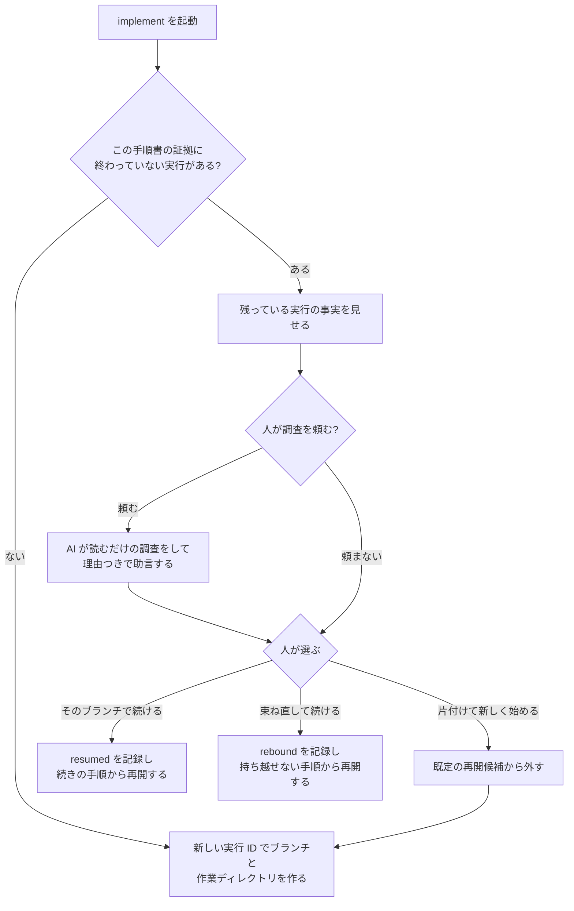

# implement の仕様

implement は、plan で承認された手順書を実際に実装するステップです。
専用のブランチと作業ディレクトリの中で、手順書の手順を 1 つずつ進め、
「どの手順がどう終わったか」の証拠をファイルとして残します。

全体の中での位置と、何を受け取り review へ何を渡すかは
[workflow.md](workflow.md) にあります。ここでは implement の中で何が起きるかを説明します。

implement は、cycle から委譲されて動くのが普通です。人が直接動かすこともできます。
どちらでも中身は同じです。

## 何をするステップか

implement は「手順書に書いてあることを、書いてある順に、証拠を残しながら実装する」
ステップです。手順書に無い重要な製品・設計・永続化・技術選定の判断が必要になったら、推測で
進めずに止まります。大筋に影響しない内部的な選択と通常の補完は、自分で判断して続けます。

implement が終わったとき、次のものができています。

- 実装の入った専用ブランチと、そのコミット列
- 手順ごとの証拠（どのテストが失敗し、どう通り、何をコミットしたか）
- 実行の状態の写し（`current-status`）

implement は、レビューを始めません。メインのブランチに取り込むこともしません。
手順書を「完了」にもしません。それらは review、cycle、人の判断の仕事です。

## 始める前に確かめること

### どの手順書を実行するか

次の順で候補を決めます。

1. 呼び出しのときに指定された手順書のパス（cycle から委譲されたときは、cycle が渡します）
2. 直前に plan が承認したばかりの手順書
3. 作業ツリーに 1 つだけある未完了の手順書

**未完了の手順書の一覧は、どこにもありません。** 手順書は git で管理し、完了したら作業
ツリーから削除するので、作業ツリーにある手順書がそのまま未完了の一覧です。

会話の流れから「たぶんこれ」と推測できますが、それは実行の根拠にはなりません。
実行できるのは、コミット済みで、作業ツリーの内容がそのコミットと同じ手順書だけです。
手順書を最後に承認したコミットのツリーから参照仕様書の版を読み、現在の仕様書と意味を
比較します。未コミット、新規作成中、または承認後に編集された手順書は実行しません。

候補が無い、複数ある、のどちらかのときだけ人に聞きます。ファイルの更新日時や名前の順で
勝手に選ぶことはしません。

### 手順書の読み方

implement は手順書を人の言葉として読みます。機械が読む入口となる top-level block は次の 2 つです
（[plan.md](plan.md)）。

- 検証の対応には、仕様パスと見出し、Step 番号、完了種別を書きます。承認コミットのツリーから仕様の版を読みます
- 予定する変更範囲には、ファイルの木を書きます。実際の変更との差を見つけ、予定外の変更の理由と影響を
  判断する起点にします

手順内では `Step N` 見出しと、完了種別に応じた宣言も機械的に読みます。承認前の候補が構造に
合わなければ plan が直します。承認済み plan の機械可読部分が不正なら、implement は内容を直さず
無変更で拒否します。検証 portfolio の意味と人が判断する場面は本文を読み、表現の揺れは意味を
変えない範囲で解釈します。意味が決まらなければ plan へ返します。

## 検証の対応から手順を決める

implement は承認済み plan の `Verification coverage` を読み、仕様節、`Step N`、完了種別の対応から
実行する手順 contract を導きます。起動する側から別の手順一覧や完了種別を受け取りません。bind と、
plan 改訂後の rebound のどちらも、承認済み plan を正本にします。

開始前に、plan が使う仕様パスと見出しが同じ仕様ファイル内にちょうど 1 つ存在することを
検査します。連続する Step 見出し、全仕様節と全手順の対応、同じ手順の完了種別も、もう一度
検査します。不正なら作業場所や evidence を変更せずに拒否します。

各手順は、要求の反例を検出する直接検証を少なくとも 1 つ持ちます。周辺を壊していないことを示す
全体test、型検査、lintなどは補助検証であり、それだけでは手順を完了しません。複数の検証は、完了
種別ごとの既存 evidence にまとめます。`test` は portfolio を含む 1 つのプロジェクトのテスト実行
コマンドを使います。`check` と `artifact` は既存の checks 一覧を使います。`external` は既存の
短い結果要約と、条件を満たしたかの判定を使います。subcommand ごとの新しい出来事は作りません。

実装中に安全な検証不足が分かったとき、仕様の意味を変えず、承認済みの依存、環境、範囲で一意に
補強できるなら、止まらずに検証を補って evidence を残します。要求が曖昧、判定基準が無い、新しい
依存、外部環境、権限が必要なら brainstorm へ返します。

## 作業場所

実装は必ず、専用のブランチ（`implement/<実行 ID>`）と、専用の作業ディレクトリ
（git worktree。同じリポジトリを別の場所にもう 1 つ展開したもの）で行います。
普段使っているメインの作業ディレクトリは触りません。変更が小さくても同じです。

メインの作業ディレクトリに未コミットの変更があっても、それを作業ディレクトリに
持ち込みません。作業ディレクトリは、承認された仕様書がコミットされている時点の
メインブランチから作ります。

実行 1 回ごとに、実行 ID（時刻と乱数から作る、ファイル名に使える文字列）が付きます。cycle から
委譲された場合は、cycle が実行 ID と記録場所を先に作って渡します。人が implement を直接
動かした場合だけ、implement 自身が同じ準備をします。
ブランチ、作業ディレクトリ、証拠の置き場所は、すべてこの ID で結び付きます。

1 つのブランチに対して同時に作業するセッションは 1 つだけです。この規則があるので、
生きている実行の一覧は `git worktree list` がそのまま持てます
（[workflow.md](workflow.md) の「現在地の導き方」）。

## 委譲されて動くとき

cycle から委譲されたときも、implement の中身は変わりません。次の 2 点だけが加わります。

- **委譲されている間、証拠を書くのは implement だけです。** 委譲した側（cycle）は待って
  いるので、同時に書く人はいません
- **委譲の開始と終了は cycle が記録します。** implement は cycle が記録した開始のあとから書き、
  戻ったあとの終了記録は cycle に任せます

委譲された会話が文脈やクォータを使い切って途中で終わっても、証拠と状態の写しが到達点を
持っているので、cycle は次の委譲を続きから起こせます。implement 側で特別な後始末は
要りません。

## 残っている作業があるとき

同じ手順書に対して、前の実行のブランチと作業ディレクトリが残っていることがあります
（途中で止まった、会話が切れた、など）。implement はそれを見つけたら、残っている内容を
見せて、人に選んでもらいます。



**束ね直す**とは、動いている実装が「どの手順書のどの内容に従っているか」を、改訂後の内容へ
張り替えることです。ブランチ、作業ディレクトリ、証拠はいずれも捨てず、従う対象だけを差し替えます。
新旧の版は Git のコミットとツリーから読み、独自の指紋は持ちません。

同じ cycle の中での委譲の切り替わりは、ここには入りません。cycle が同じ実行を続けるために
起こした次の委譲は、人へ聞かずに続きから始めます（[cycle.md](cycle.md) の「実装の委譲は、
進捗で切る」）。一方、別の起動時に前のセッションの実行が残っていた場合は、候補が一意でも
開始前に人へ見せます。理由を忘れたまま永久に放置される実行を作らないためです。

### 何を起点に見つけるか

起点は証拠ディレクトリです。`.agents/evidence/<手順書 ID>/` の下にある実行のうち、状態の写しが
「全手順完了」でなく、再開候補から外した記録も無いものを、既定で見せる「終わっていない実行」
とします。再開候補から外した実行は、実行 ID を明示した調査・復帰でだけ選べます。ブランチ名の
一覧は起点にしません。人が手で切ったブランチや、証拠の無いブランチを誤って拾わないためです。

### 何を見せるか

終わっていない実行ごとに、次の事実を見せます。

- 実行 ID と、始めた日時
- 終わった手順の数と、最後の出来事の種類と理由（状態の写しから読む）
- ブランチ `implement/<実行 ID>` があるか。あれば、始めたコミットから先端までのうち、
  `commit` の出来事で説明できないコミットの一覧（SHA と件名）
- 作業ディレクトリがあるか、`git worktree list` に登録されているか、未コミットの変更が
  あるか。あれば変更されたファイルの一覧

### 文書の変更は意味を読んで判断する

束ねた Git コミットにある手順書・仕様書と、現在のコミット済み内容が違う場合、AI が両方を
読んで意味を比較します。重要な設計判断が動いていなければ、変更内容を記録して自動で新しい版へ
追従します。重要な判断が動いていれば、そのまま書き進めず、人が束ね直すか新しく始めるかを
決めます。

それ以外の事実（証拠の外のコミット、未コミットの変更、作業ディレクトリの状態）は、機械が
一律に弾きません。重要な設計判断や危険な対象に関係しなければ、AI が調査して扱いを決め、
必要な事実を終端で報告します。重要な判断が必要なら、読むだけの調査結果を添えて人へ返します。

### 続け方

- 新しい実行を作る前に、終わっていない実行をすべて見せます。人が同じ実行を続けると決めた
  場合だけ、そのブランチへ `resumed` を追記します。候補が一意であることだけを理由に自動再開
  しません。この対話が済んだあとは、同じ cycle 内の委譲ごとに聞き直しません
- 「新しく始める」と決めた場合は、古い実行を既定の再開候補から外したことを理由つきで記録して
  から、新しい実行 ID でブランチと作業ディレクトリを作ります。出来事と証拠は残り、実行 ID を
  明示すれば後から調査・復帰できます。経過時間や AI の推測だけでは候補から外しません
- 証拠、ブランチ、作業ディレクトリを物理的に消すのは別の不可逆な操作です。implement は行わず、
  明示した対象について人の承認を得た掃除の入口へ渡します
- そのブランチで続ける場合、`resumed` の出来事には、ブランチの先端、記録で説明できない
  コミットの SHA、未コミットの変更の有無を書きます。
  証拠に無い変更を黙って引き継がないための記録です。そのうえで、残っている証拠から
  「`commit` の出来事が無い最初の手順」を導き、そこから再開します。RED の途中で
  止まっていた手順は、RED からやり直します（作業ディレクトリの状態を信頼しきれないため）。
  その手順のコミットがブランチにすでにある（コミットは済んだのに記録だけが済まなかった）
  ときは、やり直さずにそのコミットを後から記録します（下の「コミット」）。
  未コミットの変更は消しません。次の `stage`（下の「コミット」）では、予定範囲の内外を
  問わず安全検査を実施します。大筋を変えない通常の補完は理由を記録してコミットし、危険な対象や
  重要な設計判断に関わる変更はステージせず人へ返します
- 「束ね直して続ける」を選んだら、まず改訂前と改訂後の手順を突き合わせます。番号ではなく、
  見出しと本文の内容で比較します。次の対応を表にして人へ見せます。
  - 内容が同じで完了済みの手順は、証拠とコミットを持ち越します
  - 文面が変わった完了済みの手順はやり直します。コミットは残し、消すかどうかは人が決めます
  - 新しい手順は、これから実行します
  - 文面が同じで未完了の手順は、続きから実行します
  人が「続ける」と言ったら `rebound` の出来事を 1 つ記録し、改訂後の Git コミットを参照します。
  そのうえで、対応表から「持ち越せない最初の手順」を導き、そこから再開します。予定する変更
  範囲が改訂で狭まり、持ち越したコミットが新しい予定の外を触っていても、それだけで
  は止めません。理由と影響を確認し、危険な対象でなければ終端で報告します
- implement は、ブランチ、作業ディレクトリ、証拠のどれも削除しません

リポジトリ全体に 1 つしか置けない「使用中」の印は、ありません。作業は常に専用の
ブランチと作業ディレクトリで行うので、別の手順書の実行と場所がぶつかることはないからです。

## 手順の実行

手順書の手順を、書かれた順に実行します。手順の始めに、束ねた Git コミットの手順書・仕様書と
現在のコミット済み内容を比べます。違いがあれば意味を読み、重要な設計判断が動いていなければ
変更を記録して自動で追従します。動いていた場合だけ、その手順を進めずに人へ返します。

作業ディレクトリの未コミットの変更は、手順書の予定範囲内の物は作業中の変更として扱います。
予定範囲外の物は、必要な理由と影響を読みます。大筋を変えない通常の補完なら記録して続け、
重要な設計判断、新しい外部依存、本番設定やデータ移行など危険な対象が必要なら編集前に人へ
返します。

各手順は、完了の示し方（`test` / `check` / `artifact` / `external`）によって進め方が
変わります。

### テストで示す

いわゆるテスト駆動開発です。

1. 失敗するテストを先に書きます（RED）。その手順で作る振る舞い 1 つについて、小さなテストを
   1 つ書きます。製品のコードはまだ書きません。テストを走らせて、「まだ作っていないから
   失敗する」ことを確かめます。補助スクリプト（`accept-red`）が、失敗の理由を分類します。
   テストの書き間違い、読み込みの失敗、依存の不足、権限、ネットワーク、無関係な既存の失敗は
   「期待した失敗」ではありません。失敗の内容が `failed` や `exit code 1` のような、何が
   足りないのかを言っていない物であるときも、期待した失敗として受け付けません
2. 最小の実装で通します（GREEN）。テストが通るのに必要なコードだけを書きます。テスト、
   テストが読むファイル、実行コマンドは変えません。同じテストを走らせて通ることを確かめます
3. コードを整えます（REFACTOR）。重複、名前、責任の分け方を見て、直すべきところがあれば直します。
   直すところが無ければ「何を見て、なぜ不要と判断したか」を記録して先に進みます。実績を
   作るためだけの変更はしません。直したあとも同じテストを走らせます
4. **コミットする**（下の「コミット」）

RED で受け付けたテストは「凍結」されます。GREEN と REFACTOR は、凍結した内容のままで
通ることを確かめます。テストの中身、テストが読むファイル、コマンドのどれかが変わっていたら、
その状態のまま製品コードを進めることはできません。凍結を破ったこと自体は止まる理由では
ありません。同じ手順の中で新しい RED を書き直せば（`accept-red` をもう一度）、その RED が
新しい凍結になり、続きから進めます。

**この凍結が、この仕組みで唯一「AI の自己申告では代わりにならない」検査です。** テストを
弱めて通しても、AI 自身は弱めたと自覚しない場合があります。凍結したテストのバイト列を
比べることでしか、これは見つかりません。

テストを走らせるコマンドは、手順書にあればそれを使います。無ければプロジェクトの指示や
既存のスクリプトを調べ、それも無ければ標準の道具から AI が選びます。選ぶのは対象のテストを
確かめられるコマンドです。有効なコマンドを決められない場合は、完了条件が欠けた手順書として
製品コードを書く前に止まり、plan へ返します。

### 検査で示す

道具が生成した複製や、決まった検査が通ることだけが問題になる成果物です。人の承認は
求めません。判定できるのは検査であって、人ではないからです。

1. 手順書に書かれた作業をする（生成のコマンドを走らせる、ファイルを直す）
2. その手順が挙げた検査コマンドを、書かれた順にすべて走らせる
3. `check` の出来事を記録する（走らせたコマンドと終了コード、手順書の範囲内で変わった
   ファイルの一覧）。1 つでも成功以外で終わっていれば、その手順は完了しません。
   記録するファイルの一覧は、**その検査が通った時点で、手順書の範囲内に未コミットで残って
   いる変更**です。検査コマンドが変えた物だけではありません
4. 変えた物があればコミットする

検査の役目は確かめることであって、成果物を残すことではありません。何も変えない手順
（リポジトリ全体の検査が通ることを確かめるだけの手順）もあります。変えた物があるのに
コミットしていないときだけ、その手順は未完了です。

検査コマンドを挙げていない手順に、この種類は使えません。走らせるのは手順書が挙げた
コマンドだけで、その場で別のコマンドに差し替えることはしません。

### 作った物で示す

仕様書、skill の本文、設定ファイルのように、テストで振る舞いを示せないものです。

1. 手順書に書かれた内容でファイルを作る、または直す
2. 形式の検査（たとえば skill の構造検査、Markdown の参照切れの検査）があれば走らせて通す
3. `artifact` の出来事を記録する（作ったファイルの一覧、走らせた検査のコマンドと終了コード）
4. 独立した review で意味を確かめられる状態にする
5. コミットする。独立 review の合格は artifact の出来事には含めず、cycle の完了条件として後から
   確かめます。成果物を人が受け入れる判断も cycle の終端へ集約します

### 外で確かめる

実機で動かす、人が頼んだ「AI を実際に走らせる確認（実測）」のように、人の目が要るものです。

1. 手順書に書かれた確認を実施する。implement が安全に実行できない、人の権限が必要、または
   不可逆な操作なら、実行前に理由を添えて人へ返す
2. `external` の出来事を記録する（何を確かめたか、結果の短い要約）
3. 手順書の完了条件を満たしたかを判定する。人が成果物を受け入れる判断は cycle の終端で行う
4. リポジトリに残す物があればコミットする

実行の全出力や外部サービスのログは残しません（長い、秘密が混ざる、後から追えればよい）。

## 手順中に人が判断する場面

手順書へ事前に宣言できる人の確認は、不可逆な操作、人の権限が必要な操作、危険な対象へ触れる
前の確認だけです。実行中に見つかった重要な設計判断や被害が広がる事故でも人へ返します。
成果物を読んで受け入れる判断は cycle の終端へ集約し、各手順のコミット前には求めません。

宣言のタイミングに応じて、implement は次の場所で人の判断を待ちます。

| タイミング | いつ待つか |
|---|---|
| 編集の前 | その手順のファイルを編集する前 |
| コミットの前 | その手順をコミットする前 |
| 全手順完了の前 | 全手順が終わったと宣言する前 |

ただし、Git から確認した変更ファイルが空で、その手順のコミットが発生しない場合は、
「コミットの前」の判断を求めません。変更がありコミットする場合だけ、証拠を記録した後、
コミットの前に判断を待ちます。

判断は「承認」か「却下」で記録します。判断が無い、拒否された、判断の対象が変わっていた、
のどれかなら止まります。ツールの実行許可（サンドボックスの許可）を、手順書の判断の
代わりにはできません。

宣言に無い重要な設計判断が必要になったら、止まって brainstorm に戻します。合意済みの結果を
実現するための内部的な選択は AI が行い、必要なら終端で報告します。

## コミット

- 1 つの関心事につき 1 コミット。手順をまたぐコミットはしません。テストと、それを通す
  最小の実装は 1 つの関心事なので、同じコミットでかまいません
- コミットの作法は、プロジェクトの規則（AGENTS.md など）があればそれに、無ければ
  利用者の共通規則に従います
- ステージングはすべて補助スクリプト（`stage`）を通します。秘密情報、危険なパス、一時ファイル、
  ログ、ビルド成果物は、手順書の予定範囲の内外にかかわらず拒否されます。`git add .` や
  `git add -A` は使いません
- git の hook は無効化しません。hook の失敗やファイルの書き換えがあれば、原因と差分を調べます。
  安全な通常の修正なら直して再試行します。重要な設計判断や危険な対象に
  関わる場合、または別の方法でも回復できない場合だけ人へ返します
- コミットが終わったら、コミットの SHA を証拠に記録します（`record-commit`）
- 手順書の予定範囲外の直し（承認済みの仕様書に反するバグを見つけた、など）も `stage` を
  通します。通常の補完なら理由を記録してコミットし、終端で報告します。重要な設計判断、新しい
  外部依存、危険な対象が必要ならコミット前に人へ返します
- コミットは済んだのに記録が済まなかった（記録が拒否された、その間に会話が切れた）ときは、
  ブランチを積み直しません。そのコミットを後から記録します（`record-commit --commit <SHA>`）

## 証拠の残し方

証拠は、メインの作業ディレクトリ側の `.agents/evidence/<手順書 ID>/<実行 ID>/`
に残します。作業ディレクトリの中には置きません。

### 出来事

起きたことを 1 件 1 ファイルで、番号順に追記します。既存のファイルは上書きしません。

| 種類 | 意味 |
|---|---|
| `worktree-bound` | 作業場所ができた |
| `red` / `green` / `refactor` | テストで示す手順の、失敗するテスト / 通った / 整えた |
| `check` | 検査で示す手順の、走らせた検査のコマンドと終了コード、変わったファイルの一覧 |
| `artifact` | 作った物で示す手順の、作ったファイルの一覧、形式検査の結果 |
| `external` | 外で確かめる手順の、確かめた内容と結果の要約 |
| `commit` | コミットした（SHA）。後から記録したときはその旨 |
| `human_gate` | 手順書が宣言した判断の結果 |
| `delegated` / `returned` | 委譲を始めた / 委譲された会話が戻った |
| `resumed` | 残っていた実行を続けた |
| `rebound` | 改訂後の手順書・仕様書で束ね直した |
| `recovering` | AI が自分で立て直した（理由）。実行は止まっていない |
| `stopped` | 止まった（理由） |
| `implementation_green` | 全手順完了 |

### 何を書き、何を書かないか

残す内容は、**人と AI が読んで意味が分かる最小限**です。失敗の理由の短い断片、コマンド、
終了コード、テストの件数、コミットの SHA、止まった理由、どの手順か。

独自の指紋を持つのは、RED で受け付けたテストと、GREEN・REFACTOR で実行するテストが同じ
内容かを比べる場合だけです。仕様書と手順書の版は Git のコミットとツリーから読みます。
出来事どうしを鎖でつなぐ指紋、記録自身の指紋、リポジトリや作業ディレクトリの指紋は持ちません。

全出力、外部サービスのログ、認証情報、環境変数の値は残しません。

### 状態の写し

`.agents/evidence/<手順書 ID>/<実行 ID>/current-status` に、実行の現在地を
1 つ置きます。

- **出来事を追記するのと同じ操作の中で書きます。** 別の手順にしません
- 書くのは 4 つだけです — 手順書のパスと版 / 完了した手順 / 最後の出来事およびその理由 /
  ブランチと作業ディレクトリ
- **「次にすべきこと」は書きません。** 判断は追記のコードには導けないので、書くと古くなります
- 実行が終わっても消しません

復帰するセッションは、このファイルを 1 つ読めば「どこまで進んで、いま何が起きているか」が
分かります。出来事の記録を全部読む必要はありません。読むのは、経緯を辿りたいときと、
review が確かめたいときだけです。

証拠を書けないとき（書き込みが拒否された、容量が無い）は、「未検証で止まった」として
報告します。コードとテストが通っていても、証拠が無ければ「全手順完了」にはなりません。

## 止まり方

止まり方には 2 つあります。**人に返す止まり方**と、**AI が自分で立て直す止まり方**です。
[workflow.md](workflow.md) の「承認を儀式にしない」の線引きに従います。

人に返すのは、次のどれかのときだけです。それ以上の編集とコミットをやめ、理由を記録して
（補助スクリプト `stop`）、人に渡します。

- 手順書に無い重要な設計判断が必要になった（仕様の不足。brainstorm に戻す）
- 手順書か仕様書が書き換わっていて、**重要な設計判断が動いた**（下の「文書が書き換わったとき」）
- 不可逆な操作、人の権限が必要な操作、本番データなど危険な対象へ触れる必要がある
- 秘密情報の露出、意図しない公開、データ破壊など、放置すれば被害を拡大させる事故が起きた
- 必要な許可が得られない、証拠が書けないなど、人にしか解けない状態になった
- AI が原因を診断して別の方法を試しても、同じ手順が進まない

次は、AI が自分で立て直します。人を呼びません。何が起きて何をしたかを記録に残し、その手順が
終わったときにまとめて報告します。

- RED が期待した理由以外で失敗した（テストを書き直して、もう一度 RED を取る）
- 凍結したテストと食い違った（同じ手順で新しい RED を取り直す）
- 手順の途中で自分が順序を間違えた（その手順を RED からやり直す）
- コミットや hook が失敗した（原因を直して、もう一度コミットする。自動で握り潰さない）
- 記録を書き損ねた（後から記録する）
- 手順書が読みにくい形をしていた（読める形に直す。意味が変わるなら plan へ返す）
- 補助スクリプトの不具合に当たった（大筋を変えない修正なら、実行中に直しても実行は
  無効になりません）

立て直しは、実行を止めずに続けます。止めて再開する形を取るときも、同じ cycle の中なら
続けるかどうかを人に聞きません。別の起動で見つけた実行だけは、「残っている作業があるとき」
の開始前確認を通します。

次は、それだけでは止まる理由になりません。意味を調べ、大筋を変えない通常の補完なら記録して
終端で報告します: 予定範囲外の変更、証拠で説明できないコミット。

`stop` は、手順書や仕様書が書き換わっていても記録できます。止まったことを記録できない
まま動けなくなる実行を作らないためです。

### 文書が書き換わったとき

実行の途中で、手順書や仕様書を書き換えることがあります。書き損じをその場で直した場合も、
仕様書の改訂に手順書が追従した場合も、実行の束ねた内容と手元の内容は
違うものになります。

**違っているという事実そのものは、人へ返す理由になりません。** Git の差分があるという観測は、
「何かが変わった」としか言っていません。それだけを止まる根拠にすると、誤字の修正と設計の
差し替えが同じ扱いになり、前者のたびに人が呼ばれます。

代わりに、AI が両方を読んで判定します。**重要な設計判断が動いたか**です。重要な判断とは、
次を指します。

- 利用者から見える振る舞いと禁止事項
- 永続化、データの寿命、移行
- 必要な権限と外部サービス
- 新しい外部依存
- 不可逆な操作

どれかが動いていたら、人に返します。人は改訂後の内容を読み、束ね直すか新しく始めるかを
決めます。どれも動いていなければ、何がどう変わったかを `recovering` として記録し、現在の
コミット済み内容へ自動で追従して続けます。終端で、必要な変更内容だけを報告します。

この判定は機械にはできません。文面の違いが設計の違いかどうかは、読まないと分からない
からです。同じ理由で、続けた場合も必ず記録に残します。判定を間違えていたとき、人が終端で
気づけるようにするためです。

人に返す止まり方をしたあと、「この手順は止まったけど次の手順は独立してるから続けよう」とは
しません。すでに終わってコミットした手順と証拠はそのまま残し、手順書全体を止めます。
ブランチ、作業ディレクトリ、証拠は消しません。

## 会話が途切れたとき

会話の記憶が圧縮されたり切れたりしても、implement は状態の写しから現在地を読み、証拠から
詳しい経緯を読めます。使うのは手順書 ID と実行 ID から辿れる証拠ディレクトリだけで、
リポジトリ全体の印のようなものは使いません。読むことは、手順書や仕様書が承認時から変わって
いても通ります。記憶の圧縮そのものは止まる理由ではありません。内容が違うときは意味を比較し、
重要な判断が動いていなければ自動で追従し、動いていれば「残っている作業があるとき」の流れに
入ります。

委譲されて動いていて、自分の文脈が尽きそうなときも、特別なことはしません。証拠と状態の
写しが到達点を持っているので、次の委譲が続きから始めます。

## 完了と引き渡し

全手順に、完了の示し方に応じた証拠とコミットがそろったら、手順書の求める広い検証も走らせます。
完了の示し方ごとの経路は次のとおりです。

- `test` は RED → GREEN → REFACTOR → コミット
- `check` は検査 → 変えた物があればコミット
- `artifact` は記録 → 独立レビュー可能な状態 → コミット
- `external` は記録 → 条件の判定 → 残す物があればコミット

すべてそろったら、`implementation_green`（全手順完了）を記録して結果を返します。

始めたコミットから先端までの各コミットを `commit` の出来事と突き合わせます。記録した順序は
問いません。出来事で説明できないコミット、履歴の差分に含まれる予定範囲外のパス、予定範囲外の
未コミット変更があれば、その意味と危険度を調べます。重要な設計判断や危険な対象に関係すれば
人へ返します。通常の補完なら理由を記録し、終端報告へ含めて `implementation_green` を記録します。
予定範囲内に未コミットの変更が残っていたら、コミットし忘れなので止まります。

結果には、手順書、実行 ID、ブランチ、作業ディレクトリ、コミット列、証拠の場所が含まれます。
これが review への引き渡しです。

`implementation_green` は、手順書の完了ではありません。手順書は review が終わり、人が
取り込みを決めるまで作業ツリーに残ります。implement は、ブランチ、作業ディレクトリ、
コミット、証拠をそのまま残して終わります。

## やらないこと

- レビュー、修正の往復、最終の品質判断をしない
- メインのブランチへの取り込み、公開、issue の管理をしない
- ブランチ、作業ディレクトリ、証拠を削除しない。再開候補から外す論理的な片付けと、物理的な
  削除を同じ操作にしない
- 手順書の本文、状態ファイル、セッションの履歴に進捗を書かない（証拠と状態の写しが唯一の記録）
- 手順書に無い重要な設計判断を決めない。その判断を、ツールの実行許可で代用しない
- 複数の手順書を同時に実行しない
- 記録を信用するためだけの独自の指紋、出来事を結ぶ指紋の鎖、書いた直後に自分の出力を
  読み直すだけの検査を作らない。壊れた入力と不正な状態遷移は、記録の種類ごとに 1 か所ある
  読み込み境界で拒否する（[workflow.md](workflow.md) の「機械の検査は、現実との境界と
  壊れた入力を見る」）
- 単一作業者のローカルな証拠について、本人による偽造を想定した署名、真正性、改変検出、
  同一性確認を作らない

## 人が判断する場面

| 場面 | 人が決めること |
|---|---|
| 手順書の候補が決まらない | どの手順書を実行するか |
| 新しい起動時に残っている作業がある | 続けるか、束ね直すか、再開候補から外して新しく始めるか |
| 証拠、ブランチ、作業ディレクトリを物理的に掃除する | 明示した対象を削除してよいか |
| 終端で報告された予定外の変更 | 最終成果物の一部として受け入れるか |
| 軌道修正の入口 | 直接直す（A）か、手順書を改訂する（B）か、brainstorm に戻る（C）か |
| テストのコマンドが決まらない | どのコマンドを使うか |
| 手順書に宣言された不可逆・権限・危険対象の確認 | 実行してよいか |
| 仕様の不足で止まった | brainstorm に戻って決める |
| 許可待ちで止まった | 必要な許可を与えるか |

## skill の構成

```text
skills/ba0918-implement/
├── SKILL.md                  入口。責任の範囲と、どの補足をいつ読むか
├── references/
│   ├── execution.md          手順書の解決、作業場所、残っている作業、委譲、止まり方
│   ├── tdd.md                「テストで示す」手順の進め方と、テストの凍結
│   ├── artifacts.md          「検査で示す」「作った物で示す」「外で確かめる」手順の進め方
│   └── evidence.md           証拠と状態の写しの残し方
└── scripts/
    ├── implement_runtime.py  skill からランタイムを呼ぶ薄い入口
    └── runtime/              責務ごとに 1 モジュール
        ├── cli.py            コマンドラインの受け口
        ├── planning.py       手順書から、参照する仕様書と変更してよい範囲を読む
        ├── repository.py     リポジトリの発見と、ブランチと作業場所の束ね
        ├── context.py        Git にある版の照合、出来事の追記、状態の写しの更新
        ├── tdd.py            テストファーストの一周（RED の受理、GREEN・REFACTOR の凍結）
        ├── deliverables.py   成果物の記録と人の承認記録
        ├── deps.py           実行に必要な道具と依存の確認
        ├── gates.py          宣言された危険な操作の確認
        ├── staging.py        コミット境界（予定範囲との差、安全性の判定、ステージ）
        ├── resume.py         未完の実行の提示と再開、束ね直し
        ├── storage.py        .agents/ 配下への永続化
        ├── types.py          ランタイム内で共有するデータ型
        └── gitio.py          git 呼び出しの一元化
```

補助スクリプトは、外の世界との照合に加え、壊れた入力や不正な状態遷移を読み込み境界で
拒否します。記録の種類ごとに正規の読み取り規則を 1 か所へ置き、implement と review が同じ
実行証拠を別々の規則で解釈しません。記録を信用するためだけの独自の指紋、出来事を結ぶ指紋の
鎖、書いた直後に自分の出力を読み直すだけの検査は作りません。

旧形式の実行記録を新しい形式へ変換する処理は持ちません。この仕様は、ワークフローの完成後に
新しく始める実行から適用します。

AI は SKILL.md を最初に読み、場面に応じて補足を 1 つずつ読みます。
