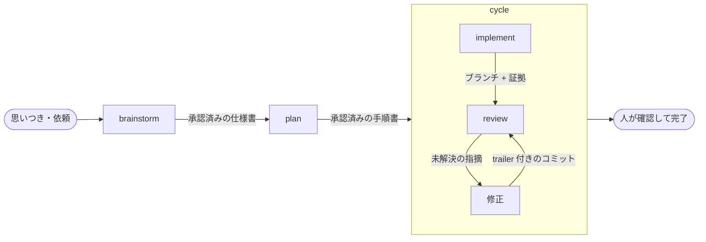

# ワークフロー全体の仕様

この文書は、5 つのステップ（brainstorm、plan、implement、review、cycle）がどうつながるか、
どんな場面でどこから入るか、ステップの間で何を受け渡すかを説明します。
各ステップの中身は、それぞれの文書（[brainstorm.md](brainstorm.md)、[plan.md](plan.md)、
[implement.md](implement.md)、[review.md](review.md)、[cycle.md](cycle.md)）にあります。

## 全体の流れ

矢印の上に書いてあるのが、ステップの間で受け渡す物です。

通常の人の確認は 3 か所です。brainstorm で仕様書を承認するとき、plan で手順書を承認するとき、
そして cycle が終わって最終成果物を受け入れるときです。判断をこの境界へ集め、実装やレビューの
途中で細かい確認を繰り返しません。

cycle の中（implement → review → 修正 → review）は原則として止めません。ただし、重要な
設計判断が未決定、不可逆な操作の直前、人の権限が必要、または放置すると被害が広がる事故が
起きた場合は、その時点で人へ返します。大筋を変えない補完や回復可能な失敗は自走し、終端で
必要な事実だけを報告します（下の「承認を儀式にしない」）。

## 動かす人から見た使い方

### 新しい機能や変更を作りたい

brainstorm から入ります。AI と対話して、何を作るか、何を作らないか、どこで人が判断するかを
決め、仕様書として残します。そのあと plan で手順書を作り、cycle で実装からレビューまでを
回します。人が途中の文書を承認するのは 2 回で、最後に成果物を確認します。

### 依頼が大きい

brainstorm が、依頼を「それぞれ単独で価値がある単位」に分けて、順番を提案します。
人がその分け方と「最初にやる 1 つ」を承認してから、その 1 つだけを詳しく決めます。
大きな依頼を 1 つの手順書にまとめることは、しません。1 つの手順書が大きくなると、
途中で仕様に無い判断が必要になったとき全部が止まり、どこまで有効か分からなくなるからです。

### すでに仕様が決まっている

仕様書があって承認済みなら、plan から入れます。plan は仕様書に書いていないことを
自分で決めません。手順書を書く途中で決まっていないことが見つかったら、brainstorm に
戻します。

### 実装が途中で止まった

implement は、止まったときの状態（作業ブランチ、コミット、証拠、状態の写し）を残したまま
止まります。次に同じ手順書で cycle か implement を動かすと、AI は残っている作業を調べます。
重要な設計判断や危険な対象が動いていなければ、そのブランチで自動的に続けます。複数の候補を
一意に選べない、または重要な判断が動いた場合だけ、「束ね直して続ける」か「新しいブランチで
始める」かを人に聞きます。AI は古い作業を消しません。**束ね直す**とは、動いて
いる実装が「どの手順書のどの内容に従っているか」を、改訂後の内容に張り替えることです
（下の「止まっても続けられる」）。

### 実装中に、仕様に書いていないことが必要になった

重要な設計判断なら、implement はそこで止まります。仕様に無い重要な判断を AI が推測で埋めて
進めることは禁止です。不足している判断は brainstorm に戻し、人と決めてから、必要なら仕様書と
手順書を改訂して再開します。内部的な選択や通常の補完は自走します。戻っても、作業ブランチと
証拠は捨てません。

### 実装済みの変更をレビューしたい

review は単体でも使えます。ブランチか差分を渡せば動きます。cycle の中から呼ばれるときは、
implement が残したブランチが対象になります。

## 受け渡す物

ステップの継ぎ目で何を渡すかを、ここに一か所でまとめます。継ぎ目のズレは、両側を並べて
見ないと分からないからです。

### brainstorm → plan: 承認済みの仕様書

brainstorm が渡すのは、人が読んで承認した仕様書です。仕様書には少なくとも次が書いて
あります。

- 何を作るか、何を作らないか
- 決まったこと、禁止したこと、まだ決まっていないこと（と、誰が決めるか）
- 実装側に任せてよいこと
- 人が判断する場面
- 完了をどう確かめるか

書かれていないことは、実装側への委任ではありません。委任する判断は仕様書に明記します。
仕上げでは、別の文脈で動くアーキテクトが、目的そのもの、暗黙の未決定、既存構造との衝突を
含めて全体をレビューします。意味が変わる改訂のあとは全体レビューをやり直し、問題が無く
なってから人へ承認を求めます。

plan は、この仕様書に書いてあることだけを手順に落とします。書いていないことは決めません。

### plan → cycle: 承認済みの手順書

plan が渡すのは、人が読んで承認した手順書です。手順書は 1 つのファイルで、人が読む部分と
implement が読む部分を分けません。人が承認したものと、AI が実行するものが同じファイルで
あることが、承認を儀式にしないための条件です。

**手順書は仕様の内容を書き写しません。**仕様書への参照と、その計画で採る実装方針、
その根拠、変更するファイル、順序、完了の示し方、実装側に任せてよい選択、止まる条件を
書きます。仕様の詳細を知りたい読者は、参照から仕様書を読みます。

写しを持つと二重管理になり、仕様書が改訂されるたびに手順書ごと作り直しになります。
実際に、写しを求めていた時期の手順書は 788 行になり、そのうち大半が仕様の写しでした。

手順書の中で、implement が決まった書き方で読むのは次の 2 つだけです。

- **参照する仕様書**: どの仕様書のどの節に基づくか。版は手順書を承認した Git コミットの
  ツリーから分かります。独自の指紋は持ちません
- **予定する変更範囲**: ファイルの木。範囲外の変更が必要になったときに、その理由と影響を
  判断する起点です。絶対的な許可リストではありません

手順、完了の示し方、人が判断する場面は、人の言葉で書かれた本文を AI が読んで理解します。
機械が読む形を求めません。読めなかったときに機械が止めても、直せるのは AI だからです。

完了の示し方は、次の 4 種類から 1 つを選びます。implement は種類ごとに違う証拠を
要求します。

| 種類 | 何に使うか | implement が要求する証拠 |
|---|---|---|
| テストで示す（`test`） | 決まった入力に決まった出力を返すコード | 先に失敗するテストを書いて、それが通るようになったこと |
| 検査で示す（`check`） | 生成した物、道具が判定できる成果物 | 手順書が名前を挙げた検査コマンドが、すべて成功で終わったこと |
| 作った物で示す（`artifact`） | 人や AI が読んで意味を判断する文章 | 決めた内容のファイルが存在し、形式の検査と独立レビューを通ったこと |
| 外で確かめる（`external`） | 実機での動作確認、人が頼んだ実測 | 実行結果が記録され、手順書の完了条件を満たしたこと。不可逆な操作や人の権限が要る操作は実行前に人へ返す |

選ぶ基準は「何を作るか」ではなく、**誰が完了を判定できるか**です。決まったコマンドが
判定できるなら「テストで示す」か「検査で示す」を選びます。人が読んで意味を判断しないと
決まらないなら「作った物で示す」か「外で確かめる」です。迷ったら人に寄せます。

「テストで示す」は、いわゆるテスト駆動開発（先に失敗するテストを書き、最小の実装で通し、
整える）です。「検査で示す」は、道具が生成した複製や、決まった検査が通ることだけが問題に
なる成果物のためにあります。ここに人の承認は要りません。判定できるのは検査であって人では
ないからです。「作った物で示す」は、仕様書や skill の本文のように、文章の意味を独立した目で
確かめる成果物のためにあります。途中で人を止めず、review と cycle の終端確認で判断します。
「外で確かめる」は、作業ディレクトリの外で結果を確かめるものです。人にしか実行できない場合と
不可逆な操作だけ、その場所で人へ返します。

### cycle → implement: 手順書と作業場所

cycle は、承認済みの手順書を implement へ渡します。実装は cycle 自身ではなく、
**別の会話（subagent）に委譲されます**。cycle を動かしている会話の文脈を、コードと
テストの出力で埋めないためです。

委譲は 1 回で実装工程ぜんぶを渡します。委譲された側が文脈やクォータを使い切っても、
証拠がどこまで進んだかを持っているので、cycle は次の委譲を続きから起こせます。

委譲している間、証拠を書くのは委譲された側だけです。委譲は同期（cycle は待つ）なので、
2 人が同時に書くことはありません。委譲の開始と終了は、証拠に 1 件ずつ記録します。

### implement → review: 作業ブランチと証拠

implement が渡すのは次の 3 つです。

- **作業ブランチ**: 実装は必ず専用のブランチと専用の作業ディレクトリ（git worktree）で
  行います。メインのブランチは触りません。
- **コミット列**: ステップごとにコミットされた変更。
- **証拠**: どのステップで、どのテストが失敗し、どう通ったか、何をコミットしたかの記録。
  1 つの出来事につき 1 ファイルで、追記だけで上書きしません。

review が読むのは差分です。証拠は「実装が終わっているか」を確かめるためだけに使います。
review はブランチか差分だけでも動きます（[review.md](review.md) の「受け取るもの」）。

### review → 修正 → review: 指摘の集合

review が渡すのは、番号の付いた指摘の集合です。最初に実装全体を見て、修正のあとは
「未解決の指摘と、その修正の差分」だけをもう一度見ます。修正が新しい問題を持ち込んだ場合は
集合へ追加しますが、偶然見つけた無関係な軽微事項は終端報告へ分けます。未解決の指摘が閉じたら、
新しい目で最終全体レビューを 1 回だけ行い、その後は限定した再レビューで閉じます。

修正する側と review の契約は 1 つだけです。**修正コミットの末尾（trailer）に指摘の ID を
書く。**review はコミット履歴の trailer から、関連する差分を機械的に計算します。

修正が承認された範囲の外を触らないと閉じられない指摘は、人が決める指摘（`human_judgment`）
になります。指摘のテキストは AI が書いた物なので、それを根拠に範囲を広げません。範囲を
広げてよいかは人が決めます。手順書の「変更してよい範囲」は、implement が終わった時点で
役目を終えるので、修正の往復には適用しません。

人が「この指摘は直さない」と決めたときは、理由つきの判断として記録され、その指摘は閉じます。
review の完了は、最終全体レビューが済み、今回の対象にした全指摘が閉じたことから導きます。詳しくは
[review.md](review.md)。

## どのステップにも共通すること

### 仕様に無い重要な設計は、brainstorm でしか決めない

plan も implement も review も、仕様書に書いていない重要な設計判断を自分で決めません。
必要になったら止まり、brainstorm に戻します。合意済みの結果を実現する内部的な選択や、
大筋を変えない通常の補完は AI が判断して進め、終端で必要な事実だけを報告します。

### 承認は、Git に固定した内容そのものに対して行う

AI が、置き場所の決まっているファイルをそこに直接書き、対象ファイルだけを Git のステージ
領域へ置きます。人にはステージ済みの差分を見るコマンドと、判断すべき点を示します。人が
その差分を読み、「この内容でよい」と言ったら、ステージ済みの内容をそのままコミットします。
要約を承認の対象にせず、独自の指紋も持ちません。

承認前の内容は、ステージされていてコミットされていない状態です。承認とコミットが同じ
操作なので、コミットされていないことがそのまま「まだ承認されていない」を表します。
承認前の内容を別の場所に置くことはしません。置き場が 2 つあると、どちらが本物かを
名指しする必要が出て、2 つがずれる余地が生まれます。

### 止まるときは、再開できる形で止まる

止まったときは、何が起きたかを記録に残し、ブランチ、作業ディレクトリ、証拠を消しません。

### 仕様書を改訂したら、それに基づく物は古くなる

仕様書が変わると、それを参照している手順書と、実行中の証拠は古い版に基づいたものになります。
やり直しにはなりません。人が改訂後の内容を承認して束ね直せば、同じブランチと証拠のまま
続きます（下の「止まっても続けられる」「文書が書き換わったとき」）。

### 2 人目のレビュアーは、頼まれたときだけ

別の AI の意見は、人がその場で明示したときだけ 1 回動きます。許可は持ち越しません。

### AI を実際に走らせる確認（実測）は、頼まれたときだけ

文章に対して LLM を走らせて振る舞いを確かめることは、既定では要求しません。人が名前を
挙げて頼んだときだけ行います。

### 機械の検査は、外の世界を見るものに限る

補助スクリプトが行う検査は、**外の世界について何かを言っているもの**に限ります。

- 人が承認した内容と、いま手元にある内容が違う
- 手順書の範囲外のファイルに書こうとしている
- パスが安全でない
- 人の判断が無い、人が読んだ物が変わった、人が却下した
- 認証情報らしき文字列や生のログが混ざっている
- テストの失敗が「何かエラーが出た」で終わっていて、承認された未実装を指していない

**自分が書く記録の形式を自分で検査すること**は行いません。機構が自分で導入したデータ構造を
自分で守っているだけで、AI が肩代わりする仕事がそこにはないからです。形式を検査する代わりに、
記録は素朴な形にして、読む側（AI）が理解できることを条件にします。

### 記録は、現実を変える操作と同じ操作の中で書く

状態を表すファイルは、それを変える操作の中で一緒に書きます。別の手順にしません。
書く手順を飛ばしても作業が進む形にすると、飛ばされて記録が古くなります。

同じ理由で、**判断は状態ファイルに書きません。**「次にすべきこと」のような判断は、記録を
追記するコードには導けないので、書くと経路が分かれて古くなります。機械的に導ける事実だけを
書き、判断は読んだ側が導きます。

## 止まったところから戻る

どのステップも、会話が切れたり、途中で強制終了されたりします。このワークフローでは、
「いまどこまで進んでいて、次に何を決めるべきか」を、会話の記憶ではなく記録から導きます。

### 1 ブランチ 1 セッション

1 つのブランチに対して、同時に作業するセッションは 1 つだけです。この規則があるので、
実行ごとの記録が別のセッションに書き換えられることはなく、生きている実行の一覧を
git がそのまま持てます（下の「現在地の導き方」）。

### 現在地の導き方

ワークフロー全体の現在地を表す 1 つの状態ファイルは置きません。導く順序は次のとおりです。

1. **生きている実行**: `git worktree list`。実装は `implement/<実行 ID>` のブランチと
   専用の作業ディレクトリで動くので、git が一覧を持っています。同じ一覧を自分で作りません
2. **その実行がどこまで進んだか**: 実行ごとの状態の写し（`current-status`）を 1 つ読む
3. **review がどこまで進んだか**: review の記録
4. **取り込まれたか**: git（実装のコミットがメインのブランチから辿れるか）

**未完了の手順書の一覧は、どこにも書きません。**手順書は git で管理し、完了したら作業
ツリーから削除します。作業ツリーに残っている手順書が、そのまま未完了の一覧です。

### 状態の写し（current-status）

実行ごとに 1 つ、`.agents/evidence/<手順書 ID>/<実行 ID>/current-status` に
置きます。全体に 1 つ置くと「いまどの実行か」を名指しする必要が出て、並行したときに
壊れるからです。

- **書くのは、出来事を追記するのと同じ操作の中で。**別の手順にしません
- **書くのは、機械的に導ける 4 つだけ** — 手順書のパスと版 / 完了した手順 / 最後の出来事と
  その理由 / ブランチと作業ディレクトリ
- **「次にすべきこと」は書きません。**判断なので、追記のコードには導けません。4 つが
  書いてあれば、読んだ側がその場で導けます
- **実行が終わっても消しません。**消すのは別の操作になり、上の約束を破ります。生きているか
  どうかは `git worktree list` が答えます

写しは元ではありません。出来事の記録が元で、写しはそこから導いた結果です。食い違ったら
写しを捨てて作り直します。元が 1 つなので、写しがいくつあっても矛盾しません。

### 承認を儀式にしない

人に承認を求めるのは、人が見て初めて決まることに限ります。決まったコマンドが判定できる
ことについて承認を求めてはいけません。どうでもいい承認を重ねると、人は中身を見ずに「OK」
と答える役になり、やがて本当に見るべき承認も素通りします。

同じことが**停止**にも当てはまります。止まる場所を増やすことは、安全を増やすことでは
ありません。実測では、1 回の実行で 9 回止まったうち、人の判断が実際に要ったのは 1 回で、
残り 8 回は次の 1 手が「続ける」でした。

**人を止めるのは、明確に道を外れたときだけ**です。道を外れたとは、次の 4 つを言います。

- 仕様に無い重要な設計判断が要る（brainstorm に戻す）
- 不可逆な操作、人の権限が必要な操作、または本番データなど危険な対象へ触れる必要がある
- 人が承認した内容から、**重要な設計の判断が動いた**（下の「文書が書き換わったとき」）
- 秘密情報の露出、意図しない公開、データ破壊など、放置すると被害が広がる事故が起きた

これ以外で AI が転んだとき — 道具の使い方を間違えた、凍結したテストと食い違った、記録を
書き損ねた、予定に無い通常のファイルが必要になった — は、人を呼びません。AI が自分で回復し、
必要な事実を記録に残し、あとで報告します。人の判断なしには回復できないと判明したときだけ
人に返します。

### 止まっても続けられる

止まる仕組みは、承認していない内容で機械が動かないためにあります。やり直させるためでは
ありません。次の約束で、「止まる」と「続けられない」を分けます。

- **読むことと止まることは、文書が変わっていてもできる。** 残っている実行を見せる、記録から
  状態を組み立て直す、止まったと記録する、の 3 つは、手順書や仕様書が承認時から変わって
  いても通ります。書き進める前にだけ、承認コミットと現在の内容の意味を比較します
- **文書が書き換わっても、やり直しにはならない。** 答えは「新しく始める」と「束ね直して
  続ける」の 2 択です。束ね直しは、「この実行を新しい内容で束ね直す」という出来事
  （`rebound`）を 1 つ記録することです。以降はその内容で検査し、同じブランチと証拠のまま
  続きます。手順の突き合わせは番号ではなく手順の文面で行い、文面が同じ完了済みの手順は
  証拠とコミットを持ち越し、変わった手順と新しい手順だけをやります
- **予定に無い通常の変更は、止める理由ではなく、人に見せる事実。** 予定範囲の外にある通常の
  ファイル、補助スクリプトの不具合、記録の欠けは、機械が一律に弾きません。大筋を変えずに
  補えるなら理由を記録して続け、終端で報告します。本番設定、データ移行、アクセス制御、
  秘密情報など、誤ると被害が大きい対象は編集前に人へ返します
- **安全検査は予定範囲の外でも迂回しない。** 秘密情報、危険なパス、一時ファイル、ログ、
  生成物の検査は、すべてのコミットで同じように通します
- **implement が「手順書に無い判断」で止まるのは、重要な設計判断に限る。** 道具の不具合、
  記録の欠け、合意済みの結果を実現する内部的な選択は、brainstorm に戻す理由ではありません

### 文書が書き換わったとき

手順書も仕様書も、実行の途中で書き換わります。書き損じが見つかればその場で直しますし、
仕様書が改訂されればそれに基づく手順書も追いかけます。

**書き換わったという事実そのものは、人に返す理由になりません。**Git の差分があるという観測は、
「何かが変わった」としか言っていません。それだけを止まる根拠にすると、誤字の修正と設計の
差し替えが同じ扱いになり、前者のたびに人が呼ばれます。

代わりに、AI が中身を読んで判定します。**重要な設計の判断が動いたか**です。重要な判断とは、
利用者から見える振る舞い、禁止事項、永続化とデータの寿命や移行、必要な権限、外部サービス、
新しい外部依存、不可逆な操作を指します。予定する変更ファイルが増えただけでは、重要な判断が
動いたことになりません。

- 動いた → 人に返します。人は改訂後の内容を読み、束ね直すか新しく始めるかを決めます
- 動いていない → 何がどう変わったかを記録して、そのまま続けます。終端で、人がその一覧を
  読みます

この判定は機械にはできません。文面の違いが設計の違いかどうかは、読まないと分からない
からです。同じ理由で、判定を間違えた場合に備えて、続けた場合も必ず記録に残します。

軌道修正の入口は、直したい物の大きさで 3 つに分かれます。どれもブランチと証拠を捨てません。
どの入口かは人が決め、AI は「それは仕様書に書いてあるか、無いか」を根拠つきで言います。

| 何が起きたか | 入口 | 人がやること | 失う物 |
|---|---|---|---|
| 実装が承認済みの仕様書に反している（バグ） | A: 直接直す | 作業ブランチで直してコミットし、終端で変更理由を確認する | 無し |
| 仕様書には書いてあるが、手順書に手順が無い・違う | B: 手順書を改訂して束ね直す | 改訂版を承認し、突き合わせの表を見て「続ける」と言う | 文面が変わった手順のやり直しだけ |
| 仕様書そのものが黙っている・間違っている | C: brainstorm で仕様書を改訂してから B | 仕様書の改訂を承認し、B と同じ | 同上 |

review も同じです。レビュー中に仕様書が改訂されたら、AI が変更の意味を読みます。重要な設計
判断が動いていなければ、新しい版へ自動で追従し、何が変わったかを終端で報告します。重要な
判断が動いていた場合だけ、`findings_stale`（指摘の前提が古くなった）と記録して人へ返します。
`stale` は完了状態ではありません。束ね直すと指摘を `open` に戻して再開します。

### どこで止まっても何が残るか

| ステップ | 止まった場所 | 残る記録 | 戻り方 |
|---|---|---|---|
| brainstorm | 対話の途中 | 作業ファイル（合意、禁止、未決定、却下、現在位置、次の話題）。保存は意味が変わった直後だけ | 作業ファイルから合意と次の話題を復元する。最後の保存より後の対話は失われる |
| brainstorm | 仕様書を書いて承認待ち | コミットされていない仕様書と記録、作業ファイル | ステージ済みの差分を出し直す |
| plan | 手順書を書く前 | 何も残らない | 最初からやり直す（失う物は無い） |
| plan | 手順書を書いて承認待ち | コミットされていない手順書 | ステージ済みの差分を出し直す |
| cycle | 委譲の途中 | 委譲の開始の記録、委譲された側が書いた証拠、状態の写し | 状態の写しを読み、続きから次の委譲を起こす |
| implement | 手順の途中 | 束ねの記録、追記だけの出来事、状態の写し、作業ブランチと作業ディレクトリ | 残っている作業を見せ、人が「続ける / 束ね直して続ける / 新しく始める」を選ぶ |
| implement | 完了・停止のあと | 終端の出来事 | review へ渡す、または人が判断する |
| review | 最初のレビューの途中（集合の固定前） | 束ねとモデルの記録だけ | 最初のレビューをやり直す。読んだ内容は失われる |
| review | 集合の固定後、修正の往復中 | 固定した集合、往復ごとの判定、修正コミット | 再レビューが記録とコミットから判定を導く |
| review | 仕様書の重要な判断が動き、指摘の前提が古くなった | 指摘の集合と、`findings_stale` の記録 | 人が束ね直すと `stale` の指摘が `open` に戻る。または新しく始める |
| review | 人の判断待ち | 判断待ちの理由が記録から導ける | 人がまとめて判断する |
| review | 最終全体レビューと全指摘の解決後 | 集合と判定の記録（完了を表す出来事は無く、指摘の状態から導く） | 人が最終成果物を確認し、取り込みを判断する |

### 意図的に失うもの

次は復元しません。作り直すほうが、途中の状態を保存し続けるより安全で安いからです。

- brainstorm の、最後に意味が変わって保存した時点より後の対話
- review の、集合を固定する前に読んだ内容と、まだ集合に入っていない指摘の候補
- 委譲された会話の中で AI が考えたこと（証拠に残るのは、何をしてどうなったかだけ）

### 人の判断の置き場

会話の記憶にしか無い判断は、次のセッションでは失われます。ワークフローの中で人が下す
判断には、それぞれ記録の置き場があります。

| 人の判断 | 置き場 |
|---|---|
| 次にどの仕様を plan するか、フェーズの順序 | ROADMAP |
| 仕様書・手順書・ROADMAP の承認 | Git のステージ済み差分と、その承認で作られたコミット |
| 止まった実装を続けるか、束ね直して続けるか、新しく始めるか | implement の出来事（続きの出来事、束ね直しの出来事、または新しい束ねの記録）。人に返すのは、道を外れた止まり方のときだけ |
| 軌道修正をどの入口（A / B / C）で行うか | 結果が記録に現れる: A は終端の承認、B は手順書の新しい版と束ね直し、C は仕様書の改訂 |
| 証拠で説明できないコミットと範囲外の変更を、意図した物と認めること | implement の終端の承認の出来事 |
| review に使うモデルと強さ | review の記録 |
| 人が決める指摘の受け入れ・却下 | review の判断の記録 |
| 機械で確かめる指摘を「直さない」と決めること | review の判断の記録（理由つき） |
| review を束ね直すか、新しく始めるか | review の束ね直しの出来事 |
| review の進捗が止まり、原因診断後も回復しないときの扱い | 実行ごとの review の記録 |
| 取り込むかどうか | git（merge コミット） |

会話の要約を次のセッションへ渡す道具（いわゆる handoff）は、このワークフローの外側の
汎用の道具で、上の記録の代わりにはなりません。

## 記録の置き場所

置き場は**誰が書いて誰が承認したか**で分けます。**人が承認した文書は `docs/` の下、
AI が書いた記録は `.agents/` の下**です。この 1 本の線で、git に入る物と入らない物が
決まります。

| 場所 | 何が入るか | 寿命 |
|---|---|---|
| `docs/spec/` | 仕様書 | 永続 |
| `docs/plans/` | 進行中の手順書 | 完了したら作業ツリーから削除する。過去は git の履歴で読む |
| `docs/agreements/` | 壁打ちで決まったことの記録（合意、禁止、未決定、委任、却下、改訂） | 進行中の間だけ置く。役目を終えたら削除する |
| `.agents/evidence/<手順書ID>/<実行ID>/` | implement の証拠と、状態の写し | 残す。上書きしない |
| `.agents/evidence/<手順書ID>/<実行ID>/review/` | review の記録（固定した指摘の集合、往復ごとの判定、人の判断） | 残す。上書きしない |
| `.agents/tmp/` | 作業ディレクトリ、2 人目のレビュアーに渡した入力と出力、その他の一時ファイル | 人が消すまで残る |

`docs/` の下は全部 git で管理し、`.agents/` の下は全部除外します。除外の設定は
`/.agents/` の 1 行で足ります。例外の一覧を持たないので、パスを見ればどちらか分かります。

**`docs/` にあるディレクトリが、そのまま「いま何が進行中か」を表します。**`spec/` しか
無ければ、動いている作業はありません。手順書も、壁打ちの記録も、役目を終えたら消します。
消しても、何が書いてあったかは git の履歴に残ります。

置かないものが 3 つあります。**未完了の手順書の一覧**（作業ツリーにある手順書がそれ
です）、**生きている実行の一覧**（`git worktree list` が答えます）、そして
**`status.md` や `session-history.md` のような、進み具合を書き写した状態ファイル**です。
どれも別の場所にある事実の写しで、写しは元とずれます。
