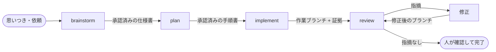

# ワークフロー全体の仕様

この文書は、4 つのステップ（brainstorm、plan、implement、review）がどうつながるか、
どんな場面でどこから入るか、ステップの間で何を受け渡すかを説明します。
各ステップの中身は、それぞれの文書（[brainstorm.md](brainstorm.md)、[plan.md](plan.md)、
[implement.md](implement.md)、[review.md](review.md)）にあります。

## 全体の流れ

矢印の上に書いてあるのが、ステップの間で受け渡す物です。どのステップも、前のステップが
「人の承認を得た物」を渡してきたときだけ動きます。そして、どのステップも次のステップを
自動では始めません。brainstorm が終わったら止まり、人が「plan を作って」と言って初めて
plan が動きます。これは、AI が勝手に先へ進んで、人が気づかないうちに実装まで終わって
いる状態を作らないためです。

## 動かす人から見た使い方

### 新しい機能や変更を作りたい

brainstorm から入ります。AI と対話して、何を作るか、何を作らないか、どこで人が判断するかを
決め、仕様書として残します。そのあと plan で手順書を作り、implement で実装し、review で
確かめます。1 ステップごとに人の承認が入ります。

### 依頼が大きい

brainstorm が、依頼を「それぞれ単独で価値がある単位」に分けて、順番を提案します。
人がその分け方と「最初にやる 1 つ」を承認してから、その 1 つだけを詳しく決めます。
大きな依頼を 1 つの手順書にまとめることは、しません。1 つの手順書が大きくなると、
途中で仕様に無い判断が必要になったとき全部が止まり、どこまで有効か分からなくなるからです。

### すでに仕様が決まっている

仕様書があって承認済みなら、plan から入れます。plan は仕様書に書いていないことを
自分で決めません。手順書を書く途中で決まっていないことが見つかったら、brainstorm に
戻します。

### 実装が途中で止まった

implement は、止まったときの状態（作業ブランチ、コミット、証拠）を残したまま止まります。
次に同じ手順書で implement を動かすと、残っている作業を見せて、「そのブランチで続ける」か
「新しいブランチで最初からやる」かを人に聞きます。AI が勝手に消したり、勝手に続けたり
することはありません。詳しくは [implement.md](implement.md)。

### 実装中に、仕様に書いていないことが必要になった

implement は、そこで止まります。仕様に無いことを AI が推測で埋めて進めることは
禁止です。不足している判断は brainstorm に戻し、人と決めてから、必要なら仕様書と手順書を
改訂して再開します。

## 受け渡す物

ステップの継ぎ目で何を渡すかを、ここに一か所でまとめます。継ぎ目のズレは、両側を並べて
見ないと分からないからです。

### brainstorm → plan: 承認済みの仕様書

brainstorm が渡すのは、人が読んで承認した仕様書です。仕様書には少なくとも次が書いて
あります。

- 何を作るか、何を作らないか
- 決まったこと、禁止したこと、まだ決まっていないこと（と、誰が決めるか）
- 実装側に任せてよいこと
- 人が判断する場面
- 完了をどう確かめるか

plan は、この仕様書に書いてあることだけを手順に落とします。書いていないことは決めません。

### plan → implement: 承認済みの手順書

plan が渡すのは、人が読んで承認した手順書です。手順書は 1 つのファイルで、人が読む部分と
implement が読む部分を分けません。人が承認したものと、AI が実行するものが同じファイルで
あることが、承認を儀式にしないための条件です。

手順書は、全体が人の言葉で書かれたうえで、implement が機械的に読む部分を決まった形で
持ちます。

- **参照する仕様書**: どの仕様書のどの版に基づくか。implement は実行前に、その仕様書が
  承認時から変わっていないことを確かめます。変わっていたら止まります。
- **手順（ステップ）**: 見出し `### 1.`、`### 2.` … で区切られた、順番に実行する単位。
  各ステップには、目的、前提、変更してよいファイルの範囲、止まる条件、そして
  **完了の示し方**が書いてあります。

完了の示し方は、次の 3 種類から 1 つを選びます。implement は種類ごとに違う証拠を
要求します。

| 種類 | 何に使うか | implement が要求する証拠 |
|---|---|---|
| テストで示す（`test`） | 決まった入力に決まった出力を返すコード | 先に失敗するテストを書いて、それが通るようになったこと |
| 作った物で示す（`artifact`） | AI に読ませる文章、設定ファイル | 決めた内容のファイルが存在し、形式の検査を通り、人が読んで OK と言ったこと |
| 外で確かめる（`external`） | 実機での動作確認、人が頼んだ実測 | 実行した結果を人が見て OK と言ったこと |

「テストで示す」は、いわゆるテスト駆動開発（先に失敗するテストを書き、最小の実装で通し、
整える）です。「作った物で示す」は、仕様書や skill の本文のように、テストで振る舞いを
示せない成果物のためにあります。「外で確かめる」は、人の目が要るものです。

手順書の細かい形（参照の書き方、ステップ見出しの形、人が判断する場面の宣言）は
[plan.md](plan.md) に、implement がそれをどう読むかは [implement.md](implement.md) に
あります。両方の文書は、ここに書いた受け渡しの約束に従います。

### implement → review: 作業ブランチと証拠

implement が渡すのは次の 3 つです。

- **作業ブランチ**: 実装は必ず専用のブランチと専用の作業ディレクトリ（git worktree）で
  行います。メインのブランチは触りません。
- **コミット列**: ステップごとにコミットされた変更。
- **証拠**: どのステップで、どのテストが失敗し、どう通ったか、何をコミットしたかの記録。
  1 つの出来事につき 1 ファイルで、追記だけで上書きしません。

review は、この 3 つがそろっていて、手順書と仕様書が承認時から変わっていないことを
確かめてから始めます。

### review → 修正 → review: 指摘の集合

review が渡すのは、番号の付いた指摘の集合です。最初のレビューで指摘の集合を固定し、
修正のあとは「未解決の指摘と、その修正の差分」だけをもう一度見ます。修正のたびに
新しい指摘が増え続けてレビューが終わらない、という状態を作らないためです。人が「この指摘は
直さない」と決めたときは、理由つきの判断として記録され、その指摘は閉じます。review の完了は、
固定した集合の全指摘が閉じたことから導きます。詳しくは [review.md](review.md)。

## どのステップにも共通すること

### 仕様に無いことは、brainstorm でしか決めない

plan、implement、review は、仕様書に書いていないことに気づいたとき、それを報告して
止まります。推測で値を選んで進めることはしません。「まだ決まっていないこと」と
「実装側に任せてよいこと」は別の状態として扱い、後者だけが実装側の裁量です。

### 承認は、人が読んだファイルそのものに対して行う

brainstorm の仕様書、plan の手順書、ROADMAP の改訂は、すべて次の手順で正本になります。

1. AI が草稿を一時ファイルに保存し、そのパスと内容の指紋（SHA-256 のハッシュ値）を
   チャットで示す。草稿の全文をチャットに貼ることはしない
2. 人が、自分の道具でそのファイルを読む
3. 人が「このファイルを正本にしてよい」と明示する
4. AI が、ファイルの指紋が提示したものと同じであることを確かめてから、正本の場所へ
   移す。読み戻して指紋が一致したときだけ成功とする

指紋は、人が見たファイルと正本になったファイルが同じであることを機械的に保証するためだけに
使います。人が承認するのは指紋ではなく、読んだ文書の中身です。だから、文書は人が読んで
判断できる形で書かれていなければなりません。読めない文書への承認は、この仕組みでは
承認とみなしません。

### 止まるときは、再開できる形で止まる

必要な人、レビュアー、証拠、外部サービスが使えないとき、どのステップも「成功」とは
言わず、「未完了で、ここから再開できる」という状態を残します。何が終わっていて、何が
まだ有効で、何が古くなったか、どこから再開するかを記録します。

### 仕様書を改訂したら、それに基づく物は古くなる

承認済みの仕様書を改訂すると、その仕様書に基づいて作られた手順書、実装の証拠、レビュー
結果、承認は古いものになります。implement と review は、参照している仕様書の指紋を
実行前に確かめるので、古いものの上で進むことはありません。

### 2 人目のレビュアーは、頼まれたときだけ

別の AI や別のモデルにもう一度レビューさせる「2 人目のレビュアー」は、その場で人が
明示的に頼んだときだけ、1 回だけ動きます。許可を次の作業に持ち越したり、失敗したら
自動でやり直したりはしません。

### AI を実際に走らせる確認（実測）は、頼まれたときだけ

skill の本文のような「AI に読ませる文章」は、実際に AI を走らせないと振る舞いを
確かめられません。その確認（実測）は費用が大きいので、既定では要求しません。
人が名前を挙げて頼んだときだけ、確認する場面を 1 つ、使う AI を 1 つ、費用の上限を
決めてから行います。

## 止まったところから戻る

どのステップも、会話が切れたり、途中で強制終了されたりします。このワークフローでは、
「いまどこまで進んでいて、次に何を決めるべきか」を、会話の記憶ではなく記録から導きます。

### 横断の状態は持たない

ワークフロー全体の現在地を表す 1 つの状態ファイルは置きません。各ステップが追記だけで
残す記録が正本で、現在地はそこから毎回導きます。全体の状態ファイルを置くと、ステップの
記録と二重になり、更新する前に止まったときにどちらが正しいか分からなくなるからです
（以前あった「リポジトリ全体の使用中の印」を捨てたのと同じ理由です）。

導く順序は、手順書の ID を根に次のとおりです。

1. 手順書の索引（`open-plans.json`）で、その手順書が現在対象か保留か
2. その手順書の最新の実行の、最後の出来事（進行中 / 全手順完了 / 停止）
3. その実行に対する review の記録（集合の固定前 / 修正の往復中 / 人の判断待ち / 完了）
4. 実装のコミットがメインのブランチから辿れるか（git が持つ事実）

観測できる事実は記録せず、導きます。実行が完了したこと、review が完了したこと、取り込まれた
ことは、それぞれの記録と git から分かるので、誰かが「完了」と書き込む役を置きません。
記録するのは、観測できない人の判断だけです。

### どこで止まっても何が残るか

| ステップ | 止まった場所 | 残る記録 | 戻り方 |
|---|---|---|---|
| brainstorm | 対話の途中 | 進捗ファイル（合意、禁止、未決定、却下、現在位置、次の話題）。保存は意味が変わった直後だけ | 進捗ファイルから合意と次の話題を復元する。最後の保存より後の対話は失われる |
| brainstorm | 草稿を出して承認待ち | 草稿と指紋、進捗ファイル | 草稿を再提示する |
| plan | 草稿を書く前 | 何も残らない | 最初からやり直す（失う物は無い） |
| plan | 草稿を保存して承認待ち | 草稿と指紋 | 草稿を再提示する |
| implement | 手順の途中 | 束ねの記録、追記だけの出来事、作業ブランチと作業ディレクトリ | 残っている作業を見せ、人が「続ける / 新しく始める」を選ぶ |
| implement | 完了・停止のあと | 終端の出来事 | review へ渡す、または人が判断する |
| review | 最初のレビューの途中（集合の固定前） | 束ねとモデルの記録だけ | 最初のレビューをやり直す。読んだ内容は失われる |
| review | 集合の固定後、修正の往復中 | 固定した集合、往復ごとの判定、修正コミット | 再レビューが記録とコミットから判定を導く |
| review | 人の判断待ち | 判断待ちの指摘が記録から導ける | 人がまとめて判断する |
| review | 全指摘が閉じたあと | 集合と判定の記録（完了を表す出来事は無く、全指摘の状態から導く） | 人が取り込みを判断する |

### 意図的に失うもの

次は復元しません。作り直すほうが、途中の状態を保存し続けるより安全で安いからです。

- brainstorm の、最後に意味が変わって保存した時点より後の対話
- review の、集合を固定する前に読んだ内容と、まだ集合に入っていない指摘の候補

### 人の判断の置き場

会話の記憶にしか無い判断は、次のセッションでは失われます。ワークフローの中で人が下す
判断には、それぞれ記録の置き場があります。

| 人の判断 | 置き場 |
|---|---|
| 次にどの仕様を plan するか、フェーズの順序 | ROADMAP |
| 仕様書・手順書・ROADMAP の承認 | 正本のファイルそのもの（承認した指紋の物が正本になる） |
| 止まった実装を続けるか、新しく始めるか | implement の出来事（新しい束ねの記録か、続きの出来事か） |
| review に使うモデルと強さ | review の記録 |
| 人が決める指摘の受け入れ・却下 | review の判断の記録 |
| 機械で確かめる指摘を「直さない」と決めること | review の判断の記録（理由つき） |
| 取り込むかどうか | git（merge コミット）。取り込まないと決めたときは、手順書の索引で保留にする |

会話の要約を次のセッションへ渡す道具（いわゆる handoff）は、このワークフローの外側の
汎用の道具で、上の記録の代わりにはなりません。

## 記録の置き場所

作業中の状態と記録は、対象リポジトリの `.agents/` 以下に置きます。

| 場所 | 何が入るか | 寿命 |
|---|---|---|
| `.agents/artifacts/ideas/progress/` | brainstorm の途中経過（合意、禁止、未決定など） | 仕様書が正本になったら消える |
| `.agents/tmp/ideas/` | brainstorm が出した仕様書・ROADMAP の草稿 | 承認されて正本に移ったら消える |
| `.agents/tmp/plans/` | plan が出した手順書の草稿 | 承認されて正本に移ったら消える |
| `.agents/artifacts/plans/` | 正本の手順書と、未完了の手順書の索引（`open-plans.json`） | 手順書が完了するまで |
| `.agents/artifacts/executions/<手順書ID>/<実行ID>/` | implement の証拠（どの仕様書・手順書に基づいたか、各ステップの出来事） | 残す。上書きしない |
| `.agents/artifacts/executions/<手順書ID>/<実行ID>/review/` | review の記録（固定した指摘の集合、往復ごとの判定、人の判断） | 残す。上書きしない |
| `.agents/tmp/reviews/` | 2 人目のレビュアーに渡した入力と、その出力 | 人が消すまで残る |
| `.agents/tmp/worktrees/` | implement の作業ディレクトリ | 人が消すまで残る |

仕様書（`docs/spec/`）と ROADMAP は git で管理する正本で、`.agents/` の外にあります。
`.agents/artifacts/` は記録として残す物、`.agents/tmp/` は一時的な物、という区別です。
