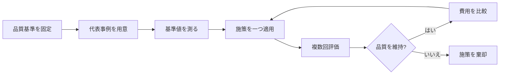

# LLMワークフローの品質を落とさないトークン効率化

> **NON-NORMATIVE:** この文書は参考資料であり、実装仕様ではない。ここにある施策を必須化する場合は、別途仕様条項と回帰試験へ昇格させる。

## TL;DR

トークン効率化は、文章を短くすることでも、安価なモデルへ置き換えることでもない。先に品質基準と評価用の事例を固定し、同じ品質で完了した仕事1件あたりの総コストを下げる活動である。

agentic workflowでは、全文reviewの反復と、仕様漏れ・実装漏れによる出戻りが大きな浪費になりやすい。機械検査への移行、意味を保った引き継ぎ、対象を絞った再reviewを優先し、モデル変更は最後に評価する。

## この文書の位置付け

この文書は、次の三種類の情報を区別する。

| 種類 | 意味 |
|---|---|
| 公式資料で確認できる事実 | Anthropicの公開notebookに記載された方針、実験条件、結果 |
| 実運用から得た観察 | agentic workflowを使用した対話で確認された費用増加の傾向 |
| 未検証の仮説 | 将来の評価や改善スキルで検証すべき提案 |

公式notebookの数値は、そのnotebook内の模擬業務、モデル、価格、prompt、評価事例に対する結果である。他のworkflowでも同じ削減率になる保証はない。

## 出発点：安さではなく品質を固定する

Anthropicの公式notebookは、最適化前に次の順序を置いている。

1. 十分な能力を持つ構成で動作させる
2. 評価方法を作る
3. 品質とコストの基準値を測る
4. 品質基準を制約として固定する
5. その制約内でコストを下げる

notebookは、token単価ではなく完了したtask単位のコストを見るよう勧めている。安価なモデルが多くのturnやretryを必要とすれば、最終的なtask単価は高くなり得る。また、出力は非決定的なので、単一試行ではなく複数試行の分布で判断する必要がある。実運用へ移す前の目安として、約50件の評価事例と、構成ごとに少なくとも5回の試行が示されている。

この考えをworkflowへ置き換えると、最適化対象は次になる。

```text
悪い指標: 1回の応答で使ったtoken
良い指標: 必須品質を満たして完了した変更1件あたりの総token・総費用
```

## 最適化の基本ループ



品質とコストを同時に変更すると、安くなった理由と壊れた理由を分離できない。評価では、可能な限り一つの施策だけを変える。

## 公式資料から得られる一般原則

### 1. 変更しない入力は再処理しない

Prompt cachingは、同じprefixを繰り返し処理する費用を減らす。notebookでは、品質を変えずに費用を下げた例として先に適用されている。

ただし、これはAPI固有の料金・cache仕様に依存する。workflow一般の原則は次のように言い換えられる。

> 同じ規則や資料を毎回新しい情報として処理させない。

測るべきものはcache hit率だけではない。prefixの一部が頻繁に変わり、毎回cacheを壊していないかも確認する。

### 2. 必要な情報へ到達できることと、最初から全部見せることを分ける

Progressive disclosureは、大きな資料や大量のtool定義を常にpromptへ入れず、必要になった時点で取得可能にする考え方である。

有効になりやすい条件：

- 資料が大きい
- 1回のtaskで使う範囲が小さい
- 必要な場所を検索できる
- 取得漏れを評価事例で検出できる

危険になりやすい条件：

- 多くのtaskが資料の大部分を必要とする
- 例外規則が離れた場所にある
- model自身が「資料を見るべき難しい事例」を判定できない
- 検索の追加turnが削減量を上回る

notebookの保存済み結果では、常駐していたmanualをtool経由にすると2試行とも9/10、tool定義の遅延読み込みでは8/10と9/10だった。一方、元の比較構成は10/10だった。これは「情報を後から読める状態」と「必要な情報を確実に読む状態」が同じではないことを示している。

### 3. 大きな成果物はcontextへ貼らず、必要な答えだけ取得する

大量の表、PDF、log、全件dumpを会話へ直接入れると、後続turnでも繰り返し費用が発生する。

toolは、次のように範囲を指定できる形が望ましい。

- 対象ID
- 期間
- 必要なfield
- 最大件数
- 集計方法

`get_all_*` のような全量取得より、必要な事実へ直接答える小さな取得方法を優先する。

### 4. 長期loopではcontextの増加を制御する

長いagent loopでは、過去のtool結果と中間出力が後続turnへ積み上がる。

候補となる方法：

- 使用済みの大きなtool結果を除去する
- 会話を圧縮する
- task境界でまとめて整理する
- subagentへ大きな調査を隔離し、短い成果物だけ返す
- 会話ではなく外部成果物へ確定状態を保存する

notebookではcompactionによりcontextが縮んだ一方、保存済みの総合比較では10/10と9/10になった2試行がある。圧縮が常に安全とは限らない。

agentic workflowでは、会話全文ではなく、次の意味状態を外部へ保持する方法が適している。

- 合意
- 禁止
- 未決定事項
- 委任範囲
- 未解決のreview指摘
- 有効な証拠と古くなった証拠
- 再開位置

毎turn全文を書き直す必要はない。意味が変わったときだけ短いeventを追記し、一定間隔で状態を整理する。

### 5. 出力形式を具体的に指定する

出力tokenは入力tokenより高価になる場合が多い。公式notebookは、上限だけでなく、必要な出力形式と終了条件を明示する方法を扱っている。

workflowでは次が有効である。

- 必須fieldを定義する
- 不要な経緯説明を要求しない
- 詳細は成果物に置き、会話では判断に必要な差分だけ示す
- 成功・失敗の終了条件を明示する
- 同じ内容を複数形式で繰り返さない

短くすること自体を目的にしてはいけない。人間の判断に必要な根拠や危険を削ると、後の出戻りが増える。

### 6. モデル変更は最後に行う

公式notebookは、cache、入力、loop、出力、batchなどを先に試し、modelと推論量の変更を後に置いている。安価なmodelが多くのretryを必要とすれば、task全体では安くならないためである。

保存済み実験では、安価なsubagent群で事実を集め、別modelで判断する構成が低費用になった一方、短縮したruleから一つの例外が落ち、2試行とも9/10だった。さらに120 requestsを要している。分業しただけでは効率化とは言えない。

分業が有効になりやすい条件：

- taskを独立した責務へ分けられる
- 各subtaskの出力契約が狭い
- 必要情報の欠落を機械検査できる
- 安価なmodelでも十分な作業を識別できる
- orchestratorが全文を再読しない

## Agentic workflowで大きくなりやすい費用

ここからは、実際のworkflow利用から得た観察である。公式notebookの結論そのものではない。

### Review loopの増幅

典型的な高コストloopは次の形になる。

```text
全体review
  -> 指摘
  -> 修正
  -> 全体reviewを再実行
  -> 別の指摘
  -> 修正
  -> 全体reviewを再実行
```

各回で仕様、plan、diff、codebase、過去の指摘を読み直すと、修正量が小さくても入力費用はほぼ初回と同じになる。reviewerが毎回新しい観点で指摘を生成すると、完了条件も安定しない。

改善案：

1. 初回reviewで指摘へ安定したIDを付ける
2. severityと必要な対応を分離する
3. 同じ原因の指摘をまとめて修正する
4. 機械検査で確認できる指摘はLLMへ戻さない
5. 再reviewは未解決の指摘と修正差分へ絞る
6. 修正が初回reviewの前提を壊した場合だけ全体reviewへ戻る

`WARN` をすべて直す運用でも、毎回の全文reviewは不要である。修正証拠を機械確認できる場合は指摘を閉じ、判断を要する場合だけ人間または対象reviewerへ戻す。

### 仕様漏れによる出戻り

仕様にない重要事項を実装中のLLMが補うと、完成後に大きな撤去や再設計が発生する。実例では、未決定だった永続化方式へJSON fileが選ばれ、databaseを前提とする要求に合わず撤去になった。

この費用はpromptを短くしても解決しない。先に次を行うほうが効率化になる。

- brainstormで要求から設計上の論点を導く
- 未決定と委任を区別する
- specから検証可能な契約を作る
- 意図した理由でREDになることを確認する
- 未決定事項へ依存する実装を止める

早い段階の重いbrainstormは、後段の大きな出戻りを減らせるなら総費用を下げる。

## 施策の分類

| 施策 | 適用範囲 | 主な利点 | 主な危険 |
|---|---|---|---|
| Prompt caching | API固有 | 同一prefixの再処理費用を下げる | prefix変更で効果が消える |
| Batch API | API固有 | 非同期taskの料金を下げる | 対話型や逐次依存taskに不適 |
| Tool定義の遅延読み込み | API・tool環境依存 | 大量schemaの常駐を避ける | 必要toolの発見漏れ |
| 必要箇所だけ読む | 一般 | 入力を小さく保つ | 例外や関連規則の取得漏れ |
| Context isolation | 一般 | 調査や実装の大量contextを隔離 | 引き継ぎ成果物の情報欠落 |
| 意味状態の外部保存 | 一般 | compact・中断に耐える | 更新漏れと二重正本 |
| 対象限定review | 一般 | 全文再読を減らす | 影響範囲の証明不足 |
| 機械検査への移行 | 一般 | LLM判断を繰り返さない | 弱い検査による偽の安心 |
| 安価なmodelへの置換 | provider依存 | 単価を下げる | retry増加、判断品質低下 |

## 測定するもの

### 必須の品質指標

- workflowの完了率
- 重大な仕様漏れの検出率
- 禁止事項の保持率
- 必須gateの通過漏れ
- 回帰fixtureの成功率
- 人間による重大な手戻り件数

### 費用指標

- 完了したtaskあたりの入力token
- 完了したtaskあたりの出力token
- cache writeとcache read
- model request数
- reviewer起動数
- 同じcontextを再読した量
- subagentが返した成果物の量
- 仕様漏れ・実装漏れによる再実装量

### 補助指標

- phase別のtoken量
- tool結果の最大・中央値
- compact回数
- 人間確認の往復数
- review指摘の重複率
- 修正後も残った指摘数

費用だけを合計すると原因が分からない。phase、model、tool、reviewer、成功・失敗ごとに分解して記録する。

## 評価fixtureの作り方

最低限、次の種類を含める。

- 通常の成功例
- 重要事項が未決定の例
- 例外規則が離れた資料にある例
- 長い会話がcompactされる例
- reviewで複数の関連指摘が出る例
- 局所変更と全体影響を区別する例
- 安価なmodelが一見もっともらしく誤る例
- 必須reviewerを利用できない例

各fixtureには、合否だけでなく「何を落としたら失敗か」を記録する。最適化で同じ1件を繰り返し落とす場合、平均点が高くても採用しない。

## 将来の改善スキル案

将来のスキルは、いきなり自動修正するのではなく、段階的に責務を増やす。

### 段階1：資料

公式資料、適用条件、失敗条件、実運用の観察を整理する。この文書が該当する。

### 段階2：計測

session、artifact、review結果から品質と費用を集計する。推測したtoken量ではなく、利用環境が提供するusage情報を優先する。

### 段階3：診断

次を検出して、改善候補と必要な評価を提示する。

- 同じ資料の反復読み込み
- 全体reviewの反復
- 使われていない常駐context
- 広すぎるtool出力
- subagent間での情報の再展開
- 機械検査へ移せるLLM判断
- 仕様漏れに起因する出戻り

### 段階4：実験

一つの施策だけを変更し、複数回のfixture実行で品質と費用を比較する。品質基準を下回る施策は自動的に棄却する。

### 段階5：限定的な自動適用

十分な証拠がある施策だけを適用する。変更前の構成、評価結果、戻し方を必ず保持する。

## 改善スキルの責務境界

改善スキルが所有するもの：

- 計測結果の正規化
- 品質制約の確認
- 費用増加箇所の検出
- 一度に一つの改善実験
- 結果の比較と採否提案

改善スキルが所有しないもの：

- product要件の変更
- 必須gateの削除
- security基準の緩和
- 利用者の許可なしのsecond reviewer起動
- 安さだけを理由とするmodel変更
- 評価なしのprompt短縮

既存のskill改善やprompt評価機能と重複する可能性がある。新しいskillを作る前に、計測、fixture実行、prompt比較、回帰評価を既存機能から再利用できるか調べる。

## 採用判断

施策を採用する条件：

- 必須品質をすべて維持する
- 重大な既知漏れを再発させない
- 複数試行で改善が再現する
- 完了taskあたりの費用が下がる
- 失敗時の戻し方がある

施策を棄却する条件：

- 一部の例外規則が失われる
- requestやretryが増えて総費用が下がらない
- 人間の重大な手戻りが増える
- 必須gateが省略される
- 改善理由を測定結果で説明できない

## Summary

- 品質基準と評価fixtureを先に固定する。
- token単価ではなく、品質を満たした完了taskあたりの総費用を見る。
- cache、入力、loop、出力、architectureを先に改善し、model変更は最後にする。
- Progressive disclosure、compaction、subagent分業は品質を落とす可能性がある。
- agentic workflowでは、review loopと仕様漏れによる出戻りを優先的に減らす。
- 会話全文ではなく、合意や未解決事項などの意味状態を外部へ保存する。
- 将来の改善スキルは、計測、診断、実験、限定的な自動適用の順で育てる。

## References

- Anthropic, [Cost Optimization on the Claude API](https://github.com/anthropics/claude-cookbooks/blob/main/cost_optimization/cost_optimization.ipynb), accessed 2026-08-21. Primary source for the optimization sequence, experimental examples, and production-evaluation guidance. The `main` branch is mutable, so numerical results should be rechecked before reuse.
- Anthropic, [Claude Cookbooks repository](https://github.com/anthropics/claude-cookbooks), accessed 2026-08-21. Repository context and license information.
- Project specification, [`docs/spec/README.md`](../spec/README.md). Normative workflow requirements; this research note does not modify them.
